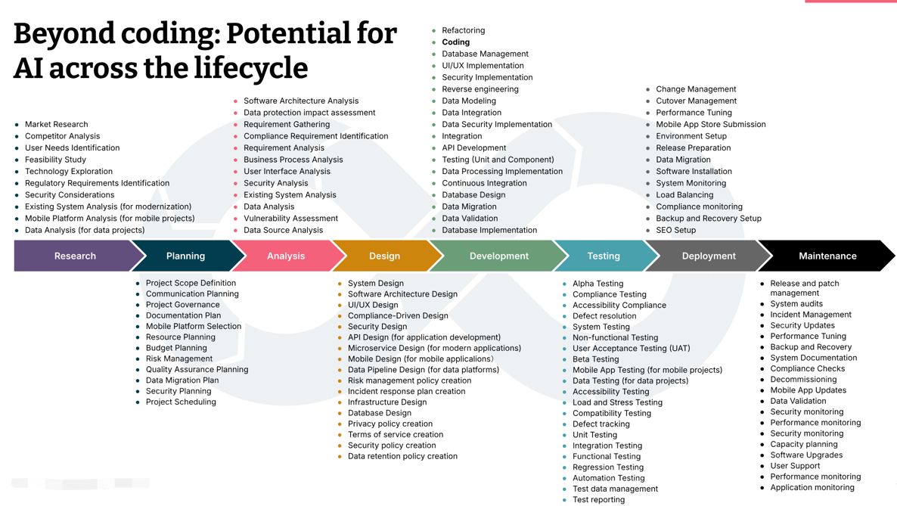

# AI

- [AI 辅助软件工程：实践与案例解析](https://aise.phodal.com/)
- [RAG系列｜大模型之RAG扫盲](https://mp.weixin.qq.com/s/RXJBEo05iZF3etnECc1SlQ)

## General

### concepts

#### Generative AI

- [What is generative AI?](https://www.ibm.com/topics/generative-ai)

Generative AI, sometimes called gen AI, is [artificial intelligence (AI)](https://www.ibm.com/topics/artificial-intelligence) that can create original content—such as text, images, video, audio or software code—in response to a user’s prompt or request.
