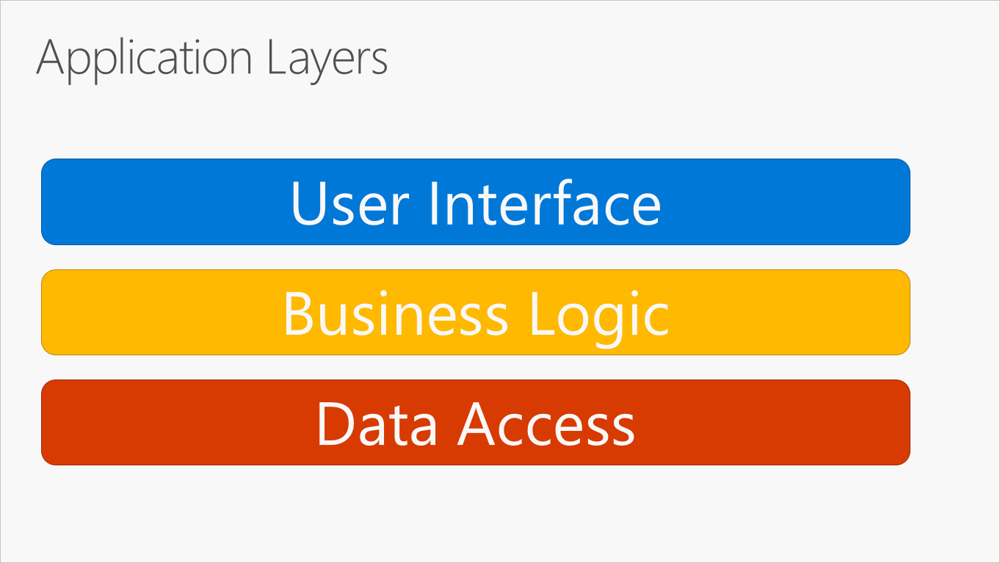
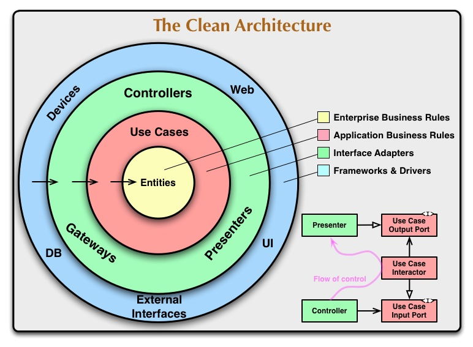
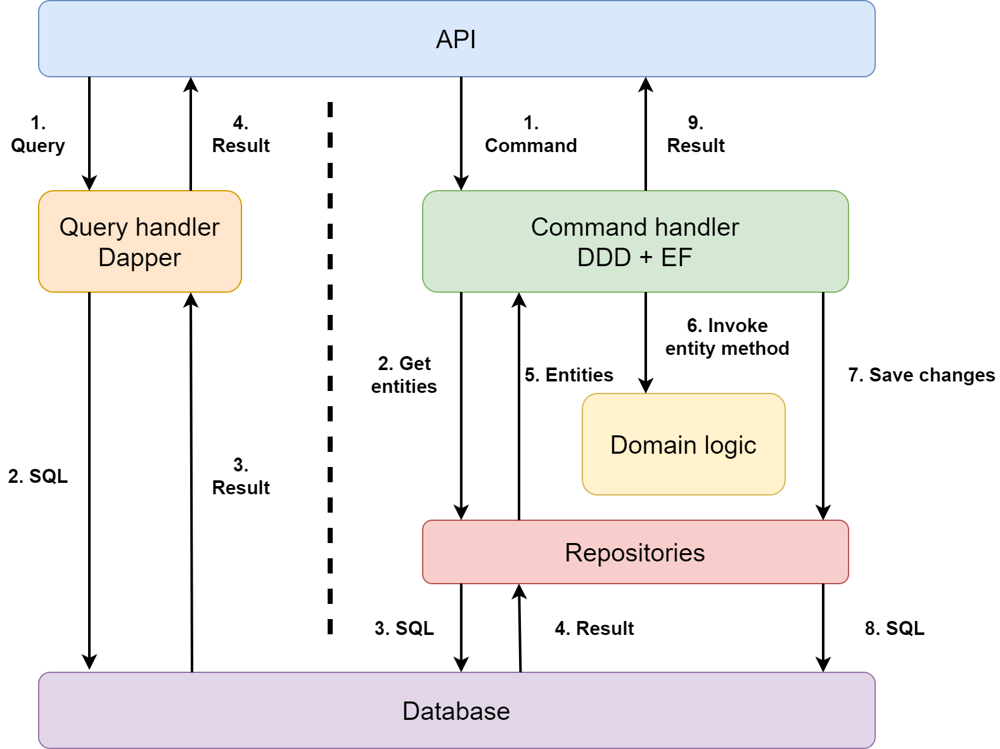

# Architecture

## 传统三层架构 - Traditional "N-Layer" architecture applications

《企业应用架构模式》中提到三个基本层次的架构：表现层、业务层和数据层：



- **表现层UI**，负责对外展示和交互，包括处理请求、展示数据；
- **业务层BL**，负责业务逻辑；
- **数据层DL**，负责与数据库、消息系统、事务管理器等通信。

数据层位于最底层；业务层在数据层之上，依赖数据层；而表现层在其他两层之上。

> 调用可以向下，import 必须向上；下层实现通过接口注入，上层代码永远看不到实现类。

```markdown
com.myapp
├─ ui ← 表现层
│ ├─ controller
│ └─ dto
├─ domain ← 业务层
│ ├─ model
│ └─ repository ← 接口包
└─ infrastructure ← 数据层
├─ persistence ← RepositoryImpl、JPA Entity
└─ messaging ← 消息队列适配器
```

- ui 包只能 `import com.myapp.domain.*;`，禁止出现 `com.myapp.infrastructure.*`。
- domain 包不能出现 `import jakarta.persistence.*`、`import org.springframework.jdbc.*` 等持久化/消息中间件 API。
- infrastructure 包允许 `import com.myapp.domain.repository.OrderRepository`; 去实现接口，但禁止 `import com.myapp.domain.service.*`、`import com.myapp.ui.*`。

## [Clean Architecture](https://blog.cleancoder.com/uncle-bob/2012/08/13/the-clean-architecture.html)



Base on DDD.

- [Hands-on Clean Architecture Template](https://github.com/macdao/hands-on-clean-architecture-template),
  可学习参考，可落地的整洁架构模板。旨在成为项目的代码库模板选项之一。

### Clean Architecture 核心原则


Base on DDD.

- [Hands-on Clean Architecture Template](https://github.com/macdao/hands-on-clean-architecture-template),
  可学习参考，可落地的整洁架构模板。旨在成为项目的代码库模板选项之一。

domain - application - adaptor/infra/presentation

application: 校验（业务校验），转换，编排，再转换

entity/model可以有多个，但聚合根只有一个

side effect, application 处理，但处理时，传给side effect的东西，最大只能是domain entity，额外的东西，即使application拿过，也不会传。


----

Clean Architecture 由 Uncle Bob 提出，遵循以下核心原则：

1. **依赖倒置原则**：内层不依赖外层，外层依赖内层的抽象
2. **单一职责原则**：每一层都有明确的职责边界
3. **开闭原则**：对扩展开放，对修改关闭
4. **框架无关性**：业务逻辑不依赖任何框架

### 架构层次详解

#### 1. Entities (Domain Layer) - 领域层
**职责**：包含业务实体、值对象、领域服务和领域事件
- 纯业务逻辑，零框架依赖
- 定义业务规则和约束
- 包含聚合根、实体和值对象

```java
// Domain Entity - Order (聚合根)
public class Order {
    private OrderId id;
    private CustomerId customerId;
    private List<OrderItem> items;
    private OrderStatus status;
    private Money totalAmount;
    
    public Order(OrderId id, CustomerId customerId) {
        this.id = id;
        this.customerId = customerId;
        this.items = new ArrayList<>();
        this.status = OrderStatus.CREATED;
        this.totalAmount = Money.ZERO;
    }
    
    public void addItem(ProductId productId, int quantity, Money unitPrice) {
        if (status != OrderStatus.CREATED) {
            throw new IllegalStateException("Cannot modify confirmed order");
        }
        
        OrderItem item = new OrderItem(productId, quantity, unitPrice);
        items.add(item);
        recalculateTotal();
    }
    
    public void confirm() {
        if (items.isEmpty()) {
            throw new IllegalStateException("Cannot confirm empty order");
        }
        this.status = OrderStatus.CONFIRMED;
    }
    
    private void recalculateTotal() {
        this.totalAmount = items.stream()
            .map(OrderItem::getSubtotal)
            .reduce(Money.ZERO, Money::add);
    }
}

// Value Object - Money
public class Money {
    public static final Money ZERO = new Money(BigDecimal.ZERO);
    private final BigDecimal amount;
    private final Currency currency;
    
    public Money(BigDecimal amount, Currency currency) {
        this.amount = amount;
        this.currency = currency;
    }
    
    public Money add(Money other) {
        if (!this.currency.equals(other.currency)) {
            throw new IllegalArgumentException("Cannot add different currencies");
        }
        return new Money(this.amount.add(other.amount), this.currency);
    }
}

// Domain Service - OrderPricingService
public class OrderPricingService {
    public Money calculateDiscount(Order order, Customer customer) {
        if (customer.isVip()) {
            return order.getTotalAmount().multiply(0.1); // 10% VIP discount
        }
        return Money.ZERO;
    }
}
```

#### 2. Use Cases (Application Layer) - 应用层
**职责**：业务流程编排、事务管理、输入验证、输出转换
- 协调领域对象完成业务用例
- 处理跨聚合的业务逻辑
- 管理事务边界
- 不包含业务规则，只负责流程编排

```java
// Use Case - CreateOrderUseCase
public class CreateOrderUseCase {
    private final OrderRepository orderRepository;
    private final CustomerRepository customerRepository;
    private final ProductRepository productRepository;
    private final OrderPricingService pricingService;
    
    public CreateOrderUseCase(OrderRepository orderRepository,
                            CustomerRepository customerRepository,
                            ProductRepository productRepository,
                            OrderPricingService pricingService) {
        this.orderRepository = orderRepository;
        this.customerRepository = customerRepository;
        this.productRepository = productRepository;
        this.pricingService = pricingService;
    }
    
    public CreateOrderResponse execute(CreateOrderRequest request) {
        // 1. 输入验证
        validateRequest(request);
        
        // 2. 获取领域对象
        Customer customer = customerRepository.findById(request.getCustomerId())
            .orElseThrow(() -> new CustomerNotFoundException(request.getCustomerId()));
        
        // 3. 创建订单
        Order order = new Order(OrderId.generate(), request.getCustomerId());
        
        // 4. 添加商品
        for (OrderItemRequest itemRequest : request.getItems()) {
            Product product = productRepository.findById(itemRequest.getProductId())
                .orElseThrow(() -> new ProductNotFoundException(itemRequest.getProductId()));
            
            order.addItem(itemRequest.getProductId(), 
                         itemRequest.getQuantity(), 
                         product.getPrice());
        }
        
        // 5. 计算折扣
        Money discount = pricingService.calculateDiscount(order, customer);
        
        // 6. 保存订单
        orderRepository.save(order);
        
        // 7. 返回响应
        return new CreateOrderResponse(order.getId(), order.getTotalAmount(), discount);
    }
    
    private void validateRequest(CreateOrderRequest request) {
        if (request.getCustomerId() == null) {
            throw new ValidationException("Customer ID is required");
        }
        if (request.getItems() == null || request.getItems().isEmpty()) {
            throw new ValidationException("Order must contain at least one item");
        }
    }
}

// DTOs
public class CreateOrderRequest {
    private CustomerId customerId;
    private List<OrderItemRequest> items;
    // getters, setters
}

public class CreateOrderResponse {
    private OrderId orderId;
    private Money totalAmount;
    private Money discount;
    // constructor, getters
}
```

#### 3. Interface Adapters (Infrastructure Layer) - 基础设施层
**职责**：实现接口适配器，连接外部系统
- 数据库访问实现
- 外部API调用
- 消息队列适配
- 缓存实现

```java
// Repository Implementation
@Repository
public class JpaOrderRepository implements OrderRepository {
    private final OrderJpaRepository jpaRepository;
    private final OrderMapper mapper;
    
    public JpaOrderRepository(OrderJpaRepository jpaRepository, OrderMapper mapper) {
        this.jpaRepository = jpaRepository;
        this.mapper = mapper;
    }
    
    @Override
    public Order save(Order order) {
        OrderEntity entity = mapper.toEntity(order);
        OrderEntity savedEntity = jpaRepository.save(entity);
        return mapper.toDomain(savedEntity);
    }
    
    @Override
    public Optional<Order> findById(OrderId id) {
        return jpaRepository.findById(id.getValue())
            .map(mapper::toDomain);
    }
}

// JPA Entity
@Entity
@Table(name = "orders")
public class OrderEntity {
    @Id
    private String id;
    
    @Column(name = "customer_id")
    private String customerId;
    
    @Enumerated(EnumType.STRING)
    private OrderStatus status;
    
    @Column(name = "total_amount")
    private BigDecimal totalAmount;
    
    @Column(name = "currency")
    private String currency;
    
    @OneToMany(mappedBy = "order", cascade = CascadeType.ALL)
    private List<OrderItemEntity> items;
    
    // getters, setters
}

// External API Adapter
public class PaymentGatewayAdapter implements PaymentGateway {
    private final RestTemplate restTemplate;
    private final String baseUrl;
    
    public PaymentGatewayAdapter(RestTemplate restTemplate, @Value("${payment.api.url}") String baseUrl) {
        this.restTemplate = restTemplate;
        this.baseUrl = baseUrl;
    }
    
    @Override
    public PaymentResult processPayment(PaymentRequest request) {
        try {
            PaymentApiRequest apiRequest = new PaymentApiRequest(
                request.getAmount(),
                request.getCurrency(),
                request.getCardToken()
            );
            
            ResponseEntity<PaymentApiResponse> response = restTemplate.postForEntity(
                baseUrl + "/payments",
                apiRequest,
                PaymentApiResponse.class
            );
            
            return new PaymentResult(
                response.getBody().getTransactionId(),
                response.getBody().getStatus()
            );
        } catch (Exception e) {
            throw new PaymentProcessingException("Failed to process payment", e);
        }
    }
}
```

#### 4. Frameworks & Drivers (Presentation Layer) - 表现层
**职责**：用户界面、API接口、配置管理
- REST API控制器
- Web界面
- 配置文件
- 依赖注入配置

```java
// REST Controller
@RestController
@RequestMapping("/api/orders")
public class OrderController {
    private final CreateOrderUseCase createOrderUseCase;
    private final GetOrderUseCase getOrderUseCase;
    
    public OrderController(CreateOrderUseCase createOrderUseCase,
                         GetOrderUseCase getOrderUseCase) {
        this.createOrderUseCase = createOrderUseCase;
        this.getOrderUseCase = getOrderUseCase;
    }
    
    @PostMapping
    public ResponseEntity<CreateOrderResponse> createOrder(@RequestBody CreateOrderRequest request) {
        try {
            CreateOrderResponse response = createOrderUseCase.execute(request);
            return ResponseEntity.ok(response);
        } catch (ValidationException e) {
            return ResponseEntity.badRequest().build();
        } catch (CustomerNotFoundException | ProductNotFoundException e) {
            return ResponseEntity.notFound().build();
        }
    }
    
    @GetMapping("/{orderId}")
    public ResponseEntity<OrderResponse> getOrder(@PathVariable String orderId) {
        try {
            Order order = getOrderUseCase.execute(new GetOrderRequest(OrderId.of(orderId)));
            return ResponseEntity.ok(OrderResponse.from(order));
        } catch (OrderNotFoundException e) {
            return ResponseEntity.notFound().build();
        }
    }
}

// Configuration
@Configuration
public class ApplicationConfig {
    
    @Bean
    public CreateOrderUseCase createOrderUseCase(OrderRepository orderRepository,
                                               CustomerRepository customerRepository,
                                               ProductRepository productRepository,
                                               OrderPricingService pricingService) {
        return new CreateOrderUseCase(orderRepository, customerRepository, 
                                    productRepository, pricingService);
    }
    
    @Bean
    public OrderRepository orderRepository(OrderJpaRepository jpaRepository, OrderMapper mapper) {
        return new JpaOrderRepository(jpaRepository, mapper);
    }
}
```

### 完整项目结构示例

```
src/main/java/com/example/order/
├── domain/                          # 领域层
│   ├── model/
│   │   ├── Order.java              # 订单聚合根
│   │   ├── OrderItem.java          # 订单项实体
│   │   ├── OrderId.java            # 订单ID值对象
│   │   └── OrderStatus.java        # 订单状态枚举
│   ├── service/
│   │   └── OrderPricingService.java # 订单定价服务
│   ├── event/
│   │   └── OrderCreatedEvent.java   # 订单创建事件
│   └── repository/
│       └── OrderRepository.java     # 订单仓储接口
├── application/                     # 应用层
│   ├── usecase/
│   │   ├── CreateOrderUseCase.java # 创建订单用例
│   │   └── GetOrderUseCase.java    # 获取订单用例
│   └── dto/
│       ├── CreateOrderRequest.java  # 创建订单请求
│       └── CreateOrderResponse.java # 创建订单响应
├── infrastructure/                  # 基础设施层
│   ├── persistence/
│   │   ├── JpaOrderRepository.java # JPA订单仓储实现
│   │   ├── OrderEntity.java        # JPA订单实体
│   │   └── OrderMapper.java        # 订单映射器
│   ├── external/
│   │   └── PaymentGatewayAdapter.java # 支付网关适配器
│   └── messaging/
│       └── OrderEventPublisher.java # 订单事件发布器
└── presentation/                    # 表现层
    ├── controller/
    │   └── OrderController.java     # 订单REST控制器
    └── config/
        └── ApplicationConfig.java   # 应用配置
```

### 实际应用场景

#### 1. 电商订单系统
- **Domain**: 订单、商品、用户等核心业务实体
- **Application**: 下单、支付、发货等业务流程
- **Infrastructure**: 数据库、支付网关、物流系统集成
- **Presentation**: 用户界面、管理后台、移动端API

#### 2. 银行账户系统
- **Domain**: 账户、交易、利率等金融实体
- **Application**: 转账、存款、贷款等业务操作
- **Infrastructure**: 核心银行系统、清算系统、风控系统
- **Presentation**: 网银、手机银行、ATM接口

#### 3. 物流配送系统
- **Domain**: 包裹、路线、车辆等物流实体
- **Application**: 路径规划、配送调度、状态跟踪
- **Infrastructure**: GPS系统、地图服务、短信通知
- **Presentation**: 配送员APP、客户查询系统

### 最佳实践

1. **依赖注入**：使用构造函数注入，避免字段注入
2. **异常处理**：定义明确的异常层次，避免泄露技术细节
3. **事务管理**：在应用层管理事务边界
4. **测试策略**：领域层单元测试，应用层集成测试
5. **文档化**：为每个用例编写清晰的文档和示例

domain - application - adaptor/infra/presentation

application: 校验（业务校验），转换，编排，再转换

entity/model可以有多个，但聚合根只有一个

side effect, application 处理，但处理时，传给side effect的东西，最大只能是domain entity，额外的东西，即使application拿过，也不会传。

#### Domain layer

纯业务，零框架依赖

- domain entity/model
- value object
- Domain Service
- Domain Event

### CQRS

CQRS（Command Query Responsibility Segregation，命令查询职责分离）是一种架构模式，核心思想是：

> 把"写（命令）"和"读（查询）"拆成两条完全独立的技术路径，各自选用最适合的模型、存储、甚至部署方式。

- 写端（Command）：只负责更新领域状态，强调一致性、业务规则、事务。
- 读端（Query）：只负责展示数据，强调性能、灵活性，甚至可以不遵循领域模型，直接走宽表、缓存、物化视图



#### CQRS Java 实现示例

```java
// Command Side
public class CreateOrderCommand {
    private final CustomerId customerId;
    private final List<OrderItemCommand> items;
    
    public CreateOrderCommand(CustomerId customerId, List<OrderItemCommand> items) {
        this.customerId = customerId;
        this.items = items;
    }
    // getters
}

public class CreateOrderCommandHandler {
    private final OrderRepository orderRepository;
    
    public void handle(CreateOrderCommand command) {
        Order order = new Order(OrderId.generate(), command.getCustomerId());
        command.getItems().forEach(item -> 
            order.addItem(item.getProductId(), item.getQuantity(), item.getUnitPrice())
        );
        orderRepository.save(order);
    }
}

// Query Side
public class OrderQuery {
    private final String customerId;
    private final LocalDate fromDate;
    private final LocalDate toDate;
    
    // constructor, getters
}

public class OrderQueryHandler {
    private final OrderQueryRepository queryRepository;
    
    public List<OrderSummary> handle(OrderQuery query) {
        return queryRepository.findOrdersByCustomerAndDateRange(
            query.getCustomerId(), 
            query.getFromDate(), 
            query.getToDate()
        );
    }
}

// Query Model (可以完全不同于Domain Model)
public class OrderSummary {
    private final String orderId;
    private final String customerName;
    private final BigDecimal totalAmount;
    private final String status;
    private final LocalDateTime createdAt;
    
    // constructor, getters
}
```

## DDD

- [types-ddd](https://alessandroadm.gitbook.io/types-ddd)
- [DDD领域驱动设计的理解](https://mp.weixin.qq.com/s/9bYfva4RJp4aax7tayDhJA)
