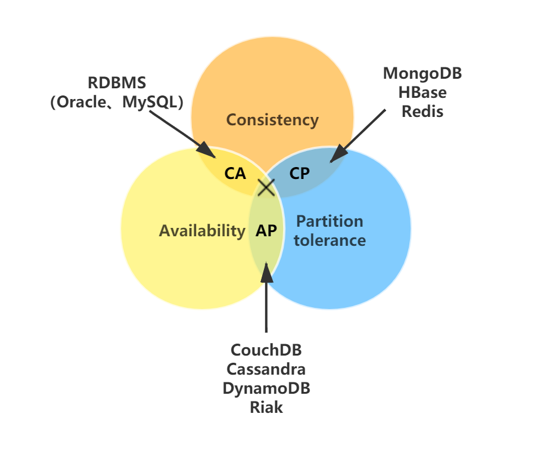

# Concept

## 阻塞、非阻塞和同步、异步

阻塞和非阻塞 I/O 其实是针对操作系统内核而言的，而不是 nodejs 本身。阻塞 I/O 的特点就是**一定要等到操作系统完成所有操作后才表示调用结束**，而非阻塞 I/O 是调用后立马返回，不用等操作系统内核完成操作。

阻塞I/O造成CPU等待I/O，CPU的处理能力不能充分利用，浪费等待时间。
非阻塞I/O不带数据直接返回，性能提高很大，但完整的I/O并没有完成，所有应用程序需要重复调用I/O操作来确认是否完成，这种叫**轮询**

nodejs中的异步 I/O 采用**多线程**的方式，由 `EventLoop`、`I/O 观察者`，`请求对象`、`线程池`四大要素相互配合，共同实现。

## Js

JS属于解释型语言，对于解释型的语言说，解释器会对源代码做如下分析:

1. 通过词法分析和语法分析生成 AST(抽象语法树)，接下来会生成执行上下文
2. 将 AST 转换为字节码（字节码是介于`AST` 和 `机器码`之间的一种代码，但是与特定类型的机器码无关，字节码需要通过解释器将其转换为机器码然后执行。）
3. 由解释器逐行执行字节码，遇到热点代码启动编译器进行编译，生成对应的机器码, 以优化执行效率。

如果把AST直接转成机器码给V8执行，也可以，但转成的机器码的体积太大，引发了严重的内存占用问题。

所以`解释器`是将字节码转成机器码。

在执行字节码的过程中，如果发现某一部分代码重复出现，那么 V8 将它记做`热点代码`(HotSpot)，然后将这段代码`编译`成`机器码`保存起来，这个用来编译的工具就是V8的`编译器`(也叫做TurboFan) , 因此在这样的机制下，代码执行的时间越久，那么执行效率会越来越高，因为有越来越多的字节码被标记为热点代码，遇到它们时直接执行相应的机器码，不用再次将转换为机器码。

编译器和解释器的 根本区别在于前者会编译生成二进制文件但后者不会。

并且，这种字节码跟编译器和解释器结合的技术，称之为即时编译(JIT)。

## [什么是 hash以及hash碰撞？](https://www.zhihu.com/question/26762707/answer/890181997)

哈希算法的实质是对原始数据的有损压缩，有损压缩后的固定字长用作唯一标识原始数据。基本原理就是把任意长度的输入，通过Hash算法变成固定长度的输出。这个映射的规则就是对应的Hash算法，而原始数据映射后的二进制串就是哈希值。活动开发中经常使用的**MD5**和**SHA**都是历史悠久的Hash算法。

若不同的原始数据被有损压缩后产生了相同的结果，该现象称为哈希碰撞。解决的常用的算法是**链地址法**和**开放地址法**。

**哈希表**属于一种物理存储结构，它应用了**哈希算法**因此称之为哈希表。物理存储结构共4种：顺序、链式、索引、散列，其中顺序和链式最常见，这两种存储结构的共同特征是**元素之间有着映射关系**，而哈希表（散列存储结构）的**元素之间相互独立**。索引存储结构类似现实世界中的字典目录，在此不多赘述。哈希表的实现方式：给定一个任意类型的数据，称为**键**，使用**哈希算法**加工该数据，把生成的结果作为键的存储地址。例如给定一个字符串参数 "str"，该键对应的元素是"jack"，那么"jack"的存储地址就是通过哈希算法对"str"进行加工生成的。这么一来，每当存取元素时不会像传统的数据结构逐个遍历、一一对比，而是通过哈希算法直接获取元素的存储地址，因此哈希表会比传统的数据结构更为高效，这也是使用哈希表的原因。

## [CAP定理](https://zh.wikipedia.org/wiki/CAP%E5%AE%9A%E7%90%86)

指的是在一个分布式系统中，一致性（**Consistency**）、可用性（**Availability**）、分区容错性（**Partition tolerance**）。CAP 原则指的是，这三个要素最多只能同时实现两点，不可能三者兼顾。

- 一致性（C）：在分布式系统中的所有数据备份，在同一时刻是否同样的值。（等同于所有节点访问同一份最新的数据副本）

- 可用性（A）：保证每个请求不管成功或者失败都有响应。

- 分区容错性（P）：系统中任意信息的丢失或失败不会影响系统的继续运作。

根据定理，分布式系统只能满足三项中的两项而不可能满足全部三项。理解CAP理论的最简单方式是想象两个节点分处分区两侧。允许至少一个节点更新状态会导致数据不一致，即丧失了C性质。如果为了保证数据一致性，将分区一侧的节点设置为不可用，那么又丧失了A性质。除非两个节点可以互相通信，才能既保证C又保证A，这又会导致丧失P性质。

  分布式系统建立在网络上，需要依靠网络来进行节点之间的通信，由于网络的不稳定性是必然存在的，这可能会导致节点网络断开，专业术语叫“网络分区”。

在上图中当网络分区产生的时候，分布式节点之间无法进行通信，数据无法及时同步，此时客户端对Node A节点数据的修改无法同步到Node B节点上，这会导致分布式系统中数据不一致，一致性（Consistency）将无法得到保证，如果此时要保证分布式系统中数据一致性，那么只能停止提供服务，等待节点网络恢复数据同步之后，在提供服务，但是这样系统就无法满足可用性（Availability）。

因此CAP原理可以这样简单的总结：当网络分区发生时，一致性和可用性不可兼得。

CAP理论应该如何取舍，CAP 原则指的是，这三个要素最多只能同时实现两点，不可能三者兼顾。并且上面有分析在分布式系统中网络分区必然存在的问题，因此理论上CAP在分布式系统中只有CP和AP两种选择。

CP—不要求可用性（Availability），CP追求的是强一致性，每个服务器节点之间的数据必须保证完全一致，选择CP会导致系统在发生网络分区时，无法对外提供服务。CP强一致性的系统架构在银行转账系统中比较常见。Redis、HBase等数据库也是典型的强一致性分布式数据库。

AP—不要求一致性（Consistency），AP追求的是系统高可用，在网络分区发生时，分布式系统仍然能够提供服务，这会导致数据短暂的不一致性。AP高可用的系统架构在淘宝、京东等电商系统的秒杀活动中比较常见。

CA—不允许分区（Partition tolerance），这种情况不符合分布式系统架构，一般情况下都是Mysql、Oracle等RDBMS传统的关系型数据库。

- [CAP原则和BASE理论](https://note.dolyw.com/distributed/00-CAP-BASE.html#_1-%E9%97%AE%E9%A2%98%E7%9A%84%E6%8F%90%E5%87%BA)
