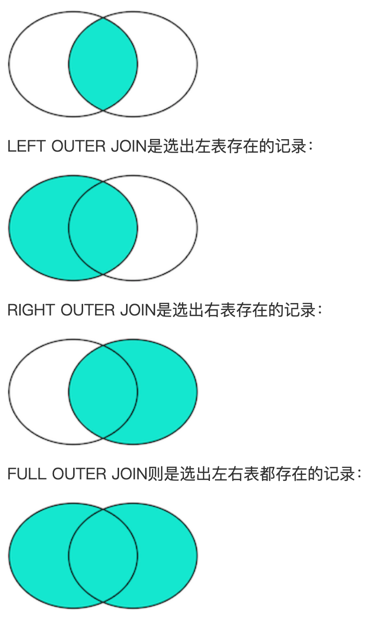

# Summary

- [万字长文详细分享Redis的常见业务场景](https://mp.weixin.qq.com/s/srkd73bS2n3mjIADLVg72A)

## 查询

### 基本查询

`SELECT * FROM <表名>`,`SELECT`是关键字，表示将要执行一个查询，`*`表示“所有列”，FROM表示将要从哪个表查询，

不带FROM子句的SELECT语句有一个有用的用途，就是用来判断当前到数据库的连接是否有效。许多检测工具会执行一条`SELECT 1;`来测试数据库连接。

### 条件查询

`SELECT * FROM <表名> WHERE <条件表达式>`

eg: `SELECT * FROM students WHERE score >= 80`,其中，`WHERE`关键字后面的`score >= 80`就是条件。`score`是列名，该列存储了学生的成绩，因此，`score >= 80`就筛选出了指定条件的记录：

条件表达式可以用`<条件1> AND <条件2>`表达满足条件1并且满足条件2。

eg: `SELECT * FROM students WHERE score >= 80 AND gender = 'M';`

还可以是：`<条件1> OR <条件2>`,`NOT <条件>`

要组合三个或者更多的条件，就需要用小括号`()`表示如何进行条件运算

eg:`SELECT * FROM students WHERE (score < 80 OR score > 90) AND gender = 'M';`

如果不加括号，条件运算按照`NOT`、`AND`、`OR`的优先级进行，即`NOT`优先级最高，其次是`AND`，最后是`OR`。加上括号可以改变优先级。

### 投影查询

`SELECT *`表示查询表的所有列

只查询对应的列：
`SELECT 列1, 列2, 列3 FROM ...`

eg: `SELECT id, score points, name FROM students WHERE gender = 'M';`

score 后的points 是别名，查询除来的列是叫points

### 排序

查询结果集通常根据**主键**排序

`ORDER BY`, eg: `SELECT id, name, gender, score FROM students ORDER BY score;`

`ORDER BY score DESC;` 倒序

`ORDER BY score DESC, gender;` 先按`score`列倒序，如果有相同分数的，再按`gender`列排序;

有`WHERE`子句，那么`ORDER BY`子句要放到`WHERE`子句后面;

### 分页查询

从结果集中“截取”出第`M~N`条记录, `LIMIT <N-M> OFFSET <M>`, eg:

```sql
SELECT id, name, gender, score
FROM students
ORDER BY score DESC
LIMIT 3 OFFSET 0;
```

上述查询`LIMIT 3 OFFSET 0`表示，对结果集从0号记录开始，最多取3条。注意SQL记录集的索引从0开始。

`LIMIT 3 OFFSET 3;` 查询第2页，“跳过”头3条记录，把`OFFSET`设定为`3`，类似的，查询第3页的时候，OFFSET应该设定为6: `LIMIT 3 OFFSET 6;`

规律：

- `LIMIT`总是设定为`pageSize`；
- `OFFSET`计算公式为`pageSize * (pageIndex - 1)`。

使用`LIMIT <M> OFFSET <N>`分页时，随着N越来越大，查询效率也会越来**越低**。

### 聚合查询

`COUNT()`函数查询统计，eg: `SELECT COUNT(*) FROM students;`

`SELECT COUNT(*) boys FROM students WHERE gender = 'M';` `boys`是一个**别名**

- 聚合函数

  | 函数  | 说明                  |
  |-----|---------------------|
  | SUM | 计算某一列的合计值，该列必须为数值类型 |
  | AVG | 计算某一列的平均值，该列必须为数值类型 |
  | MAX | 计算某一列的最大值           |
  | MIN | 计算某一列的最小值           |

eg: 查询计算男生平均成绩 `SELECT AVG(score) average FROM students WHERE gender = 'M';`

如果聚合查询的`WHERE`条件没有匹配到任何行，`COUNT()`会返回**0**，而`SUM()`、`AVG()`、`MAX()`和`MIN()`会返回`NULL`

#### 分组聚合

`SELECT class_id, COUNT(*) num FROM students GROUP BY class_id;` 各个班级的学生人数，按`class_id`分组

`SELECT class_id, gender, COUNT(*) num FROM students GROUP BY class_id, gender;` 统计各班的男生和女生人数

### 多表查询

语法: `SELECT * FROM <表1> <表2>`

查询的结果是一个二维表，它是`表1`和`表2`表的“乘积”

eg:

```sql
SELECT
    s.id sid,
    s.name,
    s.gender,
    s.score,
    c.id cid,
    c.name cname
FROM students s, classes c
WHERE s.gender = 'M' AND c.id = 1;
```

`students s`,`s`是`students`的别名，方便后面` s.id sid,`给列取别名

### 连接查询

连接查询是另一种类型的多表查询。连接查询对多个表进行JOIN运算，简单地说，就是先确定一个主表作为结果集，然后，把其他表的行有选择性地“连接”在主表结果集上。

eg:

```sql
SELECT s.id, s.name, s.class_id, c.name class_name, s.gender, s.score
FROM students s
INNER JOIN classes c
ON s.class_id = c.id;
```

假设查询语句是：
`SELECT ... FROM tableA ??? JOIN tableB ON tableA.column1 = tableB.column2;`

把tableA看作左表，把tableB看成右表，

那么INNER JOIN是选出两张表都存在的记录：


## 修改数据

关系数据库的基本操作就是增删改查，即CRUD：Create、Retrieve、Update、Delete。其中，对于查询，即上面的select

而对于增、删、改，对应的SQL语句分别是：

- INSERT：插入新记录；
- UPDATE：更新已有记录；
- DELETE：删除已有记录

### INSERT

INSERT 语句的基本语法是：`INSERT INTO <表名> (字段1, 字段2, ...) VALUES (值1, 值2, ...);`

eg:

```sql
INSERT INTO students (class_id, name, gender, score) VALUES (2, '大牛', 'M', 80);
```

```sql
INSERT INTO students (class_id, name, gender, score) VALUES
  (1, '大宝', 'M', 87),
  (2, '二宝', 'M', 81);
```

### UPDATE

`UPDATE <表名> SET 字段1=值1, 字段2=值2, ... WHERE ...;`

```sql
UPDATE students SET name='大牛', score=66 WHERE id=1;
```

eg:把所有80分以下的同学的成绩加10分：

```sql
UPDATE students SET score=score+10 WHERE score<80;
```

### DELETE

```sql
DELETE FROM <表名> WHERE ...;
```

删除id=5,6,7的记录

```sql
DELETE FROM students WHERE id>=5 AND id<=7;
```

`DELETE FROM students;` 整个表的所有记录都会被删除

## 事务

例如，一个转账操作：

```sql
-- 从id=1的账户给id=2的账户转账100元
-- 第一步：将id=1的A账户余额减去100
UPDATE accounts SET balance = balance - 100 WHERE id = 1;
-- 第二步：将id=2的B账户余额加上100
UPDATE accounts SET balance = balance + 100 WHERE id = 2;
```

比如两条SQL语句必须全部执行，或者，由于某些原因，如果第一条语句成功，第二条语句失败，就必须全部撤销。这种把多条语句作为一个整体进行操作的功能，被称为数据库**事务**。

数据库事务可以确保该事务范围内的所有操作都可以全部成功或者全部失败。如果事务失败，那么效果就和没有执行这些SQL一样，不会对数据库数据有任何改动。

数据库事务具有ACID这4个特性：

- A：Atomic，原子性，将所有SQL作为原子工作单元执行，要么全部执行，要么全部不执行；
- C：Consistent，一致性，事务完成后，所有数据的状态都是一致的，即A账户只要减去了100，B账户则必定加上了100；
- I：Isolation，隔离性，如果有多个事务并发执行，每个事务作出的修改必须与其他事务隔离；
- D：Duration，持久性，即事务完成后，对数据库数据的修改被持久化存储。

对于单条SQL语句，数据库系统自动将其作为一个事务执行，这种事务被称为**隐式事务**。

要手动把多条SQL语句作为一个事务执行，使用BEGIN开启一个事务，使用COMMIT提交一个事务，这种事务被称为**显式事务**，例如，把上述的转账操作作为一个显式事务：

```sql
BEGIN;
UPDATE accounts SET balance = balance - 100 WHERE id = 1;
UPDATE accounts SET balance = balance + 100 WHERE id = 2;
COMMIT;
```

很显然多条SQL语句要想作为一个事务执行，就必须使用显式事务。

`COMMIT`是指提交事务，即试图把事务内的所有SQL所做的修改永久保存。如果`COMMIT`语句执行失败了，整个事务也会失败。

有些时候，我们希望主动让事务失败，这时，可以用`ROLLBACK`回滚事务，整个事务会失败：
```sql
BEGIN;
UPDATE accounts SET balance = balance - 100 WHERE id = 1;
UPDATE accounts SET balance = balance + 100 WHERE id = 2;
ROLLBACK;
```

### 隔离级别
对于两个并发执行的事务，如果涉及到操作同一条记录的时候，可能会发生问题。因为并发操作会带来数据的不一致性，包括脏读、不可重复读、幻读等。数据库系统提供了隔离级别来让我们有针对性地选择事务的隔离级别，避免数据不一致的问题。

SQL标准定义了4种隔离级别，分别对应可能出现的数据不一致的情况：

| Isolation Level  | 脏读（Dirty Read） | 不可重复读（Non Repeatable Read） | 幻读（Phantom Read） |
|------------------|----------------|----------------------------|------------------|
| Read Uncommitted | Yes            | Yes                        | Yes              |
| Read Committed   | -              | Yes                        | Yes              |
| Repeatable Read  | -              | -                          | Yes              |
| Serializable     | -              | -                          | -                |


#### Read Uncommitted

Read Uncommitted是隔离级别最低的一种事务级别。在这种隔离级别下，一个事务会读到另一个事务更新后但未提交的数据，如果另一个事务回滚，那么当前事务读到的数据就是脏数据，这就是`脏读（Dirty Read）`。

#### Read Committed

在Read Committed隔离级别下，一个事务不会读到另一个事务还没有提交的数据，但可能会遇到不可重复读（Non Repeatable Read）的问题。

不可重复读是指，在一个事务内，多次读同一数据，在这个事务还没有结束时，如果另一个事务恰好修改了这个数据，那么，在第一个事务中，两次读取的数据就可能不一致。

#### Repeatable Read

#### Serializable

Serializable是最严格的隔离级别。在Serializable隔离级别下，所有事务按照次序依次执行，因此，脏读、不可重复读、幻读都不会出现。

虽然Serializable隔离级别下的事务具有最高的安全性，但是，由于事务是串行执行，所以效率会大大下降，应用程序的性能会急剧降低。如果没有特别重要的情景，一般都不会使用Serializable隔离级别。

如果没有指定隔离级别，数据库就会使用默认的隔离级别。在MySQL中，如果使用InnoDB，默认的隔离级别是Repeatable Read。

## Reference

- [SQL教程](https://liaoxuefeng.com/books/sql/introduction/index.html)
