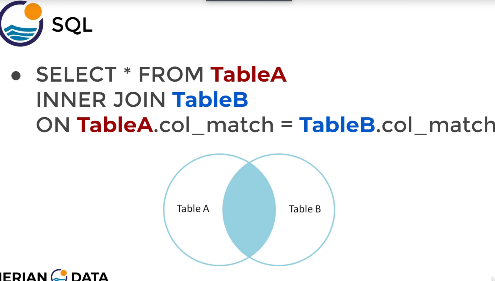
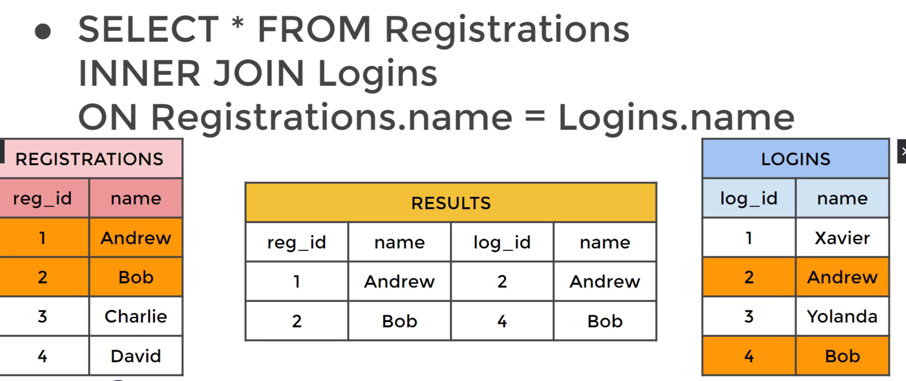
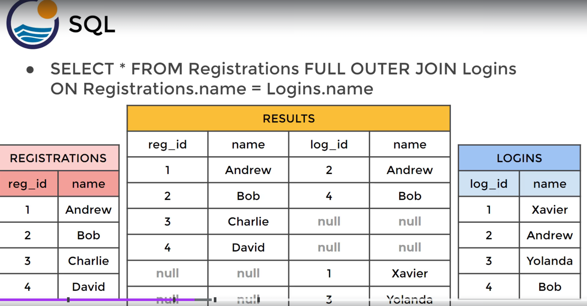
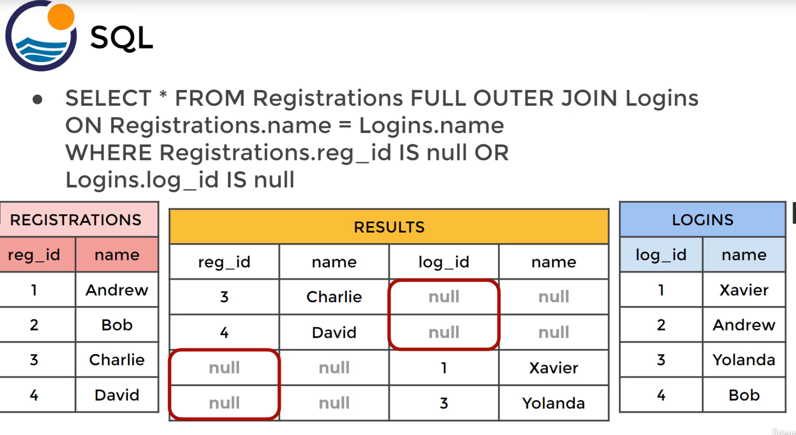
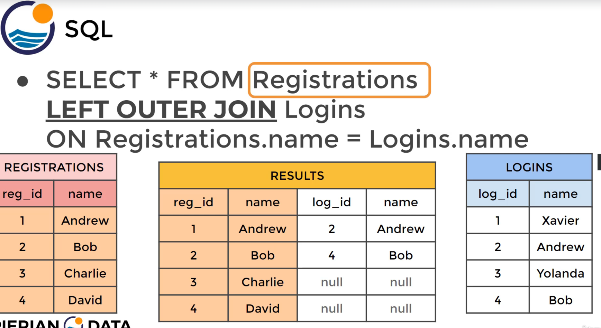
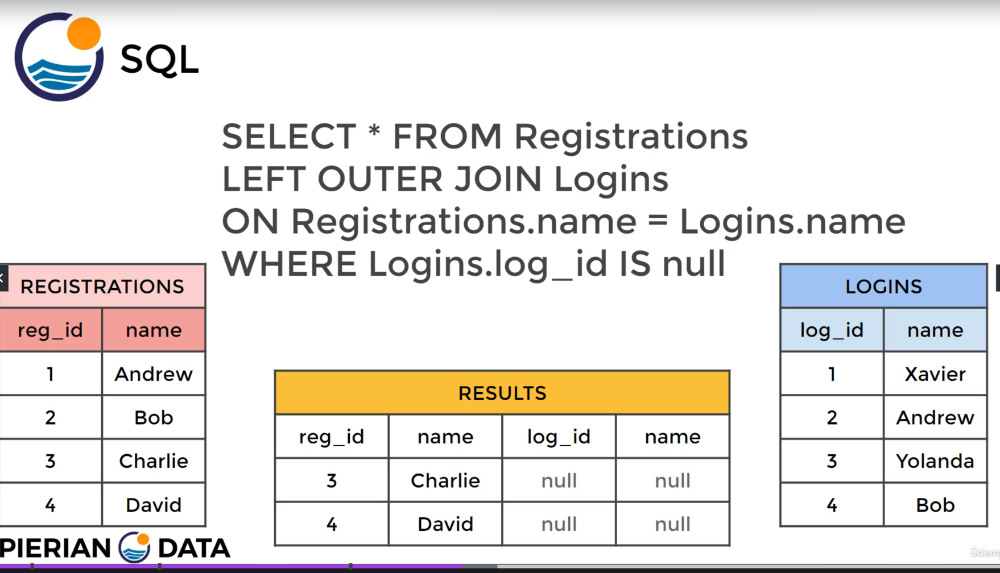

# PostgreSQL

## basic


### DISTINCT

`SELECT DISTINCT c1, c2 FROM tbl`: 从一个名为tbl的表中选择两个不同的列c1和c2，并且使用`DISTINCT`关键字来确保返回的结果中c1和c2的组合是唯一的，即不会有重复的行。

eg: `SELECT DISTINCT (rental_rate) from film;` 只会返回`rental_rate`列，并且每一行是不重复的值

```sql
-- total rows
SELECT COUNT(*) FROM payment;
-- total rows number of uniqe amount
SELECT COUNT(DISTINCT(amount)) FROM payment;
```

```sql
SELECT column1, column2
FROM table
WHERE conditions;
```

### group by

group by一般用于分组统计，它表达的逻辑就是根据一定的规则，进行分组。

```sql
CREATE TABLE `staff` (
  `id` bigint(11) NOT NULL AUTO_INCREMENT COMMENT '主键id',
  `id_card` varchar(20) NOT NULL COMMENT '身份证号码',
  `name` varchar(64) NOT NULL COMMENT '姓名',
  `age` int(4) NOT NULL COMMENT '年龄',
  `city` varchar(64) NOT NULL COMMENT '城市',
  PRIMARY KEY (`id`)
) ENGINE=InnoDB AUTO_INCREMENT=15 DEFAULT CHARSET=utf8 COMMENT='员工表';
```

eg: 统计每个城市的员工数量
`SELECT city ,COUNT(*) as num FROM staff GROUP BY city;`

### Having

由于`WHERE` 不能使用聚合函数，所以这个时候就要使用`HAVING`了。

We can not use `WHERE` to filter based off of aggregate results, because those happen **after** a `WHERE` executed.

`HAVING` allows us to use the aggregate result as a filter along with a GROUP BY

```sql
SELECT company, SUM(sales)
FROM finance_table
WHERE company != 'Google'
GROUP BY company
HAVING sum(sales) > 100
```

### WHERE 和 HAVING 区别及使用场景

#### 区别

- **执行时机**：`WHERE` 在数据分组前过滤，`HAVING` 在数据分组后过滤。
- **聚合函数使用**：`WHERE` 不能使用聚合函数，`HAVING` 可以。
- **逻辑位置**：`WHERE` 用于筛选行，`HAVING` 用于筛选分组后的结果集。

#### 使用场景

- **WHERE**：用于在数据分组前根据条件筛选数据。
- **HAVING**：用于在数据分组和聚合后根据聚合结果筛选数据。

#### 示例

##### WHERE 示例

```sql
-- 统计每个城市中年龄大于30岁的员工数量
SELECT city, COUNT(*) AS num
FROM staff
WHERE age > 30
GROUP BY city;
```

##### HAVING 示例

```sql
-- 选择每个城市的员工数量大于10的城市
SELECT city, COUNT(*) AS num
FROM staff
GROUP BY city
HAVING num > 10;
```

### SQL 查询条件和排序语法

#### BETWEEN

- **语法**：`BETWEEN` 用于选取介于两个值之间的数据范围（包含边界值）。
- **示例**：

```sql
SELECT * FROM employees WHERE salary BETWEEN 5000 AND 10000;
```

此查询将返回所有薪水在5000到10000之间的员工记录。

#### IN

- 语法：`IN` 用于选取列表中指定的值。
- 示例：

```sql
SELECT * FROM customers WHERE country IN ('USA', 'Canada', 'UK');
```

此查询将返回所有来自美国、加拿大或英国的客户记录。

#### LIKE

- 语法：`LIKE` 用于基于模式匹配搜索列中的值（大小写敏感）。
  示例：

```sql
SELECT * FROM products WHERE product_name LIKE '%apple%';
```

此查询将返回所有产品名称中包含“apple”的记录。

#### ILIKE

- 语法：`ILIKE` 用于基于模式匹配搜索列中的值（大小写不敏感，PostgreSQL中使用）。
- 示例：

```sql
SELECT * FROM products WHERE product_name ILIKE '%apple%';
```

此查询将返回所有产品名称中包含“apple”的记录，不区分大小写。

`LIKE` 和 `ILIKE` 操作符后面可以跟通配符 `%`（匹配任意数量的字符）和 `_`（匹配单个字符）。

#### ORDER BY

- 语法：`ORDER BY` 用于根据一个或多个列对结果集进行排序。
- 示例：

```sql
SELECT * FROM sales ORDER BY sale_date DESC;
```

此查询将返回所有销售记录，并按销售日期降序排序。

`ORDER BY` 可以指定 `ASC`（升序，默认）或 `DESC`（降序）

## JOINS

### AS

```sql
SELECT SUM(amount) AS net_revenue
FROM payment;
```

别名是sql最后分配的，不能用它在内部再进行筛选等。

```sql
SELECT costomer_id, SUM(amount) AS total_spent
FROM payment
GROUP BY costomer_id
HAVING SUM(amount) > 0
```

`HAVING SUM(amount) > 100` 这里就不能替换为 `total_spent > 100`

### INNER JOIN

Match in both table, 就是两张表取交集。

```sql
SELECT * FROM TableA
INNER JOIN TableB
ON TableA.col_match = TableB.col_match
```

TableA和TableB的顺序任意



eg:

```sql
SELECT payment_id, payment.customer_id, first_name
FROM payment
INNER JOIN customer
On payment.customer_id = customer.c_id
```

`INNER JOIN`可以简写为`JOIN`



### FULL OUTER JOIN

```sql
SELECT * FROM TableA
FULL OUTER JOIN TableB
ON TableA.col_match = TableB.col_match`
```


---



---


---



### LEFT OUTER JOIN
`OUTER`可以省略


- 不会从TableB中返回任何东西



找到只在A中存在，b中没有的行:


---



### RIGHT JOIN
和`LEFT JOIN`完全相反而已。


### UNION

```sql
SELECT column_name(s) FROM table1
UNION
SELECT column_name(s) FROM table2
```
## Advanced SQL

### timestamps & EXTRACT


```sql
SHOW ALL;
SHOW TIMEZONE;
-- GMT time
SELECT NOW();
SELECT CURRENT_TIME;
SELECT CURRENT_DATE;
```
