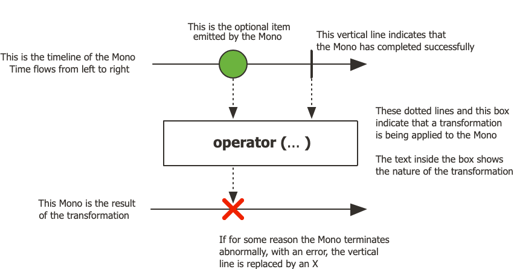
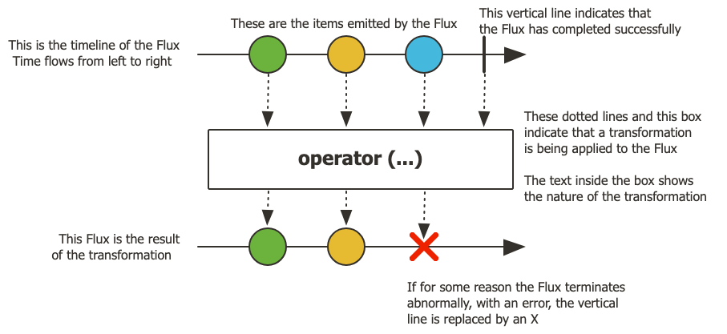
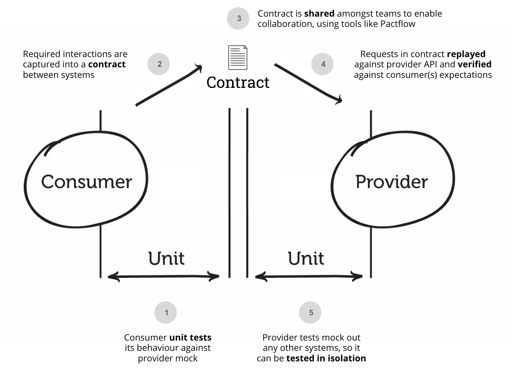

# chore

- [Hands-on Clean Architecture Template](https://github.com/macdao/hands-on-clean-architecture-template),
  可学习参考，可落地的整洁架构模板。旨在成为项目的代码库模板选项之一。

## MapStruct

`MapStruct` 是一个基于注解的 Java 代码生成器，用于简化 Java Bean 之间的映射操作。它通过分析带有 `@Mapper` 注解的接口，在编译时自动生成实现该接口的映射器类。MapStruct 的核心优势包括：

- 简化代码：无需手动编写大量的 get/set 方法，减少代码冗余。
- 性能优越：在编译期生成静态代码，避免了反射带来的性能损耗。
- 类型安全：编译时检查类型匹配，避免运行时错误。
- 灵活映射：支持嵌套对象、集合的映射，以及复杂的自定义逻辑

### 定义映射接口
使用 `Lombok` 库来自动生成 `getter` 和 `setter` 方法;

使用 `@Data` 注解来自动生成 `getter`、`setter`、`toString` 等方法。
```java
import lombok.Data;
import lombok.Builder;

@Data
@NoArgsConstructor
@AllArgsConstructor
public class User {
  private Long id;
  private String name;
  private String email;
  private String password; // 不需要映射的字段
}
```
```java
import lombok.Data;
import lombok.Builder;

@Data
@NoArgsConstructor
@AllArgsConstructor
public class UserDTO {
    private Long id;
    private String name;
    private String email;
}
```
```java
import org.mapstruct.Mapper;
import org.mapstruct.Mapping;
import org.mapstruct.factory.Mappers;

@Mapper(componentModel = "spring") // 使用 Spring 的组件模型
public interface UserMapper {
  UserMapper INSTANCE = Mappers.getMapper(UserMapper.class);

  @Mapping(target = "password", ignore = true)
  UserDTO toDTO(User user);
}
```

### 使用映射器

通过调用生成的映射器实例进行对象转换:

```java
import org.springframework.stereotype.Service;
import org.springframework.beans.factory.annotation.Autowired;

@Service
public class UserService {

  @Autowired
  private UserMapper userMapper;

  public UserDTO convertToDTO(User user) {
    return userMapper.toDTO(user);
  }
}
```
### 测试
在测试中使用 `Builder` 模式
```java
import org.springframework.beans.factory.annotation.Autowired;
import org.springframework.boot.test.context.SpringBootTest;
import org.junit.jupiter.api.Test;

@SpringBootTest
public class UserMapperTest {

    @Autowired
    private UserService userService;

    @Test
    public void testUserToDTO() {
        // 使用 Builder 模式构造 User 对象
        User user = User.builder()
                .id(1L)
                .name("John Doe")
                .email("john@example.com")
                .password("secret123") // 这个字段会被忽略
                .build();

        // 调用 Service 方法进行映射
        UserDTO userDTO = userService.convertToDTO(user);

        // 验证结果
        System.out.println("UserDTO ID: " + userDTO.getId());
        System.out.println("UserDTO Name: " + userDTO.getName());
        System.out.println("UserDTO Email: " + userDTO.getEmail());
    }
}
```

## Lombok

Lombok 是一个用于简化 Java 开发的工具库，通过注解的方式自动生成常见的样板代码，如 `getter`、`setter`、构造函数、`toString`、`equals` 和 `hashCode` 等方法。它旨在减少冗余代码，提高开发效率，同时让代码更加简洁和易读。

### 常用注解
- `@Data`：是一个组合注解，它相当于同时使用了以下注解：
  - `@Getter` 和 `@Setter`：为每个字段生成 `getter` 和 `setter` 方法。
  - `@ToString`：生成  `toString() `  方法。
  -  `@EqualsAndHashCode`：生成 `equals()` 和 `hashCode()` 方法。
  -  `@RequiredArgsConstructor`：生成包含 `final` 字段的构造函数
- `@Builder`：自动生成一个 `Builder` 类，用于构建对象。⽣成全属性的构造方法。支持链式调用。`@Data`和`@Builder`最好不要同时用，可能 既没有无参构造器，也没有完整的全参构造器
- `@NoArgsConstructor`：自动生成一个无参构造函数。
- `@AllArgsConstructor`：自动生成一个全参构造函数。
- `@Getter`：自动生成 `getter` 方法。
- `@Setter`：自动生成 `setter` 方法。
- `@ToString`：自动生成 `toString` 方法。
- `@EqualsAndHashCode`：自动生成 `equals` 和 `hashCode` 方法。
- `@Value`：自动生成一个不可变的类，即所有字段都是 `final` 的。
- `@NonNull`：用于标记字段，表示该字段不能为空。
- `@SneakyThrows`：用于标记方法，表示该方法可能会抛出异常，但编译器不会检查异常。


```java
// 示例代码：使用 Lombok 的 @Builder 注解构建 WebClient
@Configuration
public class WebClientConfig {
    
    @Bean
    public WebClient libraryWebClient() {
        return WebClient.builder()
              .baseUrl("http://localhost:8080")  // 设置基础URL
              .defaultHeader(HttpHeaders.CONTENT_TYPE, MediaType.APPLICATION_JSON_VALUE)
              .build();
    }
}
```

```java
package com.example.library.client;

import java.util.List;

import org.springframework.core.ParameterizedTypeReference;
import org.springframework.http.HttpHeaders;
import org.springframework.http.HttpStatus;
import org.springframework.http.HttpStatusCode;
import org.springframework.http.MediaType;
import org.springframework.stereotype.Component;
import org.springframework.web.reactive.function.client.WebClient;

import lombok.RequiredArgsConstructor;
import reactor.core.publisher.Mono;

@Component("LibraryClient")
@RequiredArgsConstructor
public class LibraryClient {
    public static final String BOOKS_PATH = "/v1/books";
    public static final String AUTHORS_PATH = "/v1/authors";

    // 使用 Lombok 的 @RequiredArgsConstructor 注解，自动生成一个包含所有 final 字段的构造函数
    private final WebClient libraryWebClient;

    public List<BookResponse> getBooks() {
        return libraryWebClient.get()
                .uri(uriBuilder -> uriBuilder
                        .path(BOOKS_PATH)
                        .build())
                .header(HttpHeaders.ACCEPT, MediaType.APPLICATION_JSON_VALUE)
                .retrieve().onStatus(HttpStatusCode::isError,
                        response -> response.bodyToMono(String.class)
                                .defaultIfEmpty("Missing Library response message")
                                .flatMap(responseBody -> Mono.error(new LibraryException(
                                    "Library Error getting books"
                                )))
                ).bodyToMono(new ParameterizedTypeReference<List<BookResponse>>() {})
                .block();
    }

    public List<AuthorResponse> getAuthors() {
        return libraryWebClient.get()
                .uri(uriBuilder -> uriBuilder
                        .path(AUTHORS_PATH)
                        .build())
                .header(HttpHeaders.ACCEPT, MediaType.APPLICATION_JSON_VALUE)
                .retrieve().onStatus(HttpStatusCode::isError,
                        response -> response.bodyToMono(String.class)
                                .defaultIfEmpty("Missing Library response message")
                                .flatMap(responseBody -> Mono.error(new LibraryException(
                                        "Library Error getting authors"
                                )))
                )
                .bodyToMono(new ParameterizedTypeReference<List<AuthorResponse>>() {})
                .block();
    }
}
```
- 组件注册：
`@Component("LibraryClient")`：将 `LibraryClient` 类注册为 `Spring` 容器中的一个组件，名称为 `LibraryClient`，以便可以通过名称在其他地方引用它。
- 构造函数生成：
`@RequiredArgsConstructor`：`Lombok` 提供的注解，自动生成一个包含所有 `final` 字段的构造函数。这里会生成一个包含 `WebClient libraryWebClient` 的构造函数，确保 `libraryWebClient` 在类实例化时被正确注入。

生成的构造函数：
```java
     public LibraryClient(WebClient libraryWebClient) {
         this.libraryWebClient = libraryWebClient;
     }
     
```

## Jackson

Jackson 是一个用于处理 JSON 数据的 Java 库，提供了快速且高效的 JSON 序列化和反序列化功能。它广泛应用于各种 Java 项目中，特别是在需要处理 JSON 数据交换的场景。

### Jackson 的核心模块

Jackson 由以下三个核心模块组成：

- `jackson-core`：用于 JSON 的解析和生成。
- `jackson-databind`：用于数据绑定，将 JSON 数据与 Java 对象进行转换。
- `jackson-annotations`：提供注解支持，用于自定义序列化和反序列化的行为

### 常用注解

- `@JsonProperty`：用于指定 JSON 属性名称。
- `@JsonIgnore`：用于忽略某个字段。
- `@JsonIgnoreProperties`：用于忽略多个字段。

### 常用用法

```java
import com.fasterxml.jackson.annotation.JsonFormat;
import com.fasterxml.jackson.annotation.JsonIgnore;
import com.fasterxml.jackson.annotation.JsonProperty;
import lombok.Data;

import java.time.LocalDateTime;

@Data
public class User {
    private Long id;

    @JsonProperty("full_name")
    private String fullName;

    @JsonIgnore
    private String password;

    private String email;

    @JsonFormat(pattern = "yyyy-MM-dd HH:mm:ss")
    private LocalDateTime lastLoginTime;

    private boolean active;

    // Lombok 的 @Data 注解已经生成了 Getter 和 Setter 方法
}
```
#### 序列化（Java 对象转 JSON 字符串）

```java
import com.fasterxml.jackson.databind.ObjectMapper;
import org.springframework.web.bind.annotation.GetMapping;
import org.springframework.web.bind.annotation.RestController;

@RestController
public class UserController {

    @GetMapping("/user")
    public String getUser() {
        User user = new User();
        user.setId(1L);
        user.setFullName("Alice");
        user.setPassword("secret");
        user.setEmail("alice@example.com");
        user.setLastLoginTime(LocalDateTime.now());
        user.setActive(true);

        ObjectMapper mapper = new ObjectMapper();
        try {
            String jsonString = mapper.writeValueAsString(user);
            return jsonString; // 输出 JSON 字符串
        } catch (Exception e) {
            e.printStackTrace();
            return "Error";
        }
    }
}
```

#### 反序列化（JSON 字符串转 Java 对象）

实际开发中，反序列化通常发生在接收 HTTP 请求时。例如，通过 @RequestBody 注解接收 JSON 数据并自动转换为 Java 对象：
```java
import org.springframework.web.bind.annotation.PostMapping;
import org.springframework.web.bind.annotation.RequestBody;
import org.springframework.web.bind.annotation.RestController;

@RestController
public class UserController {

    @PostMapping("/user")
    public String createUser(@RequestBody User user) {
        // user 对象已经通过 Spring 的 Jackson 配置自动反序列化
        return "User created: " + user.getFullName();
    }
}
```
## Reactor

- [projectreactor](https://projectreactor.io/docs/core/release/reference/gettingStarted.html)
- [Reactor 3 参考指南](https://easywheelsoft.github.io/reactor-core-zh/index.html#intro-reactive)

Reactor 是一个基于 Java 8 的响应式编程库，它实现了响应式流规范（Reactive Streams）。它提供了两种主要的响应式类型：`Mono` 和 `Flux`

* `Mono`: 
   `Mono` 是一个响应式类型，它表示一个异步操作，最多产生一个数据项或一个错误。 



* `Flux`: 
   `Flux` 是一个响应式类型，它表示一个异步操作，可以产生 0 到多个数据项或一个错误。



**Reactive Streams** 是一个规范，定义了响应式编程的基本接口和规则，以实现**非阻塞的背压**（Backpressure）处理。在Java中，Reactive Streams通过发布者（Publisher）和订阅者（Subscriber）之间的交互来实现数据的异步处理。

背压机制：当下游（订阅者）处理数据的速度跟不上上游（发布者）产生数据的速度时，背压机制允许下游控制数据的流动速度，避免因数据积压导致内存溢出等问题。例如，一个网络应用在高并发场景下，如果客户端请求处理速度跟不上数据生成速度，背压机制可以有效缓解这种压力。

### 基于事件驱动和非阻塞I/O

- 事件驱动：Java响应式编程基于事件驱动模型，当有数据可用或事件发生时，系统会触发相应的处理逻辑。例如，在一个Web服务器中，当接收到客户端的请求时，会触发一个事件，然后通过响应式的方式处理请求。
- 非阻塞I/O：与传统的阻塞I/O不同，响应式编程使用非阻塞I/O操作。这意味着在等待I/O操作完成时，线程不会被阻塞，可以继续处理其他任务。例如，在一个文件读取操作中，使用非阻塞I/O可以在等待文件数据读取完成的同时，处理其他请求


### Spring MVC（传统模型）

一个请求一个线程

- 线程模型：Spring MVC使用Servlet容器（如Tomcat）来处理HTTP请求。每个HTTP请求都会分配一个独立的线程来处理，直到请求完成。这种模型被称为“线程池模型”，线程池中的线程会被复用，但每个请求在处理过程中会占用一个线程。
- 阻塞I/O：传统的Servlet API是基于阻塞I/O的。当线程等待I/O操作（如数据库查询、文件读写等）完成时，线程会被阻塞，无法处理其他任务。这会导致线程资源的浪费，尤其是在高并发场景下。
- 资源利用率：由于线程在等待I/O操作时会被阻塞，系统需要创建更多的线程来处理高并发请求，这会增加线程上下文切换的开销，降低系统的吞吐量。

### Spring WebFlux（响应式模型）

#### 非阻塞I/O和事件驱动

- 线程模型：Spring WebFlux不依赖传统的Servlet容器，而是使用响应式编程模型。它基于事件驱动和非阻塞I/O，允许单个线程处理多个请求。这种模型被称为“事件循环模型”，类似于Node.js的事件循环。常用的容器有`Netty`, `Undertow`, `Tomcat`
- 非阻塞I/O：Spring WebFlux使用非阻塞I/O操作，当线程等待I/O操作完成时，不会被阻塞，而是可以继续处理其他任务。这大大提高了线程的利用率。
- 事件循环：Spring WebFlux使用事件循环来处理请求。事件循环会监听各种事件（如HTTP请求、I/O操作完成等），并触发相应的处理逻辑。这种模型减少了线程的创建和销毁，提高了系统的吞吐量。

#### 响应式编程模型

- Flux和Mono：Spring WebFlux使用Flux和Mono等响应式类型来表示数据流。这些类型支持链式调用和背压机制，可以方便地进行数据处理。
- 背压机制：当下游处理数据的速度跟不上上游生成数据的速度时，背压机制可以控制数据的流动速度，避免内存溢出等问题。
- 异步处理：Spring WebFlux支持异步处理，可以更高效地处理高并发请求。例如，异步的数据库查询操作不会阻塞主线程，主线程可以继续处理其他请求。

### 常用操作符

#### flatMap

将每个元素转换为新的异步流（Mono/Flux），并按时间顺序合并结果。异步嵌套调用（如HTTP请求、数据库查询）。

```java
Flux<UserId> userIds = Flux.just("1", "2", "3");
Flux<User> users = userIds.flatMap(id -> userService.getUserById(id)); // 异步获取用户详情
```

- `map`：同步、直接转换元素的值，不处理异步流。
- `flatMap`：异步、展开嵌套流，处理返回 `Publisher` 的操作。

```java
// 假设 userService.getUserById 返回 Mono<User>
// orderService.getOrders 返回 Flux<Order>

// 错误：map 导致返回 Flux<Mono<Flux<Order>>>
Flux<Mono<Flux<Order>>> wrong = userIds
    .map(id -> userService.getUserById(id)
        .map(user -> orderService.getOrders(user.getId()))
    );

// 正确：flatMap 展开所有流
Flux<Order> correct = userIds
    .flatMap(id -> userService.getUserById(id))       // 获取用户
    .flatMap(user -> orderService.getOrders(user.getId())); // 获取订单
```

#### concatMap

类似 `flatMap`，但严格保留元素顺序。需要顺序保障的异步操作。

```java
Flux<User> users = userIds.concatMap(id -> userService.getUserById(id)); // 按顺序处理
```

#### `Mono.block()`

`Mono.block()`方法的作用是**同步**等待Mono中的异步操作完成，并返回操作的结果。如果Mono中没有元素，则返回`null`；如果操作失败，则抛出异常。

```java
import reactor.core.publisher.Mono;

public class MonoBlockExample {
    public static void main(String[] args) {
        Mono<String> mono = Mono.just("Hello, World!");

        // 同步等待并获取结果
        String result = mono.block();

        System.out.println(result); // 输出: Hello, World!
    }
}
```

处理异步操作的异常

```java
import reactor.core.publisher.Mono;

public class MonoBlockErrorExample {
    public static void main(String[] args) {
        Mono<String> mono = Mono.error(new RuntimeException("Something went wrong"));

        try {
            // 同步等待并获取结果
            String result = mono.block();
            System.out.println(result);
        } catch (RuntimeException e) {
            System.err.println("Error: " + e.getMessage());
        }
    }
}
```

- 阻塞线程: `block()`方法会阻塞当前线程，直到异步操作完成。在响应式编程中，阻塞操作通常被认为是反模式，因为它会降低系统的响应性和吞吐量。因此，尽量避免在响应式流中使用`block()`方法，除非你确实需要同步获取结果。

##### 替代方案

如果需要处理异步操作的结果，但又不想阻塞线程，可以使用响应式编程的其他操作符，如`subscribe`、`map`、`flatMap`等。这些操作符可以让你以非阻塞的方式处理异步操作的结果。

```java
import reactor.core.publisher.Mono;

public class MonoMapExample {
    public static void main(String[] args) {
        Mono<String> mono = Mono.just("Hello, World!");

        // 使用map对数据进行转换
        Mono<String> transformedMono = mono.map(s -> s.toUpperCase());

        // 使用subscribe处理最终结果
        transformedMono.subscribe(
            result -> System.out.println("Transformed: " + result), // 处理结果
            error -> System.err.println("Error: " + error) // 处理错误
        );
    }
}
```

#### Mono.zipWhen

基于前一个结果触发新操作，合并两者的结果。链式依赖操作（如先获取用户，再获取订单）。

在第一个流（Mono）完成后，基于其结果触发第二个流，并将两个结果合并为一个元组。

专用于 `Mono`（`Flux` 无此操作符）。 链式依赖：第二个流的输入依赖第一个流的输出。

```java
Mono<User> userMono = userService.getUserById("1");
Mono<Tuple2<User, Order>> result = userMono
    .zipWhen(user -> orderService.getOrder(user.getOrderId())); // 合并用户和订单
```

#### Mono.zip

`Mono.zip` 是 `Mono` 的静态方法，用于将多个 `Mono` 组合成一个 `Mono`，并发执行所有传入的 `Mono`，并在所有操作完成后将结果组合成一个元组（Tuple）。

如果任何一个 `Mono` 失败，`Mono.zip` 会立即终止并传播错误。


- `getUser(String userId)`：获取用户信息。
- `getOrders(String userId)`：获取用户的订单。
- `getPreferences(String userId)`：获取用户的偏好设置。

```java
public Mono<UserProfile> getUserProfile(String userId) {
    Mono<User> userMono = getUser(userId);
    Mono<List<Order>> ordersMono = getOrders(userId);
    Mono<Preferences> preferencesMono = getPreferences(userId);

    return Mono.zip(userMono, ordersMono, preferencesMono)
               .map(tuple -> {
                   User user = tuple.getT1();
                   List<Order> orders = tuple.getT2();
                   Preferences preferences = tuple.getT3();
                   return new UserProfile(user, orders, preferences);
               });
}
```

```java
class Test {
  public static void main(String[] args) {
    return assetAndItemClient
      .getAsset(assetId)  // 1. 发起 getAsset 请求
      .flatMap(asset -> {
        // 2. 并发执行所有操作
        return Mono.zip(
          getClassifications(asset.classificationId()),  // 2.1 获取分类信息
          getItems(assetId),  // 2.2 获取项目信息
          getDeal(assetId),  // 2.3 获取交易信息
          getSeller(asset.sellerId()),  // 2.4 获取卖家信息
          getAnotherInfo(asset.anotherId())  // 2.5 获取其他信息
        ).map(tuple -> {
          // 3. 组合所有结果并映射为 DTO
          return AssetAndItemResourceMapper.INSTANCE.toAssetDetailResponseDto(
            asset,  // getAsset 的结果
            tuple.getT1(),  // getClassifications 的结果
            tuple.getT2(),  // getItems 的结果
            tuple.getT3(),  // getDeal 的结果
            tuple.getT4(),  // getSeller 的结果
            tuple.getT5()   // getAnotherInfo 的结果
          );
        });
      });
  }
}
```

组合动态数量的 `Mono`

```java
class Test {
  public static void main(String[] args) {
    List<Mono<String>> monos = List.of(
      Mono.just("A"),
      Mono.just("B"),
      Mono.just("C")
    );

    Mono<List<String>> zippedMono = Mono.zip(monos, array -> {
      List<String> results = new ArrayList<>();
      for (Object item : array) {
        results.add((String) item);
      }
      return results;
    });

    zippedMono.subscribe(results -> {
      System.out.println("Combined Results: " + results); // Combined Results: [A, B, C]
    });
  }
}
```

#### zipWith

将当前流与另一个流直接组合，合并两者的元素（一对一配对）。适用于 Mono 和 Flux。

并行执行：两个流独立运行，结果按到达顺序配对。所以2个是**并发**的

也可以链式掉用多个`.zipWith`组合多个 Publisher，并且所有的 `Publisher` 都是并发执行的

如果任何一个 `Publisher` 失败，`zipWith` 会立即终止并传播错误。 即另一个 `Publisher` 会被取消订阅。

```java
import reactor.core.publisher.Mono;
import reactor.util.function.Tuple2;

public class ZipWithExample1 {
  public static void main(String[] args) {
    Mono<String> mono1 = Mono.just("Hello");
    Mono<String> mono2 = Mono.just("World");

    Mono<Tuple2<String, String>> zippedMono = mono1.zipWith(mono2);

    zippedMono.subscribe(tuple -> {
      System.out.println("Tuple2: (" + tuple.getT1() + ", " + tuple.getT2() + ")"); // Tuple2: (Hello, World)
    });
  }
}
```

组合两个 `Flux`

```java
import reactor.core.publisher.Flux;
import reactor.util.function.Tuple2;

public class ZipWithExample2 {
  public static void main(String[] args) {
    Flux<Integer> flux1 = Flux.just(1, 2, 3);
    Flux<String> flux2 = Flux.just("A", "B", "C");

    Flux<Tuple2<Integer, String>> zippedFlux = flux1.zipWith(flux2);

    zippedFlux.subscribe(tuple -> {
      System.out.println("Tuple2: (" + tuple.getT1() + ", " + tuple.getT2() + ")");
    });
  }
}
// 输出
//Tuple2: (1, A)
//Tuple2: (2, B)
//Tuple2: (3, C)
```
自定义组合函数

```java
import reactor.core.publisher.Mono;

public class ZipWithExample3 {
    public static void main(String[] args) {
        Mono<String> mono1 = Mono.just("Hello");
        Mono<String> mono2 = Mono.just("World");

        Mono<String> zippedMono = mono1.zipWith(mono2, (result1, result2) -> {
            return result1 + " " + result2;
        });

        zippedMono.subscribe(result -> {
            System.out.println("Combined Result: " + result);
        });
    }
}
```
输出：`Combined Result: Hello World`

##### 异常

```java
import reactor.core.publisher.Mono;
import reactor.util.function.Tuple2;

import java.time.Duration;

public class ZipWithErrorExample {
    public static void main(String[] args) throws InterruptedException {
        Mono<String> mono1 = Mono.fromCallable(() -> {
                System.out.println("Starting mono1");
                Thread.sleep(1000); // 模拟耗时操作
                System.out.println("Completed mono1");
                return "Hello";
            })
            .subscribeOn(reactor.core.scheduler.Schedulers.parallel());

        Mono<String> mono2 = Mono.fromCallable(() -> {
                System.out.println("Starting mono2");
                throw new RuntimeException("Error in mono2"); // 模拟失败
            })
            .subscribeOn(reactor.core.scheduler.Schedulers.parallel());

        Mono<Tuple2<String, String>> zippedMono = mono1.zipWith(mono2);

        zippedMono.subscribe(
            tuple -> System.out.println("Tuple2: (" + tuple.getT1() + ", " + tuple.getT2() + ")"),
            error -> System.out.println("Error: " + error.getMessage())
        );

        // 等待异步操作完成
        Thread.sleep(2000);
    }
}

// 输出
//Starting mono1
//Starting mono2
//Error: Error in mono2
```

- `zipWith` 捕获到 `mono2` 的异常，立即终止并传播错误。
- `mono1` 被取消订阅，因此不会输出 Completed mono1。

| 特性 | zipWith | Mono.zip | Flux.concat |
| --- | --- | --- | --- |
| 执行方式 | 并发执行 | 并发执行 | 顺序执行 |
| 结果组合 | 组合两个 Publisher 的结果 | 组合多个 Mono 的结果 | 按顺序合并多Publisher果 |
| 错误处理 | 任何一个失败则终止 | 任何一个失败则终止 | 任何一个失败则终止 |
| 适用场景 | 并发执行两个异步操作并组合结果 | 并发执行多个异步操作并组合结果 | 按顺序执行多个异步操作并合并结果 |


- `zipWith`：适合并发执行两个异步操作并组合结果。
- `Mono.zip`：适合并发执行多个异步操作并组合结果。
- `Flux.concat`：适合按顺序执行多个异步操作并合并结果。


##### 异常处理

- 默认情况下，如果任何一个 `Publisher` 失败，都会立即终止并传播错误。
- 使用 `onErrorContinue` 忽略异常，继续处理。
- 使用 `onErrorResume` 捕获异常，并返回默认值。
- 使用 `retryWhen` 重试。

#### switchIfEmpty

当流为空时，切换到备用流。

场景：提供默认值或回退逻辑。

```java
class Test {
  public static void main(String[] args) {
    userService.getUserById("unknown")
      .switchIfEmpty(Mono.just(User.DEFAULT_USER)) // 找不到用户时返回默认
      .subscribe(System.out::println);
  }
}
```

用户登录后获取订单和地址，合并结果并处理异常。

```java
class Test {
  public static void main(String[] args) {
    userService.login("user", "pass")
      // 1. 先获取用户订单
      .zipWhen(user -> orderService.getOrder(user.getId()))
      // 此时流类型为 Mono<Tuple2<User, Order>>

      // 2. 再基于用户和订单获取地址
      .zipWhen(userAndOrder ->
        addressService.getAddress(userAndOrder.getT1().getId())
      )
      // 此时流类型为 Mono<Tuple2<Tuple2<User, Order>, Address>>

      // 3. 解构元组并构建 UserProfile
      .map(combined -> {
        User user = combined.getT1().getT1(); // 第一个 Tuple2 的 User
        Order order = combined.getT1().getT2(); // 第一个 Tuple2 的 Order
        Address address = combined.getT2(); // 第二个操作的 Address
        return new UserProfile(user, order, address);
      })

      // 4. 超时控制（5秒）
      .timeout(Duration.ofSeconds(5))

      // 5. 异常处理
      .onErrorResume(e -> {
        log.error("Error: ", e);
        return Mono.just(UserProfile.fallback());
      })

      // 6. 重试策略（最多2次，间隔1秒）
      .retryWhen(Retry.fixedDelay(2, Duration.ofSeconds(1)));
  }
}
```

### getT1

假设有一个 `Tuple2` 对象：

```java
Tuple2<String, Integer> tuple = Tuples.of("Alice", 30);
String name = tuple.getT1(); // 返回第一个元素 "Alice"
Integer age = tuple.getT2(); // 返回第二个元素 30
```

`Tuple` 是所有元组的抽象基类。

`Tuple2` 是 `Tuple` 的一个具体子类，用于存储两个元素。

`Tuple2` 是 Reactor 中用于存储两个值的元组类型。

通过 `getT1()` 和 `getT2()`` 访问元素。

## R2DBC

R2DBC（Reactive Relational Database Connectivity）是一个基于`Reactive Streams`规范的**非阻塞API**，用于在Java应用程序中以响应式编程的方式访问关系型数据库。它解决了传统JDBC（Java Database Connectivity）的阻塞问题，允许开发者在响应式编程环境中高效地与SQL数据库交互。

在 Spring Data R2DBC 中，动态查询方法是通过方法名解析机制来实现的。Spring Data 会根据方法名的命名约定，自动生成对应的 SQL 查询语句。这种方法大大减少了手动编写 SQL 的工作量，并且使得代码更加简洁和易于维护。

Spring Data R2DBC 会解析方法名，根据命名约定生成对应的查询逻辑。例如：
- findByField：表示根据某个字段进行精确匹配。
- findByFieldContaining：表示根据某个字段进行模糊匹配（包含某个子字符串）。
- findByFieldGreaterThan：表示根据某个字段进行大于比较。
- findByFieldLessThan：表示根据某个字段进行小于比较。

方法名 `findByTitleContaining` 会生成类似以下的 SQL 查询：

```sql
SELECT * FROM tutorial WHERE title LIKE '%?%'
```
findByTitleStartingWith => `SELECT * FROM tutorial WHERE title LIKE '?%'`

动态查询方法的返回类型通常是响应式类型，如 `Flux<T>` 或 `Mono<T>`，以支持异步操作。

### Example

* application.properties

在`src/main/resources/application.properties`中配置R2DBC连接信息：

```properties
spring.r2dbc.url=r2dbc:postgresql://localhost:5432/testdb
spring.r2dbc.username=postgres
spring.r2dbc.password=123
```

* 定义数据模型

在model包中创建Tutorial类：

```java
package com.example.demo.model;

import org.springframework.data.annotation.Id;

public class Tutorial {
    @Id
    private int id;
    private String title;
    private String description;
    private boolean published;

    // 构造函数、getter和setter省略

    @Override
    public String toString() {
        return "Tutorial [id=" + id + ", title=" + title + ", description=" + description + ", published=" + published + "]";
    }
}
```

* 创建`Repository`接口

Repository接口封装了与数据库交互的逻辑，使得业务逻辑层（Service层）不需要直接处理数据库操作的

```java
package com.example.demo.repository;

import com.example.demo.model.Tutorial;
import org.springframework.data.r2dbc.repository.R2dbcRepository;
import org.springframework.stereotype.Repository;
import reactor.core.publisher.Flux;
import reactor.core.publisher.Mono;

@Repository
public interface TutorialRepository extends R2dbcRepository<Tutorial, Integer> {
    Flux<Tutorial> findByTitleContaining(String title);
}
```

**Spring Data R2DBC 会根据方法名生成对应的 SQL 查询语句，并将方法参数绑定到查询语句中。**

方法名 `findByTitleContaining` 会生成类似以下的 SQL 查询：

```sql
SELECT * FROM tutorial WHERE title LIKE '%?%'
```
findByTitleStartingWith => `SELECT * FROM tutorial WHERE title LIKE '?%'`


* Service层
```java
package com.example.demo.service;

import com.example.demo.model.Tutorial;
import com.example.demo.repository.TutorialRepository;
import org.springframework.beans.factory.annotation.Autowired;
import org.springframework.stereotype.Service;
import reactor.core.publisher.Flux;
import reactor.core.publisher.Mono;

@Service
public class TutorialService {
    @Autowired
    private TutorialRepository repository;

    public Flux<Tutorial> findAll() {
        return repository.findAll();
    }

    public Mono<Tutorial> findById(int id) {
        return repository.findById(id);
    }

    public Mono<Tutorial> save(Tutorial tutorial) {
        return repository.save(tutorial);
    }

    public Mono<Void> deleteById(int id) {
        return repository.deleteById(id);
    }

    public Flux<Tutorial> findByTitleContaining(String title) {
        return repository.findByTitleContaining(title);
    }
}
```

* Controller层

```java
package com.example.demo.controller;

import com.example.demo.model.Tutorial;
import com.example.demo.service.TutorialService;
import org.springframework.beans.factory.annotation.Autowired;
import org.springframework.web.bind.annotation.*;
import reactor.core.publisher.Flux;
import reactor.core.publisher.Mono;

@RestController
@RequestMapping("/api/tutorials")
public class TutorialController {
    @Autowired
    private TutorialService service;

    @GetMapping
    public Flux<Tutorial> getAllTutorials() {
        return service.findAll();
    }

    @GetMapping("/{id}")
    public Mono<Tutorial> getTutorialById(@PathVariable int id) {
        return service.findById(id);
    }

    @PostMapping
    public Mono<Tutorial> createTutorial(@RequestBody Tutorial tutorial) {
        return service.save(tutorial);
    }

    @DeleteMapping("/{id}")
    public Mono<Void> deleteTutorial(@PathVariable int id) {
        return service.deleteById(id);
    }

    @GetMapping("/search")
    public Flux<Tutorial> searchTutorials(@RequestParam String title) {
        return service.findByTitleContaining(title);
    }
}
```
* 启动类

```java
package com.example.demo;

import org.springframework.boot.CommandLineRunner;
import org.springframework.boot.SpringApplication;
import org.springframework.boot.autoconfigure.SpringBootApplication;
import org.springframework.context.annotation.Bean;
import org.springframework.core.io.ClassPathResource;
import org.springframework.r2dbc.connection.init.ConnectionFactoryInitializer;
import org.springframework.r2dbc.connection.init.ResourceDatabasePopulator;
import reactor.core.publisher.Flux;

import java.time.Duration;

@SpringBootApplication
public class AccessingDataR2dbcApplication {

    public static void main(String[] args) {
        SpringApplication.run(AccessingDataR2dbcApplication.class, args);
    }

    @Bean
    ConnectionFactoryInitializer initializer(ConnectionFactory connectionFactory) {
        ConnectionFactoryInitializer initializer = new ConnectionFactoryInitializer();
        initializer.setConnectionFactory(connectionFactory);
        initializer.setDatabasePopulator(new ResourceDatabasePopulator(new ClassPathResource("schema.sql")));
        return initializer;
    }

    @Bean
    CommandLineRunner demo(TutorialRepository repository) {
        return args -> {
            Flux.just(
                    new Tutorial("Spring Boot", "Spring Boot with R2DBC", true),
                    new Tutorial("Spring Data", "Spring Data R2DBC", false)
            ).flatMap(repository::save)
              .thenMany(repository.findAll())
              .subscribe(System.out::println);
        };
    }
}
```
* sql

```sql
CREATE TABLE IF NOT EXISTS tutorial (
  id SERIAL PRIMARY KEY,
  title VARCHAR(255),
  description TEXT,
  published BOOLEAN
);
```

## [PACT](https://docs.pact.io/getting_started/how_pact_works)



Pact 是一种**契约测试**工具，通过定义和验证应用程序之间交互的契约来确保它们能够正确地协同工作。契约测试的核心思想是，消费者（Consumer）和提供者（Provider）之间通过一个契约来约定交互的格式和内容。

- 适用场景：契约测试适用于任何两个需要通信的服务，例如 API 客户端和 Web 前端。在微服务架构中，契约测试尤其有用，因为它可以帮助开发者避免版本冲突，确保服务之间的兼容性。
- 术语：在契约测试中，通常有两个角色：消费者（Consumer）和提供者（Provider）。消费者是需要接收数据的客户端，提供者是提供数据的服务端。

* Consumer: An application that makes use of the functionality or data from another application to do its job. For applications that use HTTP, the consumer is always the application that initiates the HTTP request (eg. the web front end), regardless of the direction of data flow. For applications that use queues, the consumer is the application that reads the message from the queue.
* Provider: An application (often called a service) that provides functionality or data for other applications to use, often via an API. For applications that use HTTP, the provider is the application that returns the response. For applications that use queues, the provider (also called producer) is the application that writes the messages to the queue.

A contract between a consumer and provider is called a pact. Each pact is a collection of interactions. Each interaction describes:

* For HTTP:

An expected request - describing what the consumer is expected to send to the provider
A minimal expected response - describing the parts of the response the consumer wants the provider to return.
* For messages:

The minimal expected message - describing the parts of the message that the consumer wants to use.


### Example

* 消费者测试
消费者测试的核心是定义与提供者交互的契约。

Data model

```java
package com.example.consumer.model;

import lombok.Data;

@Data
public record Order(int id, String[] items) {
}
```

order client 简单实现

```java
package com.example.consumer.client;

import com.example.consumer.model.Order;
import org.springframework.web.client.RestTemplate;

import java.util.Arrays;

public class OrderApiClient {
    private final RestTemplate restTemplate;
    private final String baseUrl;

    public OrderApiClient(String baseUrl) {
        this.baseUrl = baseUrl;
        this.restTemplate = new RestTemplate();
    }

    public Order[] fetchOrders() {
        return restTemplate.getForObject(baseUrl + "/orders", Order[].class);
    }
}
```

```java
package com.example.consumer;

import au.com.dius.pact.consumer.dsl.PactDslWithProvider;
import au.com.dius.pact.consumer.junit5.PactConsumerTestExt;
import au.com.dius.pact.consumer.junit5.PactTestFor;
import au.com.dius.pact.core.model.RequestResponsePact;
import au.com.dius.pact.core.model.annotations.Pact;
import com.example.consumer.client.OrderApiClient;
import com.example.consumer.model.Order;
import org.junit.jupiter.api.Test;
import org.junit.jupiter.api.extension.ExtendWith;
import org.springframework.web.client.RestTemplate;

import static org.junit.jupiter.api.Assertions.assertEquals;

@ExtendWith(PactConsumerTestExt.class)
public class ConsumerTest {
    @Pact(provider = "OrderAPI", consumer = "OrderWeb")
    public RequestResponsePact defineOrderApiInteraction(PactDslWithProvider builder) {
        return builder
                .given("there are orders")
                .uponReceiving("a request for orders")
                .path("/orders")
                .method("GET")
                .willRespondWith()
                .status(200)
                .body("[{\"id\":1,\"items\":[\"burger\",\"coke\"]}]")
                .toPact();
    }

    @Test
    @PactTestFor(pactMethod = "defineOrderApiInteraction")
    public void testFetchOrders() {
        OrderApiClient client = new OrderApiClient("http://localhost:8080");
        Order[] orders = client.fetchOrders();
        assertEquals(1, orders.length);
        assertEquals(1, orders[0].id());
        assertEquals("[burger, coke]", Arrays.toString(orders[0].items()));
    }
}
```

#### Provider Project

提供者验证测试的核心是确保提供者的行为符合契约。

```java
package com.example.provider.controller;

import com.example.provider.model.Order;
import org.springframework.web.bind.annotation.GetMapping;
import org.springframework.web.bind.annotation.RequestMapping;
import org.springframework.web.bind.annotation.RestController;

import java.util.Arrays;
import java.util.List;

@RestController
@RequestMapping("/orders")
public class OrderController {
    @GetMapping
    public List<Order> getOrders() {
        return Arrays.asList(new Order(1, new String[]{"burger", "coke"}));
    }
}
```
验证
```java
package com.example.provider;

import au.com.dius.pact.provider.junit5.PactVerificationContext;
import au.com.dius.pact.provider.junit5.PactVerificationInvocationContextProvider;
import au.com.dius.pact.provider.junitsupport.Provider;
import au.com.dius.pact.provider.junitsupport.VerificationReports;
import au.com.dius.pact.provider.junitsupport.loader.PactBroker;
import org.junit.jupiter.api.BeforeEach;
import org.junit.jupiter.api.TestTemplate;
import org.junit.jupiter.api.extension.ExtendWith;

@Provider("OrderAPI")
@VerificationReports({"console", "markdown"})
@PactBroker(url = "http://your-pact-broker-url")
public class ProviderTest {

    @BeforeEach
    public void before(PactVerificationContext context) {
        context.setTarget(new HttpTestTarget("localhost", 8080, "/"));
    }

    @TestTemplate
    @ExtendWith(PactVerificationInvocationContextProvider.class)
    public void testPact(PactVerificationContext context) {
        context.verifyInteraction();
    }
}
```
