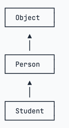

# Summary

使用了当前最新的技术和工具、推荐的使用/配置方式和最佳实践。

Java是介于编译型语言和解释型语言之间。编译型语言如C、C++，代码是直接编译成机器码执行，但是不同的平台（x86、ARM等）CPU的指令集不同，因此，需要编译出每一种平台的对应机器码。解释型语言如Python、Ruby没有这个问题，可以由解释器直接加载源码然后运行，代价是运行效率太低。而Java是将代码编译成一种“字节码”，它类似于抽象的CPU指令，然后，针对不同平台编写虚拟机，不同平台的虚拟机负责加载字节码并执行，这样就实现了“一次编写，到处运行”的效果。

- Java SE：Standard Edition

- Java EE：Enterprise Edition

- Java ME：Micro Edition


简单来说，Java SE就是标准版，包含标准的JVM和标准库，而Java EE是企业版，它只是在Java
SE的基础上加上了大量的API和库，以便方便开发Web应用、数据库、消息服务等，Java EE的应用使用的虚拟机和Java SE完全相同。

Java ME就和Java SE不同，它是一个针对嵌入式设备的“瘦身版”，Java SE的标准库无法在Java ME上使用，Java ME的虚拟机也是“瘦身版”。

- JDK：Java Development Kit
- JRE：Java Runtime Environment

JRE就是运行Java字节码的虚拟机。但是，如果只有Java源码，要编译成Java字节码，就需要JDK，因为JDK除了包含JRE，还提供了编译器、调试器等开发工具。

二者关系如下：


## 类型

基本类型：

- 整数类型：`byte`，`short`，`int`，`long`
- 浮点数类型：`float`，`double`
- 字符类型：`char`
- 布尔类型：`boolean`

引用类型：所有`class`和`interface`类型

引用类型可以赋值为`null`，表示空，但基本类型不能赋值为`null`；

常量：定义变量的时加`final`

```java
final double PI = 3.14; // PI是一个常量
```

#### 字符串

Java的`String`和`char`在内存中总是以`Unicode`编码表示。

比较：必须使用`equals()`方法而不能用`==`。

```java
public class Main {
  public static void main(String[] args) {
    String s1 = "hello";
    String s2 = "hello";
    System.out.println(s1 == s2);
    System.out.println(s1.equals(s2));
  }
}
```

两个字符串用`==`和`equals()`比较都为`true`，但实际上那只是Java编译器在编译期，会自动把所有**相同的字符串当作一个对象放入常量池**，自然s1和s2的引用就是相同的。

所以，这种`==`比较返回`true`纯属巧合。

要判断引用类型的变量内容是否相等，要使用`equals()`方法，如果使用`==`比较，它比较的是两个引用类型的变量是否是同一个对象。因此，引用类型内容比较，要始终使用
`equals()`方法，但enum类型可以例外。

这是因为**enum类型的每个常量在JVM中只有一个唯一实例**，所以可以直接用`==`比较。

`==`用于比较基本数据类型的值是否相等, String并不是基本数据类型，而是引用类型。也可以比较值是否是`null`,比如`String s = null;`，那么`s == null`为true。

### 数组

```java
public class Main {
  public static void main(String[] args) {
    int[] ns = new int[5];
    ns[0] = 68;
    ns[1] = 79;

    int[] ns2 = new int[]{68, 79, 91, 85, 62}; // 简写：int[] ns2 = { 68, 79, 91, 85, 62 };
    System.out.println(ns.length); // 编译器自动推算数组大小为5

    // 遍历
    for (int i = 0; i < ns2.length; i++) {
      int n = ns2[i];
      System.out.println(n);
    }
    // for each
    for (int n : ns2) {
      System.out.println(n);
    }
    // 二维数组
    int[][] ns3 = {
      {1, 2, 3, 4},
      {5, 6, 7, 8},
      {9, 10, 11, 12}
    };
    System.out.println(ns.length); // 3
  }
}
```

java的数组有几个特点：

- 数组所有元素初始化为默认值，整型都是`0`，浮点型是`0.0`，布尔型是`false`；
- 数组一旦创建后，大小就不可改变。

数组是引用类型，在使用索引访问数组元素时，如果索引超出范围，运行时将报错：

```java
// 数组
public class Main {
  public static void main(String[] args) {
    // 5位同学的成绩:
    int[] ns = new int[5];
    int n = 5;
    System.out.println(ns[n]); // 索引n不能超出范围
  }
}
```

## 面向对象

#### 方法的可变参数

可变参数用`类型...`定义，可变参数相当于数组类型：

```java
class Group {
    private String[] names;

    public void setNames(String... names) {
        this.names = names;
    }
}
```

### 作用域

- `public`：公共的，任何地方都可以访问；
- `protected`：受保护的，只有同一个包的类可以访问，或者子类可以访问；
- `private`：私有的，只有自己可以访问。

### 构造方法

任何`class`都有构造方法，如果一个类没有定义构造方法，编译器会自动为我们生成一个默认构造方法，它没有参数，也没有执行语句。

如果我们自定义了一个构造方法，那么，编译器就不再自动创建默认构造方法。

如果既要能使用带参数的构造方法，又想保留不带参数的构造方法，那么只能把两个构造方法都定义出来：

```java
// 构造方法
public class Main {
  public static void main(String[] args) {
    Person p1 = new Person("Xiao Ming", 15); // 既可以调用带参数的构造方法
    Person p2 = new Person(); // 也可以调用无参数构造方法
  }
}

class Person {
  private String name;
  private int age;

  public Person() {
  }

  public Person(String name, int age) {
    this.name = name;
    this.age = age;
  }

  public String getName() {
    return this.name;
  }

  public int getAge() {
    return this.age;
  }
}
```

### 方法重载

方法名相同，但各自的参数不同，称为方法重载Overload。

方法重载的返回值类型通常都是相同的。

举个例子，String类提供了多个重载方法`indexOf()`，可以查找子串：

- `int indexOf(int ch)`：根据字符的Unicode码查找；
- `int indexOf(String str)`：根据字符串查找；
- `int indexOf(int ch, int fromIndex)`：根据字符查找，但指定起始位置；
- `int indexOf(String str, int fromIndex)`根据字符串查找，但指定起始位置。

### 继承

子类自动获得了父类的所有字段，严禁定义与父类重名的字段！

```java
class Person {
  private String name;
  private int age;

  public String getName() {
  }

  public void setName(String name) {
  }

  public int getAge() {
  }

  public void setAge(int age) {
  }
}

class Student extends Person {
  // 不要重复name和age字段/方法,
  // 只需要定义新增score字段/方法:
  private int score;

  public int getScore() {
  }

  public void setScore(int score) {
  }
}
```

- 继承树



Java只允许一个class继承自一个类，因此，一个类有且仅有一个父类。只有Object特殊，它没有父类。

### protected

继承有个特点，就是子类无法访问父类的`private`字段或者`private`方法。例如，Student类就无法访问Person类的name和age字段：

```java
class Person {
    private String name;
    private int age;
}

class Student extends Person {
    public String hello() {
        return "Hello, " + name; // 编译错误：无法访问name字段
    }
}
```

把`private`改为`protected`。用`protected`修饰的字段可以被子类访问。

### super

`super`关键字表示父类（超类）。子类引用父类的字段时，可以用`super.fieldName`。

如果父类没有默认的构造方法，子类就必须显式调用`super()`并给出参数以便让编译器定位到父类的一个合适的构造方法。

eg:

```java
public class Main {
  public static void main(String[] args) {
    Student s = new Student("Xiao Ming", 12, 89);
  }
}

class Person {
  protected String name;
  protected int age;

  public Person(String name, int age) {
    this.name = name;
    this.age = age;
  }
}

class Student extends Person {
  protected int score;

  public Student(String name, int age, int score) {
    this.score = score;
  }
}
```

运行上面的代码，会得到一个编译错误，大意是在Student的构造方法中，无法调用Person的构造方法。

这是因为在Java中，任何class的构造方法，第一行语句必须是调用父类的构造方法。如果没有明确地调用父类的构造方法，编译器会帮我们自动加一句super()
;，所以，Student类的构造方法实际上是这样：

```java
class Student extends Person {
  protected int score;

  public Student(String name, int age, int score) {
    super(); // 自动调用父类的构造方法
    this.score = score;
  }
}
```

但是，Person类并没有无参数的构造方法，因此，编译失败。

解决方法是调用Person类存在的某个构造方法。例如：

```java
class Student extends Person {
  protected int score;

  public Student(String name, int age, int score) {
    super(name, age); // 调用父类的构造方法Person(String, int)
    this.score = score;
  }
}
```

即子类不会继承任何父类的构造方法。子类默认的构造方法是编译器自动生成的，不是继承的。

### 阻止继承

正常情况下，只要某个class没有`final`修饰符，那么任何类都可以从该`class`继承。

### 多态

在继承关系中，子类如果定义了一个与父类方法签名完全相同的方法，被称为覆写（Override）。

多态的特性就是，运行期才能动态决定调用的子类方法。对某个类型调用某个方法，执行的实际方法可能是某个子类的覆写方法

---

在Java中，一个类只能继承自另一个类，不能从多个类继承。但是，一个类可以实现多个`interface`。
interface，就是比抽象类还要抽象的纯抽象接口，因为它连字段都不能有.

```java
class Student implements Person, Hello { // 实现了两个interface
}
```

包没有父子关系。`java.util`和`java.util.zip`是不同的包，两者没有任何继承关系。


### 接口 interface

抽象类和接口的对比如下：

|       | abstract class | interface |
| ---------- | -------------- | --------- |
| 继承       | 只能extends一个class | 可以implements多个interface |
| 字段       | 可以定义实例字段 | 不能定义实例字段 |
| 抽象方法   | 可以定义抽象方法 | 可以定义抽象方法 |
| 非抽象方法 | 可以定义非抽象方法 | 可以定义default方法 |

因为 `interface` 是一个纯抽象类，所以它不能定义实例字段。但是，`interface` 是可以有静态字段的，并且静态字段必须为 `final` 类型：

```java
public interface Person {
    public static final int MALE = 1;
    public static final int FEMALE = 2;
}
```

实际上，因为 `interface` 的字段只能是 `public static final` 类型，所以我们可以把这些修饰符都去掉，上述代码可以简写为：

```java
public interface Person {
  // 编译器会自动加上public static final:
    int MALE = 1;
    int FEMALE = 2;
}
```


## 异常处理

异常是一种class，因此它本身带有类型信息。异常可以在任何地方抛出，但只需要在上层捕获，这样就和方法调用分离了：

```java
public class Main {
  public static void main(String[] args) {
    try {
      String s = processFile("C:\\test.txt");
      // ok:
    } catch (
      FileNotFoundException e) {
      // file not found:
    } catch (
      SecurityException e) {
      // no read permission:
    } catch (
      IOException e) {
      // io error:
    } catch (
      Exception e) {
      // other error:
    }

  }
}
```


`Throwable`是异常体系的根，它继承自`Object`。`Throwable`有两个体系：`Error`和Exception，`Error`表示严重的错误，程序对此一般无能为力，例如：

- OutOfMemoryError：内存耗尽
- NoClassDefFoundError：无法加载某个Class
- StackOverflowError：栈溢出

而`Exception`则是运行时的错误，它可以被捕获并处理。

Exception又分为两大类：

- RuntimeException以及它的子类；
- 非RuntimeException（包括IOException、ReflectiveOperationException等等）
-

Java规定：

- 必须捕获的异常，包括Exception及其子类，但不包括RuntimeException及其子类，这种类型的异常称为Checked Exception。

- 不需要捕获的异常，包括Error及其子类，RuntimeException及其子类。

存在多个catch的时候，catch的顺序非常重要：子类必须写在前面。例如：

```java
public static void main(String[] args) {
  try {
    process1();
    process2();
    process3();
  } catch (IOException e) {
    System.out.println("IO error");
  } catch (UnsupportedEncodingException e) { // 永远捕获不到
    System.out.println("Bad encoding");
  }
}
```

`UnsupportedEncodingException`异常是永远捕获不到的，因为它是`IOException`的子类。当抛出`UnsupportedEncodingException`
异常时，会被`catch (IOException e) { ... }`捕获并执行。

### NullPointerException

空指针异常，俗称NPE,如果一个对象为`null`，调用其方法或访问其字段就会产生`NullPointerException`，这个异常通常是由`JVM`
抛出的，例如：

```java
public class Main {
  public static void main(String[] args) {
    String s = null;
    System.out.println(s.toLowerCase());
  }
}
```

Java语言中并无指针。我们定义的变量实际上是引用，Null Pointer更确切地说是Null Reference

NPE是一种代码逻辑错误，遵循原则是早暴露，早修复，严禁使用catch来隐藏这种编码错误：

```java
public class Main {
  public static void main(String[] args) {
    try {
      transferMoney(from, to, amount);
    } catch (
      NullPointerException e) {
    }
  }
}
```

## 反射

反射就是Reflection，Java的反射是指程序在运行期可以拿到一个对象的所有信息。 反射是为了解决在运行期，对某个实例一无所知的情况下，如何调用其方法。

## 泛型

eg:

```java
ArrayList<String> strList = new ArrayList<String>();
```

### 泛型接口

除了`ArrayList<T>`使用了泛型，还可以在接口中使用泛型。例如，`Arrays.sort(Object[])`可以对任意数组进行排序，但待排序的元素必须实现
`Comparable<T>`这个泛型接口：

```java
public interface Comparable<T> {
  /**
   * 返回负数: 当前实例比参数o小
   * 返回0: 当前实例与参数o相等
   * 返回正数: 当前实例比参数o大
   */
  int compareTo(T o);
}
```

eg: 对Person排序

```java
public class Person implements Comparable<Person> {

  @Range(min = 1, max = 20)
  public String name;

  @Range(max = 10)
  public String city;

  @Range(min = 1, max = 100)
  public int age;

  public Person(String name, String city, int age) {
    this.name = name;
    this.city = city;
    this.age = age;
  }

  @Override
  public String toString() {
    return String.format("{Person: name=%s, city=%s, age=%d}", name, city, age);
  }

  @Override
  public int compareTo(Person other) {
    // 按年龄升序排列
    return this.age - other.age;
  }
}
```

```java
import java.util.Arrays;


public class Main {

  public static void main(String[] args) throws Exception {
    Person p1 = new Person("Bob", "Beijing", 12);
    Person p2 = new Person("Tom", "Shanghai", 24);
    Person p3 = new Person("Alice", "Chengdu", 199);

    for (Person p : new Person[]{p1, p2, p3}) {
      try {
        check(p);
        System.out.println("Person " + p + " checked ok.");
      } catch (IllegalArgumentException e) {
        System.out.println("Person " + p + " checked failed: " + e);
      }
    }
    Person[] peoples = {p3, p2, p1};
    // 排序
    Arrays.sort(peoples);
    System.out.println(Arrays.toString(peoples));
  }

  // 结合反射对注释的使用
  static void check(Person person) throws IllegalArgumentException, ReflectiveOperationException {
    for (Field field : person.getClass().getFields()) {
      Range range = field.getAnnotation(Range.class);

      if (range != null) {
        Object value = field.get(person);
        if (value instanceof String s) {
          if (s.length() < range.min() || s.length() > range.max()) {
            throw new IllegalArgumentException("Invalid field:" + field.getName());
          }
        } else if (value instanceof Integer i) {
          if (i < range.min() || i > range.max()) {
            throw new IllegalArgumentException("Invalid field:" + field.getName());
          }
        }
      }
    }
  }
}
```

自定义注释

```java
import java.lang.annotation.ElementType;
import java.lang.annotation.RetentionPolicy;

import java.lang.annotation.Retention;
import java.lang.annotation.Target;

@Retention(RetentionPolicy.RUNTIME)
@Target(ElementType.FIELD)
public @interface Range {

  int min() default 0;

  int max() default 255;

}
```

### 静态方法

编写泛型类时，要特别注意，泛型类型`<T>`不能用于静态方法，因为：

- 泛型类型是在实例化对象时确定的，而静态方法是在类加载时就可以直接调用的，无需创建对象实例。所以静态方法中的返回值、参数等不能依赖泛型类型
  `<T>`，必须将静态方法的泛型类型和实例类型的泛型类型区分开。
- 此外，静态方法是与类本身相关联的，而不是与类的实例相关联的。因此，即使创建了一个类的实例，静态方法也无法访问实例的泛型类型。

```java{1,12}
public class Pair<T> {
    private T first;
    private T last;
    public Pair(T first, T last) {
        this.first = first;
        this.last = last;
    }
    public T getFirst() { ... }
    public T getLast() { ... }

    // 静态泛型方法应该使用其他类型区分:
    public static <K> Pair<K> create(K first, K last) {
        return new Pair<K>(first, last);
    }
}
```

### 擦拭法

Java语言的泛型实现方式是擦拭法（Type Erasure）。擦拭法是指，虚拟机对泛型其实一无所知，所有的工作都是编译器做的。

- 编译器把类型`<T>`视为`Object`；
- 编译器根据`<T>`实现安全的强制转型。

使用泛型的时候，我们编写的代码也是编译器看到的代码：

```java
Pair<String> p = new Pair<>("Hello", "world");
String first = p.getFirst();
String last = p.getLast();
```

而虚拟机执行的代码并没有泛型：

```java
Pair p = new Pair("Hello", "world");
String first = (String) p.getFirst();
String last = (String) p.getLast();
```

所以，Java的泛型是由编译器在编译时实行的，编译器内部永远把所有类型`T`视为`Object`处理，但是，在需要转型的时候，编译器会根据
`T`的类型自动为我们实行安全地强制转型。

### Java泛型的局限

- `<T>`不能是基本类型，例如`int`，因为实际类型是`Object`，Object类型无法持有基本类型：
- 无法取得带泛型的Class，获取到的是同一个Class，eg: `Pair<Object>`
- 无法判断带泛型的类型
- 不能实例化`T`类型

`<? extends Number>`通配符的一个重要限制：方法参数签名`setFirst(? extends Number)`无法传递任何Number的子类型给
`setFirst(? extends Number)`。

```java
  public static void main(String[] args) {
  Pair<Integer> p = new Pair<>(123, 456);
  int n = add(p);
  System.out.println(n);
}

static int add(Pair<? extends Number> p) {
  Number first = p.getFirst();
  Number last = p.getLast();
  // 会报错
  p.setFirst(new Integer(first.intValue() + 100));
  p.setLast(new Integer(last.intValue() + 100));
  return p.getFirst().intValue() + p.getFirst().intValue();
}
```

这里唯一的例外是可以给方法参数传入`null`：

```
p.setFirst(null); // ok, 但是后面会抛出NullPointerException
p.getFirst().intValue(); // NullPointerException
```

定义泛型类型`Pair<T>`的时候，也可以使用`extends`通配符来限定T的类型：

`public class Pair<T extends Number> { ... }`, then, 只能定义这些：

```java
Pair<Number> p1 = null;
Pair<Integer> p2 = new Pair<>(1, 2);
Pair<Double> p3 = null;
```

即`Number`的子类

相应的有`super`,` <? super T>`, 两者的区别在于：

- `<? extends T>`允许调用读方法`T get()`获取T的引用，但不允许调用写方法`set(T)`传入T的引用（传入`null`除外）；

- `<? super T>`允许调用写方法`set(T)`传入`T`的引用，但不允许调用读方法`T get()`获取T的引用（获取`Object`除外）。

一个是允许读不允许写，另一个是允许写不允许读。

eg: Java标准库的`Collections`类定义的`copy()`方法：

```java
public class Collections {
  // 把src的每个元素复制到dest中:
  public static <T> void copy(List<? super T> dest, List<? extends T> src) {
    for (int i = 0; i < src.size(); i++) {
      T t = src.get(i);
      dest.add(t);
    }
  }
}
```

### PECS原则

何时使用extends，何时使用super？可以用PECS原则：Producer Extends Consumer Super。

上面的 `src是producer`, dest是consumer

其实PECS原因就是**java向上转型安全，而向下转型不安全**

#### 无限定通配符

```java
void sample(Pair<?> p) {
}
```

- 不允许调用`set(T)`方法并传入引用（`null`除外）；
- 不允许调用`T get()`方法并获取`T`引用（只能获取`Object`引用）。

既不能读，也不能写，那只能做一些null判断：

```java
static boolean isNull(Pair<?> p) {
  return p.getFirst() == null || p.getLast() == null;
}
```

大多数情况下，可以引入泛型参数`<T>`消除`<?>`通配符：

```java
static <T> boolean isNull(Pair<T> p) {
  return p.getFirst() == null || p.getLast() == null;
}
```

## IOC & DI

IoC（Inversion of Control）又称为依赖注入（DI：Dependency Injection），它解决了一个最主要的问题：将组件的创建+配置与组件的使用相分离，并且，由IoC容器负责管理组件的生命周期。

## 集合

```java
public class Main {
  public static void main(String[] args) {
    List<String> list = List.of("A", "B", "C");
    System.out.println(list.contains(new String("C"))); // true or false?
    System.out.println(list.indexOf(new String("C"))); // 2 or -1?
  }
}
```

结果是`true` & `2`，是不同的实例，但`List`内部并不是通过`==`判断两个元素是否相等，而是使用`equals()`方法判断两个元素是否相等，
`contains()`方法可以实现如下：

```java
public class ArrayList {
  Object[] elementData;

  public boolean contains(Object o) {
    for (int i = 0; i < elementData.length; i++) {
      if (o.equals(elementData[i])) {
        return true;
      }
    }
    return false;
  }
}
```

因此，要正确使用`List`的`contains()`、`indexOf()`这些方法，放入的实例必须正确覆写`equals()`方法，否则，放进去的实例，查找不到。
eg:

```java
public class Person {
  public String name;
  public int age;

  public boolean equals(Object o) {
    if (o instanceof Person p) {
      return Objects.equals(this.name, p.name) && this.age == p.age;
    }
    return false;
  }

  @Override
    // 要正确使用HashMap，作为key的类必须正确覆写equals()和hashCode()方法；
  int hashCode() {
    int h = 0;
    h = 31 * h + firstName.hashCode();
    h = 31 * h + lastName.hashCode();
    h = 31 * h + age;
    return h;
  }
}
```

## IO

IO流是一种流式的数据输入/输出模型：

- 二进制数据以`byte`为最小单位在`InputStream/OutputStream`中单向流动；

- 字符数据以`char`为最小单位在`Reader/Writer`中单向流动。

Java标准库的java.io包提供了**同步**IO功能：

- 字节流接口：InputStream/OutputStream；

- 字符流接口：Reader/Writer。

## Stream

`java.util.stream`, 这个`Stream`不同于`java.io`的`InputStream`和`OutputStream` 它代表的是任意Java对象的序列。

这个`Stream`和`List`也不一样，List存储的每个元素都是已经存储在内存中的某个Java对象，而`Stream`输出的元素可能并没有预先存储在内存中，而是实时计算出来的。

一个无限自然数的stream

```java
class NatualSupplier implements Supplier<Integer> {
  int n = 0;

  public Integer get() {
    n++;
    return n;
  }
}

public class Main {
  public static void main(String[] args) {
    Stream.generate(new NatualSupplier())
      .map((n) -> n * n)
      .limit(100)
      .forEach(System.out::println);

    // 计算1..100的和
    int sum = Stream.generate(new NatualSupplier())
      .limit(100)
      .reduce(0, Integer::sum);
    System.out.println("sum: " + sum);
  }
}
```

从一组给定的LocalDate中过滤掉工作日，以便得到休息日：

```java
public class Main {
  public static void main(String[] args) {
    Stream.generate(new LocalDateSupplier())
      .limit(31)
      .filter(ldt -> ldt.getDayOfWeek() == DayOfWeek.SATURDAY || ldt.getDayOfWeek() == DayOfWeek.SUNDAY)
      .forEach(System.out::println);
  }
}

class LocalDateSupplier implements Supplier<LocalDate> {
  LocalDate start = LocalDate.of(2020, 1, 1);
  int n = -1;

  public LocalDate get() {
    n++;
    return start.plusDays(n);
  }
}
```

操作对`Stream`来说可以分为两类，一类是转换操作，即把一个Stream转换为另一个Stream，例如`map()`和`filter()`
，另一类是聚合操作，即对Stream的每个元素进行计算，得到一个确定的结果，例如`reduce()`。

区分这两种操作是非常重要的，因为对于Stream来说，对其进行**转换操作并不会触发任何计算**

### `flatMap`

```java
<R> Stream<R> flatMap(Function<? super T, ? extends Stream<? extends R>> mapper);
```

- `T` 是原始流中元素的类型。
- `R` 是展平后流中元素的类型。
