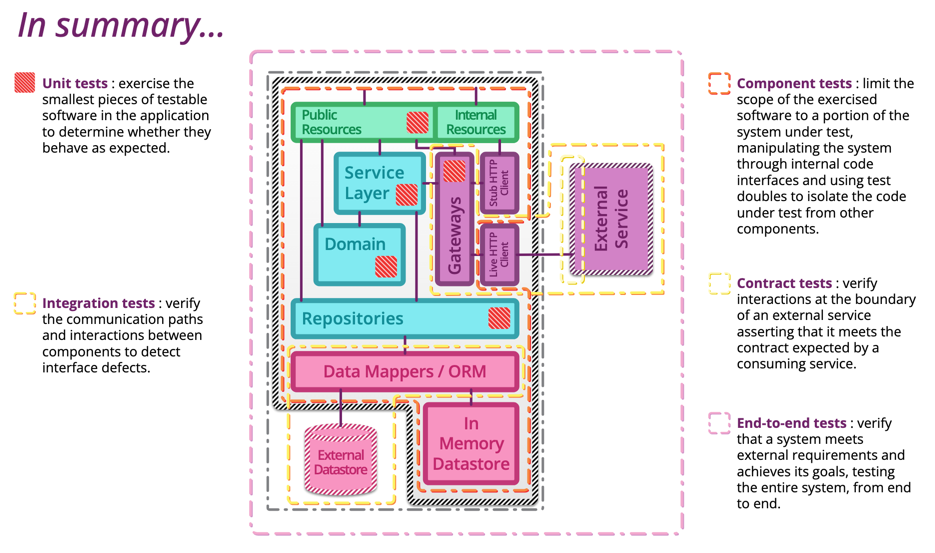

# Summary

- [Write your application as a modular binary. Deploy it as a set of microservices.](https://serviceweaver.dev/)

## 测试策略

- [Testing Strategies in a Microservice Architecture](https://martinfowler.com/articles/microservice-testing/#conclusion-summary)

System architecture is based on microservices, testing requires a structured approach to ensure **reliability**, **maintainability**, and **efficiency**. Traditional monolithic testing strategies do not fully address the complexities of microservices, such as inter-service communication, independent deployments, and distributed data consistency.

The testing structure is organized according to the testing pyramid, from bottom to top:

- **Unit Test** – Tests the smallest testable piece of software in the application to verify it behaves as expected, Validate individual components in isolation.
- **Integration Test** – Tests integrations with data stores and external components (Kafka integration), Verify communication between multiple services
- **Component Test** – In a microservice architecture, the components are the services themselves. Test the behavior of a service in isolation, including its dependencies and side effects.
- **Contract Test** - Where all the consumer/provider contract lives. Ensure that service interactions conform to predefined contracts.

This structured approach minimizes the reliance on expensive and brittle end-to-end tests while maximizing confidence through more focused and efficient testing at lower levels.

### Guide
implement the microservice test strategy as follows:
- Prioritize **unit and component tests** to catch issues early and ensure individual service reliability.
- Use **contract tests** to validate interactions between services and enforce API expectations, using [Pact](https://docs.pact.io/)
- Leverage **integration tests** for key workflows that span multiple services.
- Ensure automation and CI/CD integration for all test levels to maintain rapid feedback cycles.

### Consequences
- Faster feedback loops due to emphasis on lower-level tests.
- Enhanced service reliability through contract validation and integration testing.
- Reduced maintenance burden as brittle UI tests are minimized.
- Adoption of a consistent testing approach aligned with industry best practices.
