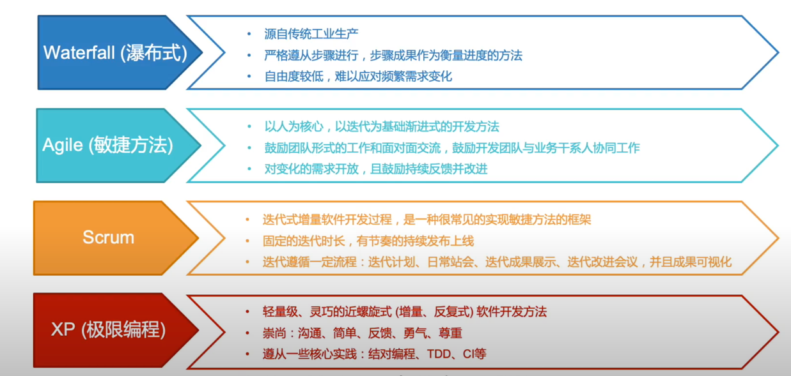
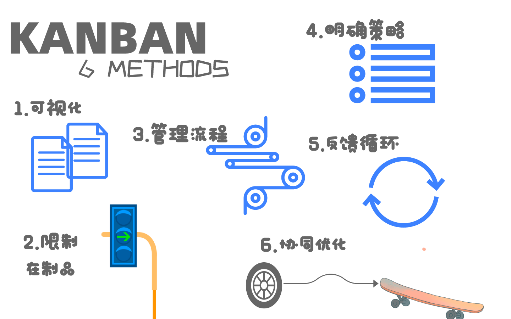

## 什么是敏捷开发

敏捷开发(Agile Development)是一种以人为核心、迭代、循序渐进的开发方法。

简单地来说，敏捷开发并不追求前期完美的设计、完美编码，而是力求在很短的周期内开发出产品的核心功能，尽早发布出可用的版本。然后在后续的生产周期内，按照新需求不断迭代升级，完善产品。

敏捷不是一门技术，它是一系列方法和实践的总称，也是一种软件开发的流程，它会指导我们用规定的环节、流程、方法去一步一步完成项目的开发，是自组织、跨职能团队运用适合他们自身环境的实践进行演进得出解决方案。

### 敏捷是怎么产生的？

敏捷怎么产生的和软件开发方法的演进肯定是不可分割的，我理解敏捷开发也是集大成者，之所以现如今被广泛提起或使用，也是基于瀑布模型或者原型模型等迭代和增量式软件开发方法经验，沉淀而来。

一种新方法的出现最常见的就是为了解决老方法的痛点问题提出来的，所以提到敏捷不得不提的就是**瀑布模型**，而且瀑布模型还在国内广泛使用。

#### 瀑布模型

一般常规的开发流程如下：

1. 需求分析：通常定义系统需求；
2. 设计：通常确定系统使用什么数据库，系统模块的划分，各个模块的功能；
3. 编码实现：用编程语言实现设计阶段的功能；
4. 测试验证：主要测试功能是否实现；
5. 交付维护：交付软件给客户，根据用户新的需求重新修改系统，使系统运行正常，更加稳定。

其实这也就是常说的**瀑布模型**。在该流程下，核心的就是*需求分析*。一旦需求分析出现大的偏差，之后的流程即使做得再好，也是徒劳，因为你最后交付的根本不是用户想要的。

但是软件是这种东西，因为看不见摸不着。因而在具体的东西出来之前，大概率，用户根本就不知道自己想要的是什么，这样就导致第一步就有问题。信息的二次记录和多次传递，还有每个人的理解等等，都会带来偏差。 但软件开发就是看不见摸不着，高度定制，没有工业化标准。因此对用户来说，直到第一次看到实物（可运行的软件），才会逐渐在脑子中清晰他想要的是什么的东西。这就是软件开发的本质所在，没有任何人真的有错。但再当你去返工，看着交付时间，加班乃至加人，即使最后客户认可了产品，但背后的付出和成本，却远远超出预期。

因此，为避免再出现《需求分析》争议的情况，在之后项目中，在需求分析阶段，会尽量的在《需求分析》中增加原型出来，叫做原型模型，一般适合开发小型、灵活性高的系统。

当然，这些做法效果肯定是有的。但也并没有从根本上解决问题。之后的项目还是会有返工的情况出现，区别只是严重程度的大小而已。 这种情况（返工），只要是在瀑布模型下，就无法根本避免，因为来自以下事实：

- 只要有沟通，就会有信息的变形，因此《需求分析》是不可靠的。
- 即使《需求分析》是可靠的，随着项目的进展，竞争对手的出现，需求也可能过时。
- 瀑布模型，这种自上而下的开发方式，无法响应这个快速变化的时代。

据统计，以瀑布模型开发的软件失败率在70%作用，但个人存疑，只是在国内没那么离谱或者失败的定义不一样吧。总之为了解决以上的这些问题，才会有后面敏捷的出现。

### [敏捷宣言](https://agilemanifesto.org/iso/zhchs/manifesto.html)

2001年2月，Martin Fowler，Jim Highsmith等17位著名的软件开发专家齐聚在美国犹他州雪鸟滑雪圣地，举行了一次敏捷方法发起者和实践者的聚会。在这次会议上面，他们正式提出了Agile(敏捷开发)这个概念，并共同签署了《敏捷宣言》，即：

> 我们一直在实践中探寻更好的软件开发方法，身体力行的同时也帮助他人。由此我们建立了如下价值观：
>
> 个体和互动 高于 流程和工具；
>
> 工作的软件 高于 详尽的文档；
>
> 客户合作 高于 合同谈判；
>
> 响应变化 高于 遵循计划；
>
> 也就是说，尽管右项有价值，我们更重视左项的价值。

浅浅地解读：

1. 以人为本、保持成员间的协作和沟通，能产生更多的灵感和进步，流程和工具是死的，人才是活的，而且要交流沟通起来。
2. 划分阶段，迭代式开发，即整个开发过程被分为几个迭代周期，每个阶段都能产出实际工作的交付软件，文档只是辅助
3. 与客户协同工作，一起达到目标，增量交付，始终保持目标的一致性。
4. 崇尚短期计划，有更多的灵活性，现实往往计划赶不上变化。

#### 敏捷宣言遵循的原则

* 我们最重要的目标，是通过持续不断地及早交付有价值的软件使客户满意
* 欣然面对需求变化，即使在开发后期也一样，为了客户的竞争优势，敏捷过程掌控变化
* 经常地交付可工作的软件，相隔几星期或一两个月，倾向于采取较短的周期
* 业务人员和开发人员必须相互合作，项目中的每一天都不例外
* 激发个体的斗志，以他们为核心搭建项目，提供所需的环境和支援，辅以信任，从而达成目标
* 不论团队内外，传递信息效果最好效率也最高的方式是面对面交谈
* 可工作的软件是进度的首要度量标准
* 敏捷过程倡导可持续开发。责任人、开发人员和用户要能够同步维持其步调稳定延续
* 坚持不懈地追求技术卓越和良好设计，敏捷能力由此增强
* 以简洁为本，它是极力减少不必要工作量的艺术
* 最好的架构、需求和设计出自组织团队
* 团队定期地反思如何能提高成效，并以此调整自身的举止表现

### 敏捷方法简介

敏捷开发的实现主要包括SCRUM，极限编程（xp）、[水晶开发（Crystal Clear）](https://www.geeksforgeeks.org/crystal-methods-in-agile-development-framework/) 、精益软件开发（Lean Software Development），动态系统开发方法（DSDM），特征驱动开发（Feature Driver Development）等等。其中 `SCRUM` 与 `XP` 最为流行, 也是目前我在TW中实际项目经历过的。

所有这些方法都具有以下共同特征：

1. 迭代式开发。即整个开发过程被分为几个迭代周期，每个迭代周期是一个定长或不定长的时间块每个迭代周期持续的时间一般较短，通常为一到六周。
2. 增量交付。产品是在每个迭代周期结束时被逐步交付使用，而不是在整个开发过程结束的时候一次性交付使用。每次交付的都是可以被部署到用户应用环境中被用户使用的、能给用户带来即时效益和价值的产品。
3. 开发团队和用户反馈推动产品开发。敏捷开发方法主张用户能够全程参与到整个开发过程中。这使需求变化和用户反馈能被动态管理并及时集成到产品中。同时，团队对于用户的需求也能及时提供反馈意见。
4. 持续集成。新的功能或需求变化总是尽可能频繁地被整合到产品中。一些项目是在每个迭代周期结束的时候集成， 有些项目则每天都在这么做。
5. 开发团队自我管理。拥有一个积极的、自我管理的、具备自由交流风格的开发团队，是每个敏捷项目必不可少的条件。人是敏捷开发的核心。敏捷开发总是以人为中心建立开发的过程和机制，而非把过程和机制强加给人。

### 敏捷项目基本流程

这里的流程图是scrum和xp结合而来，以一个公司开发自己的产品为列，大致可以归纳为8个步骤包括：

1. 目标制定，目标对齐：通过市场调研、业务思路、风险评估制定公司规划和目标，根据这一目标产生所有部门的目标并实现对齐；
2. 产品规划：产品研发部门根据目标制定产品关键路线图，这个路线图中分布着不同的产品特性和其完成时间；
3. 组织产品待办列表：产品规划产生的需求、客户需求、市场人员收集到的缺陷等将组成产品待办列表；
4. 需求梳理：然后产品负责人(Product Owner)对这个列表进行梳理，并在需求梳理会(Backlog Grooming Meeting)讲解具体每一个需求，团队成员根据需求的复杂程度评估每个任务的工作量，输出本次迭代的待办事项列表，完成优先级排序等工作；
5. 迭代规划：通过Sprint计划会，明确要执行的工作、冲刺目标等，
6. 迭代开发：期间会进行每日站会、性能测试、CodeReview、TDD、重构、Pair、测试等工作；
7. Sprint评审：由每个任务的负责人演示其完整的工作，由PO确定Sprint目标是否完成，版本什么时候对外发布，新增bug的紧急程度等等。
8. 开回顾会议：回顾会议由Scrum团队检视自身在过去的Sprint的表现，包括人 、关系、过程、工具等，思考在下一个Sprint中怎么样可以表现得更好，更高效，怎么样可以和团队合作地更愉快。

以上流程是从目标阶段开始，到一个迭代结束，形成了一个相对完整的闭环。但仅从这个流程也只能了解大概，其实还有很多细枝末节。后续会以最常用的Scrum为详细列子，并记录知道或者遇到的实践，比如T-shirt size 评估法，RAID，看板等。

## Scrum

同样是敏捷开发，XP 极限编程 更侧重于实践，并力求把实践做到极限。这一实践可以是测试先行，也可以是结对编程等，关键要看具体的应用场景。

SCRUM 则是一种开发流程框架，也可以说是一种套路。SCRUM 框架中包含三个角色，三个工件，四个会议等，听起来很复杂，但其目的是为了有效地完成每一次迭代周期的工作。

### 什么是Sprint

Sprint是短距离赛跑的意思，迭代即Sprint，在将整个开发过程划分为多个迭代的过程中，我们要以完成一次迭代的开发内容为目标发起冲刺的过程，即一个Sprint。

### 用户故事（User Story）?

用户故事是从用户的角度来描述用户渴望得到的功能。一个好的用户故事包括三个要素：

1. 角色：谁要使用这个功能。
2. 活动：需要完成什么样的功能。
3. 商业价值：为什么需要这个功能，这个功能带来什么样的价值。

一个好的用户故事的`INVEST标准`，分别是独立（Independent），可协商(Negotiable)，有价值(Valuable)，可估算(Estimable)，小(Small)，可测试(Testable)。这里不展开说了。

用户故事通常按照如下的格式来表达：`As a <Role>, I want to <Activity>, so that <Business Value>`，即 `作为一个<角色>, 我想要<活动>, 以便于<商业价值>`

### Scrum中的人员角色

Scrum中的人员分为3个角色：产品所有者（Product Owner-PO）, Scrum Master，开发团队(Dev Team)。

- 产品所有者：定义所有产品功能，决定产品发布的内容以及日期，对产品的投入产出负责，根据市场变化对需要开发的功能排列优先顺序，合理地调整产品功能和迭代顺序，认同或者拒绝迭代的交付。
- Scrum Master ：ScrumMaster不是项目经理，他没有分配任务的权力，没有考核的权力，没有下命令的权力，他指导项目组的成员按照Scrum的原则、方法做事情，领导团队完成Scrum的实践以及体现其价值，排除团队遇到的困难，确保团队胜任其工作，并保持高效的生产率，使得团队紧密合作，使得团队个人具有多方面职能的工作能力，保护团队不受到外来无端影响。
- 开发团队：经典团队拥有 5-9 人，团队成员包含程序员、测试员、用户体验设计等等，团队关系在一个迭代中应该是固定的，个人的职能可以在新迭代开始时发生调整，团队自我组织和管理（自组织，自驱动），团队成员都全职工作。

所谓Scrum团队的自组织，就是说他们会在内部决定如何最好地完成他们的工作，而不是由团队外的其他人来指挥他们。

### 五个会议

Scrum 整个开发过程分为五个会议:

#### 待办事项整理会议（Backlog Grooming Meeting）

迭代计划会议开始之前3天召开，PO与SM必须参加，关键开发者或架构师需要参加；时间控制在30分钟到1小时。

由PO将一批希望团队在下次迭代时实现的用户故事，按照实现顺序描述给在场的团队成员，SM与在场成员分析用户故事，明确指出团队认为需求不明确的地方，PO现场记录，会后补全，SM与架构师，还有在场成员分析用户故事需要包含哪些技术任务，SM先把子任务建立，方便迭代计划会议的时候团队可以更准确地预估任务故事点。

会议结束时，PO确保在迭代计划会议开始之前团队提出的问题都能被解决，会议重点如果团队发现需要加强或是完善的地方，PO还有两到三天的时间可以补强，而不是浪费迭代计划会议的时间去做这件事情。

#### 迭代计划会议（Sprint/Iteration Planning Meeting）

产品负责人建立产品功能列表（Product Backlog）。产品功能列表是一组条目化需求，它必须从客户价值角度描述，并按优先级排序。

Scrum Master召集相关人员召开迭代计划会，迭代计划会在每个迭代第一天召开，目的是选择本次迭代的Backlog和估算本次迭代的工作量。

产品负责人逐条讲解最重要的产品功能，开发团队共同估算Backlog所需工作量，直到本迭代工作量达到饱和。产品负责人参与讨论并回答和需求相关的问题，但不干扰估算结果。队员认领任务（或由组长协商分发），独立或与别人一起完成任务；会议时间控制在1-2小时内。

#### 每日站会（Standup Meeting）

团队内部利用每日立会来沟通进度，15分钟结束，开发团队利用燃尽图来展示整体进度；如无特殊原因，迭代期内无变更，在每日站会上团队成员需要回答以下3个问题：

- 昨天你做了什么?
- 今天你将要做什么?
- 你有需要帮助的地方吗?

这些都是团队成员的彼此承诺。

#### 评审会（ShowCase Meeting）

小组向产品负责人展示迭代工作结果，产品负责人给出评价和反馈。以用户故事是否能成功交付来评价任务完成情况。整个团队都需要参加，ScrumMaster、产品所有者、团队，可能还有客户，时间控制在1-2小时内。

#### 反思会（Retrospective Meeting）

在每个迭代后召开简短地反思会，总结哪些事情做得好，哪些事情做得不好。做得好地保留，不好地摒弃。会议得出这样的结论：开始做什么、继续做什么、停止做什么，一般控制在15-30分钟。

以上的会议，我们需要知道5W1H：是什么(What)、谁参与(Who)、什么时间(When)、在哪里(Where)、为什么(Why) 以及怎么做(How)

### 三个工件

Scrum的三个工件分别是：Product Backlog（产品待办列表) 、Sprint Backlog(Sprint 待办列表)、 Increment(可交付产品增量)。

#### Product Backlog （产品待办列表）

产品待办列表Product Backlog即产品视角的需求清单。

1. 由PO负责维护，包括增删及优先级。
2. 用户故事是其中一种最佳实践。
3. 每项需求都需要描述其外部价值。

产品待办列表是一份涵盖产品中已知所需每项内容的有序列表，它是产品需求变动的唯一来源。产品负责人负责管理产品待办列表的内容、可用性和排序。产品待办列表永远是不完整的。

#### Sprint Backlog （Sprint 待办列表）

Sprint Backlog 即此次冲刺周期内规划要完成的内容。

1. 来源于Product Backlog。
2. 由团队评估和选择Product Backlog中哪些放入Sprint Backlog。
3. 团队需要一起定义“完成”的标准，即估点。

Sprint 产品待办列表将开发团队用来达成 Sprint 目标的所有工作变得清晰可见。为了确保持续改进，它至少包括一项在先前回顾会议中确定下来的高优先级过程改进。

在 Sprint 期间，只有开发团队可以改变 Sprint 待办列表。Sprint 待办列表是高度可见的，是对开发团队计划在当前 Sprint 内工作完成情况的实时反映，该列表由开发团队全权负责。

#### Increment （可交付产品增量）

可交付产品增量Increment即冲刺结束后可对外发布的产品功能增量部分。

1. 需要关注其是可工作的软件功能增量。
2. 需要要在Scrum Review会议上进行演示。

增量是一个 Sprint 完成的所有产品待办列表项的总和，以及之前所有 Sprint 所产生的增量的价值总和。在 Sprint 的最后，新的增量必须是“完成”的，这意味着它必须可用并且达到了 Scrum 团队“完成”的定义的标准。增量是在 Sprint 结束时支持经验主义的可检视的和已完成的产品组成部分。增量是迈向愿景或目标的一步。无论产品负责人是否决定发布它，增量必须可用。

Scrum三个工件是Scrum 重要的核心内容，它们代表了Scrum框架的核心骨架，在实际敏捷团队执行中，工件的透明性要求需要用合适的工具将这三个工件的内容展示在敏捷团队明显的位置，且能达成一致的认识；在Scrum的五个会议过程中，需要不断检视工件内容，实时更新到最新状态；Scrum的检视者发现过程中的一个或多个方面偏离可接受范围以外，并且将会导致产品不可接受时，就必须对过程或过程化的内容加以调整。调整工作必须尽快执行如此才能最小化进一步地偏离。

### Kick Off & Desk check

即在`sprint`过程中，dev team的成员需要Kick Off和Desk check 2个开始和结束的流程去贯穿一张卡的开发。

也是需要掌握5W1H原则：是什么(What)、谁参与(Who)、什么时间(When)、在哪里(Where)、为什么(Why) 以及怎么做(How)。这里就不详细展开来。

Scrum是一套开发流程，是敏捷的一种，实施主要还是看人，强调是自组织、自驱动的，只有不断的在实际应用中仔细体会，才能理解Scrum的真谛，把Scrum用好。

## XP 极限编程

极限编程（XP）也是一个敏捷的软件开发框架，是由 Kent Beck 发起的一项实验演化来的，旨在为开发团队生成更高质量的软件和更高的生活质量。如今，极限编程被那些采用其他敏捷框架的团队揉和在各自的框架中去最大限度地发掘团队成员的开发潜力。

敏捷开发是一个大的概念。scrum其实是一种敏捷方法而已，而极限编程是敏捷开发的一种实践方法。在我看来，scrum是道，极限编程是术。两者并不冲突，而且是可以结合使用的。

scrum更强调的是一套核心价值观，在这个价值观的指导下推导出的一系列行为准则，产生了一系列的scrum活动（站会，冲刺，评审，回顾等）。只要和scrum价值观匹配的实践方法都可以引入到scrum过程中来，比如在scrum中经常会使用的看板，其实来源于丰田的精益方法。TDD，结对编程等极限编程的同样可以应用在scrum的过程中。

#### 核心实践

极限编程的12个核心实践
1. 计划游戏 ( Planning Game )

   （1）快速制定计划、随着细节的不断变化而完善；

   （2）详解：要求结合项目进展和技术情况，确定下一阶段要开发与发布的系统范围。当计划赶不上实际变化时就应更新计划。
2. 小型发布 ( Small Release )

   （1）系统的设计要能够尽可能早地交付；

   （2）详解：强调在非常短的周期内以递增的方式发布新版本，从而可以很容易地估计每个迭代周期的进度，便于控制工作量和风险；同时，也可以及时处理用户的反馈。
3. 系统隐喻( System Metaphor )

   （1）找到合适的比喻传达信息；

   （2）详解：通过隐喻来描述系统如何运作、新的功能以何种方式加入到系统。它通常包含了一些可以参照和比较的类和设计模式。
4. 简单设计( Simple Design )

   （1）只处理当前的需求使设计保持简单；

   （2）详解：任何时候都应当将系统设计的尽可能简单。不必要的复杂性一旦被发现就马上去掉。
5. 测试驱动( Test-driven )

   （1）先写测试代码再编写程序；

   （2）详解：程序员不断地编写单元测试，在这些测试能够准确无误地运行的情况下开发才可以继续。
6. 重构( Refactoring )

   （1）重新审视需求和设计，重新明确地描述它们，以符合新的和现有的需求；

   （2）详解：代码重构是指在不改变系统行为的前提下，重新调整、优化系统的内部结构以减少复杂性、消除冗余、增加灵活性和提高性能。
7. 结对编程( Pair Programming )

   （1）由两个程序员在同一台电脑上共同编写解决同一问题的代码。

   （2）详解：通常一个人负责写编码，而另一个负责保证代码的正确性与可读性。
8. 集体所有权（Collective Ownership）

   （1）任何人在任何时候都可以在系统中的任何位置更改任何代码。

   （2）详解：每个成员都有更改代码的权利，所有的人对于全部代码负责。
9. 持续集成( Continuous Integration )

   （1）可以按日甚至按小时为客户提供可运行的版本；

   （2）提倡在一天中集成系统多次，而且随着需求的改变，要不断的进行回归测试，避免了一次系统集成的恶梦。
10. 每周工作40小时 ( 40-hour Week )

（1）要求项目团队人员每周工作时间不能超过40小时，加班不得连续超过两周，否则反而会影响生产率。
11. 现场客户( On-site Customer )

    （1）在团队中加入一位真正的、起作用的用户，他将全职负责回答问题。

    （2）详解：要求至少有一名实际的客户代表在整个项目开发周期在现场负责确定需求、回答团队问题以及编写功能验收测试。
12. 编码标准( Code Standards )

    （1）强调通过指定严格的代码规范来进行沟通，尽可能减少不必要的文档。

## Kanban

### 什么是Kanban？

Kanban是一种用于管理工作流程的可视化方法，强调可视化工作流程的重要性，最大限度地减少浪费，保持效率并为客户提供高质量的产品。作为一种敏捷和精益框架，它涉及执行较短的生产周期，逐步发布产品并根据客户反馈调整产品。

> KanBan is an approach to change management that employs a Kanban system onto an existing process context in order to provoke evolutionary and incremental change.

这句话意思就是说，Kanban可以被引入进任何开发框架去支持和推动持续性软件开发，不管你的开发模式是Agile的(比如: XP)还是传统的开发方式(比如:waterfall, iterative)。

### Kanban VS 看板

`Kanban`是一种敏捷工作方法，而`看板`是一种可视化工具，Kanban管理中也会使用到看板。现在大家所谈论的Kanban管理大多是指精益Kanban之父David J. Anderson发扬的管理方法，它既继承了丰田体系的精髓，又增加了诸多针对现代团队、企业管理非常有益的Kanban实践方法。
这是看板的示例：

### 看板和 Scrum 的区别

看板和 Scrum 是用于优化组织工作流程的方法。虽然这两个框架都侧重于持续学习和改进，但它们具有不同的结构和目的。

看板是一种项目管理方法，可以帮助团队可视化任务，而 Scrum 是一种为团队和日程提供结构的方法。许多公司使用 Scrum 和看板的混合模型来组织和优化他们的任务完成。

虽然看板和 Scrum 都是专注于将复杂项目拆分为更小、更易于管理的任务的敏捷框架，但两种方法之间存在一些差异，包括：

- Scrum冲刺有开始和结束日期，而看板是一个持续的过程。
- 团队角色在scrum中有明确定义（产品所有者，开发团队和scrum主），而看板没有正式角色。两个团队都是自组织的。
- 在项目的整个生命周期中都使用了看板，而在每次冲刺后都会清理并回收Scrum板。
- Scrum会有一定数量的任务，并有严格的期限完成任务。
- 看板在任务和时间安排方面更加灵活。可以根据需要重新分配任务的优先级，重新分配或更新任务。

Kanban以客户需求作为动力，通过限制在制品缩短生产周期，用可视化展现工作状态和发现问题。
Scrum使用迭代的开发方式，每一次迭代中，都会经历一个“任务——实践——验证——反思”的过程。两者具体区别请参照下图。

## 其他知识笔记

### Iteration 0

> An Iteration Zero is an iteration where you set up all the servers, make sure you have a release plan, develop a product backlog and in general do all those things that “assure” you that your project is ready to go.

迭代0是指在启动敏捷开发前的准备工作阶段，确保整个开发有发布、产品待办列表等一些总体上能确保项目能开始的准备工作。

### RAID

The RAID log is a spreadsheet with multiple tabs. It contains:
- Risks: Identify risk, root cause, trigger date, risk response plan, risk mitigating activities, rating.
- Actions: Those items you are tracking which must be completed usually by the core team.
- Issues: Risks that have been realized and now tracking as issue: owner, eta solution, root, daily, hourly updates, lesson learned.
- Dependencies: matrix identifying cross stream dependencies, due dates, status, owners, recipients.

Actually, in some cases you might see the 'D' described as 'Decisions'. There's certainly value in having a log of all technical and non-technical decisions identifying decision makers, date, venue, so sometimes we include that in our Dependencies' category too.

Other components often included:
- Team (listing of team members and concise stakeholder analysis of each).
- Communication plan matrix.
- Meeting cadence.
- Success criteria, gate criteria, experiment results.
- Go no-go checklist.
- Release checklist.

[The power of RAID](https://www.thoughtworks.com/insights/blog/power-raid)

[RAID Analysis](https://www.groupmap.com/portfolio/raid-analysis)

## Reference

- [wiki-敏捷软件开发](https://zh.wikipedia.org/zh-sg/%E6%95%8F%E6%8D%B7%E8%BD%AF%E4%BB%B6%E5%BC%80%E5%8F%91)
- [Agile Essentials](https://www.agilealliance.org/agile-essentials/)
- [你如何理解敏捷开发？](https://www.zhihu.com/question/19645396/answer/608940699)
- [scrum中文网](https://www.scrumcn.com/agile/scrum-knowledge-library.html)
- [敏捷实践 | 分不清Kanban和看板的人只剩你了……](https://ligai.cn/blog/alige/557.html)
