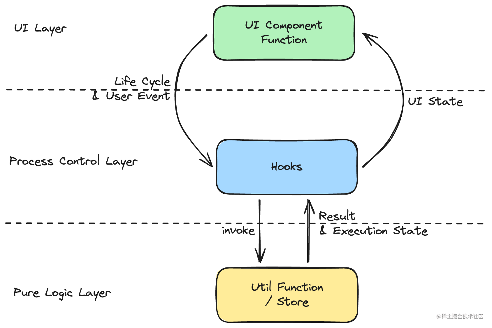
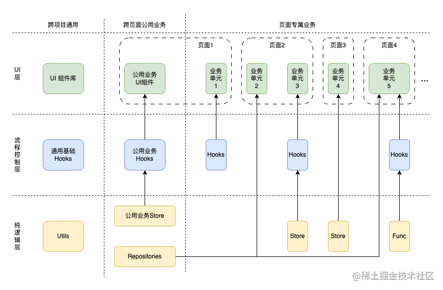

# Architecture

## [通用应用架构——如何设计一个适用于多平台的前端通用架构](https://juejin.cn/post/7390569548367970314)

### 分层设计

1. UI层
2. 流程控制层
3. 纯逻辑层

#### UI层

组件函数内部的代码应仅限于**根据state的值渲染相应的UI**。组件函数内部应当都是一些分支逻辑，如 `if(state == xxx)`或`switch(state)`之类。而**UI state当然是来自逻辑层**，还有UI中的用户事件自然也是分发逻辑层来处理。

遵守上述原则来实现的UI层逻辑非常单薄，输入输出也非常明确，因此这样的UI层是非常容易测试的。在单元测试中只需要传入不同的state来判断对应UI是否显示正确即可。而对于用户事件则需要模拟触发，然后判断逻辑层是否被调用就行。

> PS：还有一点要注意的是，并不是所有UI state都要抽到逻辑层，对于一些不影响业务逻辑的state是可以放在UI层的。比如列表的展开/收起状态、按钮hover时显示tooltip等。

#### 流程控制层

逻辑层的逻辑由UI层的**生命周期**和**用户事件**来触发，相应逻辑执行完后会**去修改UI State**，从而触发UI层的重绘。

逻辑层的逻辑可以分为两类：**UI相关的逻辑**和**UI无关的逻辑**。在我们的架构中，逻辑层将被一分为二，UI相关的逻辑通常包括一些控制UI流程的逻辑，如路由、弹窗等，因此命名为**流程控制层**。

而非UI相关的逻辑则是一些纯粹的业务逻辑，如计算、数据处理等，因此命名为**纯逻辑层**。

由于流程控制层需要与UI层交互, 所以它必须要具备两个能力：**能定义UI state**、**能监听UI组件的生命周期**。至于用户事件则是直接通过函数调用来实现的。

在声明式UI中，Hooks函数是非常适合担任流程控制层的角色的。理由如下：

- Hooks函数可以返回一个由UI state和函数组成的对象，等同于具备了面向对象三大特性之一的“封装”。其返回的对象类型是流程控制层组件与UI层组件之间交互所约定的一个接口协议，符合依赖倒置原则(DIP)，从而使得UI层与流程控制层能够解耦。
- Hooks函数的性质与组件函数最为接近，使其可以最大程度的感知UI。例如，它可以使用`useEffect`来监听UI组件的生命周期，使用`useState`来定义UI state、它内部state的的生命周期与UI组件一致不需要手动清理、它会参与UI组件的重绘等等。
- Hooks函数可以连接纯逻辑层，所以它很适合当一个“承上启下”的角色。他可以合并多个纯逻辑层组件，也可以包装纯逻辑层组件以更好的适配UI层。

流程控制层的输入是生命周期和用户事件响应函数的调用，输出则是UI State。因此它的测试需要模拟生命周期或者直接调用用户事件响应函数，然后判断UI State是否符合预期。

#### 纯逻辑层

纯逻辑层并不等同于传统意义上的数据层，而是数据层的超集。

我们将数据层扩充为纯逻辑层以容纳所有UI无关的业务逻辑。另外，所有异步操作都应该放入纯逻辑层，因为组件函数与Hooks函数性质特殊，它们并不能容纳任何耗时或者异步操作。所以如IO操作、密集计算之类的代码都应该放在纯逻辑层。

纯逻辑层中的组件根据内部是否含有状态可分为两类。无状态的纯逻辑组件通常是一些纯函数(Util Functions)，它们的输入输出是确定的，不会有副作用。有状态的纯逻辑组件则是一些状态机，它们的状态会随着时间的推移而改变。这类组件通常用Store来实现，值得注意的一点是这类组件中的状态也是UI State，因为有些页面不需要流程控制层，UI组件会与纯逻辑层直接交互

**纯逻辑层是应用业务逻辑的核心部分**

### Vertical Slicing 纵向切分

上图是加上纵向切分后的架构图。

最左侧这一列是项目中的通用部分，它们不包含任何业务逻辑。项目中引入的大部分第三方库都是处于这个区域，日常开发中也可以在写业务时尝试做一些抽象，形成自己的通用库。

中间这一列是对应项目中会被多个页面使用到的公用业务逻辑，根据DRP原则，如果项目中有些UI或逻辑被不止一处使用到，那么就应该考虑把它们提取出来放到这一列中。

最右侧的这一列是项目中占比最大的一个部分，这一列的前两层在大部分项目占比都会超过50%，而其他部分也都是为了支撑这一部分而存在的。在图中我已经尽可能地画出页面、业务单元和数据流之间的关系，图中可以清晰看到App是由一条条数据流组成的，而每条数据流又都具备UI层、流程控制层和纯逻辑层（或者两者存其一）。这样的组织方式使得项目中的每个业务单元都是一个独立的整体，可以单独修改、移动、删除。这种架构很适合敏捷的开发方式，因为它可以很好的应对需求的变化。

