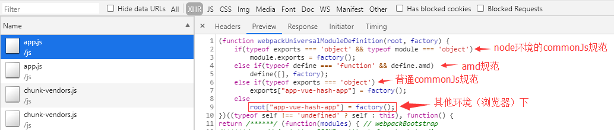

#### [微前端框架qiankun之原理与实战](http://okgoes.cn/blog/detail?blog_id=26419)
#### [微前端框架 之 single-spa 从入门到精通](https://juejin.cn/post/6862661545592111111)
#### [微前端框架 之 qiankun 从入门到源码分析](https://juejin.cn/post/6885211340999229454)

#### [微前端从入门到熟悉](https://juejin.im/post/6872132988780412935)
#### [qiankun微前端方案实践及总结](https://juejin.im/post/6844904185910018062)
#### [qiankun微前端实践总结（二）](https://juejin.im/post/6856569463950639117)
#### [详细解析微前端、微前端框架qiankun以及源码](https://segmentfault.com/a/1190000022275991)

目前主流的微前端方案包括以下几个：

- iframe：是传统的微前端解决方案，基于iframe标签实现，技术难度低，隔离性和兼容性很好，但是性能和使用体验比较差，多用于集成第三方系统；
- 基座模式：主要基于路由分发，即由一个基座应用来监听路由，并按照路由规则来加载不同的应用，以实现应用间解耦；`qiankun`和`single-spa`就是基于这种模式
- 组合式集成：把组件单独打包和发布，然后在构建或运行时组合；即单独构建组件，按需加载，类似npm包的形式
- EMP：基于Webpack5 Module Federation，一种去中心化的微前端实现方案，它不仅能很好地隔离应用，还可以轻松实现应用间的资源共享和通信；
- Web Components：是官方提出的组件化方案，它通过对组件进行更高程度的封装，来实现微前端，但是目前兼容性不够好，尚未普及。

总的来说，iframe主要用于简单并且性能要求不高的第三方系统；组合式集成目前主要用于前端组件化，而不是微前端；基座模式、EMP和Web Components是目前主流的微前端方案。


### 部署遇到的问题

1、部署在k8s中，测试环境使用Ingress配置域名路径，可直接配置PathWrite，因为在
容器中访问的地址是是不带PUBLIC_PATH的，比如http://www.onetv3.com/ops/css/styles.169c8319.css这个路径转过去是http://11.12.6.24:32149/ops/css/styles.169c8319.css。
                         应该是http://11.12.6.24:32149/css/styles.169c8319.css才对。
也可配置nginx 重新路径 比如使用alias

[k8s ingress原理及ingress-nginx部署测试](https://segmentfault.com/a/1190000019908991)

[Nginx 配置中nginx和alias的区别分析](https://blog.csdn.net/tuoni123/article/details/79712246)
```nginx
server {
    listen       80;
    server_name  localhost;

    location / {
        add_header Access-Control-Allow-Origin *;
        add_header Access-Control-Allow-Methods 'GET, POST, OPTIONS';
        add_header Cache-Control no-cache;
        root  /data/www;
        index  index.html index.htm;
        try_files $uri $uri/ /index.html;
    }

    location /subapp/ram/ {
        alias /data/www/;
    }

    #error_page  404              /404.html;

    # redirect server error pages to the static page /50x.html
    #
    error_page   500 502 503 504  /50x.html;
    location = /50x.html {
        root   /usr/share/nginx/html;
    }
}

```

#### nginx配置`proxy_pass`时url末尾带“/”与不带“/”的区别
-[nginx location中斜线的位置](https://blog.csdn.net/u010509052/article/details/105455813)

在proxy_pass中
1. proxy_pass包含路径如 `http://127.0.0.1:8080/abc` 和`http://127.0.0.1:8080`规则都有区别。

2. proxy_pass结尾加斜杠/和不加斜杠的有区别

当`location`为正则表达式匹配模式时，`proxy_pass`中的url末尾是不允许有"/"的，因此正则表达式匹配模式不在讨论范围内。
**proxy_pass配置中url末尾带/时，nginx转发时，会将原uri去除location匹配表达式后的内容拼接在proxy_pass中url之后。**
测试地址：`http://192.168.10.1/proxy/test.html`访问

- 场景一：第一种(末尾加斜杠，proxy_pass中不包含路径）：
```
location  /proxy/ {
   proxy_pass http://127.0.0.1:81/;
}
```
代理后实际访问地址：`http://127.0.0.1:81/test.html`( (proxy_pass+请求url匹配的location路径后的内容）)

- 场景二：末尾不加斜杠,proxy_pass不包含路径
```
location  /proxy/ {
   proxy_pass http://127.0.0.1:81;
}
```
代理后实际访问地址：`http://127.0.0.1:81/proxy/test.html` (proxy_pass替换请求url的ip和端口）

- 场景三：末尾加斜杠,proxy_pass包含路径
```
location  /proxy/ {
   proxy_pass http://127.0.0.1:81/abc/;
}
```
代理后实际访问地址：`http://127.0.0.1:81/abc/test.html` (proxy_pass+请求url匹配的location路径后的内容）

- 场景四：末尾不加斜杠,url包含路径
```
location  /proxy/ {
   proxy_pass http://127.0.0.1:81/abc;
}
```
代理后实际访问地址：`http://127.0.0.1:81/abctest.html` (proxy_pass+请求url匹配的location路径后的内容）

1. 如果`proxy_pass`后面有斜杠。转发url为`proxy_pass+原url匹配的location路径之后的内容`。
2. proxy_pass后面没有斜杠

  a. 只有当proxy_pass只有IP加端口，无路径时。匹配规则为proxy_pass替换原请求url的ip和端口，
  
  同时保留了location路径。例子为上述的第二种情况。
   
  b. 当proxy_pass端口后包含路径时，匹配规则同1.


### 打包成UMD, UMD
> 一个整合了commonJS和AMD规范的方法。希望能解决跨平台模块的解决方案。

运行的原理：

UMD会先判断是否支持Node.js的模块（export)是不是存在。存在则使用node.js的模块方式。

再判断是不是支持AMD(define是不是存在。存在则使用AMD方式加载模块。

```javascript
(function(root, factory){
    if (typeof exports === 'object' && typeof module === 'object') {
        module.exports = factory()
    } else if (typeof define === 'function' && define.amd) {
        define([], factory)
    } else if (typeof exports === 'object') {
        exports['subapp-ram'] = factory()
    } else root['subapp-ram'] = factory()
})(this,function () {
    //    do something
})
```
#### 总结

 - 1、使用html-webpack-externals-plugin抽取公共库及UI库资源；
    由于是要私有化部署，没有CDN，选择了再主应用中安装UI库包（主应用没有使用UI框架），使用copy-webpack-plugin插件，复制js,css文件到static文件夹,
    如下配置，但css中字体文件路径有问题，需要处理，选择在构建完后添加glup处理，如下
    `"build:one": "vue-cli-service build --mode one && gulp --gulpfile cdn-adaptor.js",`

三种思路解决
1. 通过gulp
2. 通过`copy-webpack-plugin`(5.1.2)，配置属性transform转换文件
3. 通过webpack 插件    

##### cdn-adaptor.js
 ::: details 点击查看代码
```javascript
const gulp = require('gulp');
const through2 = require('through2');

function fontPathChanger() {
  return through2.obj(function(file, enc, cb) {
    if (file.isNull()) {
      return cb(null, file);
    }
    // eslint-disable-next-line
      let str = file.contents
      .toString()
      .replace(/fonts\/ionicons/g, `/ops/static/one-ui/styles/fonts/ionicons`);
    file.contents = Buffer.from(str);

    cb(null, file);
  });
}

// 处理css font 路径
gulp.task('css', function(cb) {
  gulp
    .src('dist/static/one-ui/styles/one-ui.css')
    .pipe(fontPathChanger())
    .pipe(gulp.dest(`dist/static/one-ui/styles`));
  cb();
});

gulp.task('default', gulp.parallel('css'));
```
 ::: 
    
2. copy-webpack-plugin配置
 ::: details 点击查看代码
```js
new Copy([
        {
          from: path.resolve(__dirname, 'node_modules/@cmi/one-ui/dist'),
          to: 'static/one-ui',
          ignore: ['.*'],
          cache: true,
          transform(content, path) {
            if (path.indexOf('styles/one-ui.css') > -1) {
              let str = content
                .toString()
                .replace(/fonts\/ionicons/g, `/ops/static/one-ui/styles/fonts/ionicons`);
              return Buffer.from(str);
            }
            return content
          }
        }])
```
:::
3. webpack 插件
 ::: details 点击查看代码
```js
class CdnAdaptorPlugin {
	// 将 `apply` 定义为其原型方法，此方法以 compiler 作为参数
	apply(compiler) {
		// 指定要附加到的事件钩子函数
		compiler.hooks.emit.tapAsync('FileListPlugin', (compilation, callback) => {
			const key = 'static/one-ui/styles/one-ui.css'
			const src = compilation.assets[key]
			const str = src.source()
				.toString()
				.replace(/fonts\/ionicons/g, `/ops/static/one-ui/styles/fonts/ionicons`);
			const content = Buffer.from(str);
			console.log(content)
			compilation.assets[key] = Object.assign(compilation.assets[key],{
				source: function() {
					return content;
				},
				size: function() {
					return content.length;
				}
			})
			callback()
		});
	}
}

module.exports = CdnAdaptorPlugin
```
 ::: 

#### 主应用vue.config.ts
 ::: details 点击查看代码
```javascript
const path = require('path');
const Copy = require('copy-webpack-plugin');
const HtmlWebpackExternalsPlugin = require('html-webpack-externals-plugin');

const resolve = dir => {
  return path.join(__dirname, dir);
};

console.log('env:',
  'NODE_ENV', process.env.NODE_ENV,
  'VUE_APP_API_BASE_URL', process.env.VUE_APP_API_BASE_URL,
  'CDN_DOMIAN', process.env.CDN_DOMIAN
)
module.exports = {
  publicPath: '/ops',
  lintOnSave: true,
  productionSourceMap: false,
  chainWebpack: config => {
    config.resolve.alias
      .set('@', resolve('src')) // key,value自行定义，比如.set('@@', resolve('src/components'))
      .set('_c', resolve('src/components'));
    config
      .plugin('html')
      .tap(args => {
      args[0].CDN_DOMIAN = process.env.CDN_DOMIAN; // 添加cdn index.html引入
      return args;
    });
    config.optimization.splitChunks({
      cacheGroups: {
        // 将动态引入的css合并成一个css文件
        async: {
          name: 'styles',
          test: m => m.constructor.name === 'CssModule',
          chunks: 'all',
          minChunks: 1,
          reuseExistingChunk: true,
          enforce: true
        },
        vendors: {
          name: 'chunk-vendors',
          // eslint-disable-next-line no-useless-escape
          test: /[\\\/]node_modules[\\\/]/,
          priority: -10,
          chunks: 'initial'
        },
        common: {
          name: 'chunk-common',
          minChunks: 2,
          priority: -20,
          chunks: 'initial',
          reuseExistingChunk: true
        }
      }
    });
    // 外部链接优化
    config
      .plugin('htmlExternals')
      .after('html')
      .use(HtmlWebpackExternalsPlugin, [
        {
          externals: [
            {
              module: 'vue',
              entry: {
                path: `${process.env.CDN_DOMIAN}/vue/vue.min.js`,
                type: 'js'
              },
              global: 'Vue'
            },
            {
              module: 'vue-router',
              entry: {
                path: `${process.env.CDN_DOMIAN}/vue/vue-router.min.js`,
                type: 'js'
              },
              global: 'VueRouter'
            },
            {
              module: 'vuex',
              entry: {
                path: `${process.env.CDN_DOMIAN}/vue/vuex.min.js`,
                type: 'js'
              },
              global: 'Vuex'
            }
          ],
          enabled: process.env.NODE_ENV === 'production'
        }
      ]);
  },
  configureWebpack: {
    plugins: [
      new Copy([
        {
          from: path.resolve(__dirname, 'node_modules/@cmi/one-ui/dist'),
          to: 'static/one-ui',
          ignore: ['.*']
        },
        {
          from: path.resolve(__dirname, 'node_modules/vue/dist/vue.min.js'),
          to: 'static/vue',
          ignore: ['.*']
        },
        {
          from: path.resolve(__dirname, 'node_modules/vuex/dist/vuex.min.js'),
          to: 'static/vue',
          ignore: ['.*']
        },
        {
          from: path.resolve(__dirname, 'node_modules/vue-router/dist/vue-router.min.js'),
          to: 'static/vue',
          ignore: ['.*']
        }
      ])
    ]
  },
  devServer: {
    port: 8080,
    host: '0.0.0.0',
    proxy: {
      [process.env.VUE_APP_API_BASE_URL]: {
        target: 'http://ops.test.com',
        changeOrigin: true
      },
      '/api/v1': {
        target: 'http://ops.test.com',
        changeOrigin: true
      }
    }
  }
};

```
 ::: 
 
##### 子应用vue.config.ts

```
VUE_APP_ROUTER_BASE_URL=/ops/stateManage
VUE_APP_API_BASE_URL=/ops/api/ram/api/v1
FONT_BASE_URL=/ops/subapp/stateManage
PUBLIC_PATH=/ops/subapp/stateManage
CDN_DOMIAN=http://www.one.com/ops/static
```
 ::: details 点击查看代码
```javascript
const path = require('path')
const packages = require('./package.json')
const HtmlWebpackExternalsPlugin = require('html-webpack-externals-plugin')
const CompressionPlugin = require('compression-webpack-plugin')

function resolve (dir) {
  return path.join(__dirname, dir)
}
console.log('env:',
  'VUE_APP_ROUTER_BASE_URL', process.env.VUE_APP_ROUTER_BASE_URL, // 路由要和父应用激活路由对应
  'VUE_APP_API_BASE_URL', process.env.VUE_APP_API_BASE_URL,
  'FONT_BASE_URL', process.env.FONT_BASE_URL, // 本地写死路径不然本地主应用显示会有问题
  'PUBLIC_PATH', process.env.PUBLIC_PATH, // 与子应用访问路径相同
  'CDN_DOMIAN', process.env.CDN_DOMIAN
)

module.exports = {
  productionSourceMap: false,
  publicPath: process.env.PUBLIC_PATH,
  devServer: {
    contentBase: 'static',
    proxy: {
      '/api/v1': {
        target: 'http://ops.test.com',
        changeOrigin: true
      }
    },
    headers: {
      'Access-Control-Allow-Origin': '*'
    },
    host: '0.0.0.0',
    port: 8082,
    open: true
  },
  css: {
    loaderOptions: {
      scss: {
        prependData: '@import "~@/assets/css/var.scss";'
      }
    }
  },
  configureWebpack: {
    output: {
      // 把子应用打包成 umd 库格式
      library: `${packages.name}-[name]`,
      libraryTarget: 'umd',
      jsonpFunction: `webpackJsonp_${packages.name}`
    },
    plugins: [
    ]
  },
  chainWebpack: config => {
    config.resolve.alias
      .set('@', resolve('src'))
      .set('_c', resolve('src/components'))
      .set('_v', resolve('src/views'))
      .set('_com', resolve('src/common'))
      .set('static', resolve('static'))
    config.optimization.minimizer('terser').tap((args) => {
      args[0].terserOptions.compress.drop_console = true
      return args
    })
    config.module.rule('fonts')
      .use('url-loader')
      .loader('url-loader')
      .tap(options => {
        // 字体文件在嵌入乾坤时，可能需要生成完整的路径，通过环境变量PUBLIC_PATH注入
        return {
          limit: 4096,
          fallback: {
            loader: 'file-loader',
            options: {
              name: 'fonts/[name].[hash:4].[ext]',
              publicPath: process.env.FONT_BASE_URL
            }
          }
        }
      })
    // 图片内联大小限制2kb
    config.module.rule('images')
      .use('url-loader')
      .loader('url-loader')
      .tap(options => {
        options.limit = 2048
        options.fallback.options.publicPath = process.env.FONT_BASE_URL
        return options
      })
    config.optimization.splitChunks({
      cacheGroups: {
        // 将动态引入的css合并成一个css文件
        async: {
          name: 'styles',
          test: (m) => m.constructor.name === 'CssModule',
          chunks: 'all',
          minChunks: 1,
          reuseExistingChunk: true,
          enforce: true
        },
        vendors: {
          name: 'chunk-vendors',
          // eslint-disable-next-line no-useless-escape
          test: /[\\\/]node_modules[\\\/]/,
          priority: -10,
          chunks: 'initial'
        },
        common: {
          name: 'chunk-common',
          minChunks: 2,
          priority: -20,
          chunks: 'initial',
          reuseExistingChunk: true
        }
      }
    })
    // 外部链接优化
    config.plugin('htmlExternals').after('html').use(HtmlWebpackExternalsPlugin, [
      {
        externals: [
          {
            module: 'vue',
            entry: {
              path: `${process.env.CDN_DOMIAN}/vue/vue.min.js`,
              type: 'js'
            },
            global: 'Vue'
          },
          {
            module: 'vue-router',
            entry: {
              path: `${process.env.CDN_DOMIAN}/vue/vue-router.min.js`,
              type: 'js'
            },
            global: 'VueRouter'
          },
          {
            module: 'vuex',
            entry: {
              path: `${process.env.CDN_DOMIAN}/vue/vuex.min.js`,
              type: 'js'
            },
            global: 'Vuex'
          },
          {
            module: '@cmi/one-ui',
            entry: `${process.env.CDN_DOMIAN}/one-ui/one-ui.min.js`,
            global: 'one-ui'
          },
          {
            module: '@cmi/one-ui/dist/styles/one-ui.css',
            entry: {
              path: `${process.env.CDN_DOMIAN}/one-ui/styles/one-ui.css`,
              type: 'css'
            }
          }
        ],
        enabled: !!process.env.CDN_DOMIAN
      }
    ])
    // 配置gzip压缩
    if (process.env.NODE_ENV === 'production') {
      config.plugin('compression').use(CompressionPlugin, [
        {
          test: /\.js$|\.css$/, // 匹配文件名
          threshold: 10240, // 对超过10K的数据进行压缩
          deleteOriginalAssets: false // 是否删除源文件（建议false，万一ng没把gizp_static 开起就JJ了）
        }
      ])
    }
  }
}

```
 ::: 
