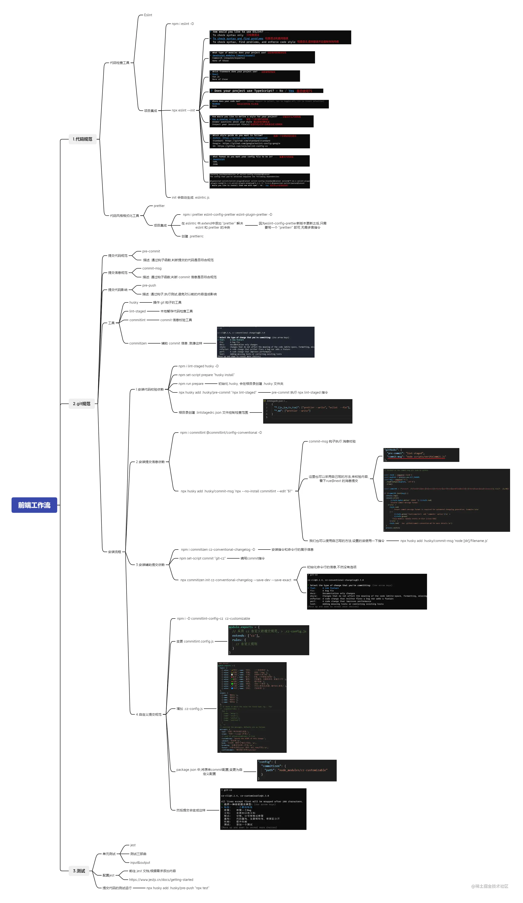

### 中后台系统

#### 中台
- [中台”到底是什么？](https://zhuanlan.zhihu.com/p/75223466)

目的：便于高速发展的复杂应用的敏捷开发

手段：解耦，提高复用

在一般的中后台系统中，我们可以把前端的架构划分为三大部分：这分别是**核心框架库**，**插件**，**公共机制**。

- 核心框架库： 系统的基础框架技术选型，比如像Vue,Vuex,Vue Router，或者说React,Redux,Router这样的，就属于核心框架库，这一部分选型是在前期完成的，需要慎重，因为它决定了整个系统以后的开发走向；
- 插件： 可以理解为工具库，比如UI框架库antd、element，图表工具库eCharts，3d库three.js等等
- 公共机制： 把一些公共的功能模块封装起来，以供其他开发人员使用，极大提升开发效率。核心在于封装。

在中后台系统中，这一般包括以下五个小部分：

1. UI组件库的二次封装。这针对一些极其常用的UI组件，主要是为了统一风格，以使用频率最高的table和form为代表；

2. 请求插件的封装。以axios为例，主要是做后台请求发生错误的统一拦截显示；

3. 后台API请求的URL地址文件封装。这主要是为了统一管理，使得URL不会零散地分布在各个业务组件中，统一修改，统一替换公共域名等；

4. 权限和菜单的封装。一般中后台系统是分人员角色的，那么不同的角色就对应不同的权限，拿到的菜单也不一样；

5. 格式化的封装。像中后台系统里面的很多格式是比较常见的，如身份证、电话号码、日期、金额、车牌号等，这些可用于一些前端校验和前端展示的场景，且在很多地方都会用到，所以非常有必要把一些常用的格式化操作放到全局。

- [前端架构探索与实践](https://blog.csdn.net/qq_29438877/article/details/108675426)

## 项目目录结构

- [React 项目文件分层原则](https://mp.weixin.qq.com/s/INNwbrax3NHiC5fganeFlQ)

```markdown
project-root/
├── .github/                     # GitHub 相关
│   └── workflows/               # CI/CD 配置
│       └── deploy.yml
├── .husky/                      # Git Hooks
│   ├── pre-commit               # 提交前检查
│   └── commit-msg               # commit 信息检查
├── .vscode/                     # VS Code 配置
│   ├── settings.json            # 编辑器设置
│   ├── extensions.json          # 推荐插件
│   └── launch.json              # 调试配置
├── public/                      # 静态资源
│   ├── favicon.ico
│   ├── robots.txt
│   └── manifest.json
├── scripts/                     # 自定义脚本
│   ├── build.js                 # 构建脚本
│   ├── deploy.js                # 部署脚本
│   └── generate-component.js    # 组件生成脚本
├── src/
│   ├── assets/                  # 资源文件
│   │   ├── images/
│   │   ├── fonts/
│   │   └── icons/
│   ├── components/              # 通用组件
│   ├── features/                # 业务功能
│   ├── pages/                   # 页面组件
│   ├── layouts/                 # 布局组件
│   ├── hooks/                   # 自定义 Hooks
│   ├── services/                # API 服务
│   ├── store/                   # 状态管理
│   ├── utils/                   # 工具函数
│   ├── types/                   # TS 类型定义
│   ├── constants/               # 常量
│   ├── config/                  # 配置
│   ├── styles/                  # 全局样式
│   ├── App.tsx                  # 根组件
│   ├── main.tsx                 # 入口文件
│   └── vite-env.d.ts            # Vite 类型声明
├── tests/                       # 测试文件
│   ├── unit/                    # 单元测试
│   ├── integration/             # 集成测试
│   └── e2e/                     # 端到端测试
├── .env.example                 # 环境变量示例
├── .eslintrc.js
├── .prettierrc
├── .gitignore
├── tsconfig.json
├── vite.config.ts
├── package.json
└── README.md
```

## 前端工作流

忘记哪里copy的了


