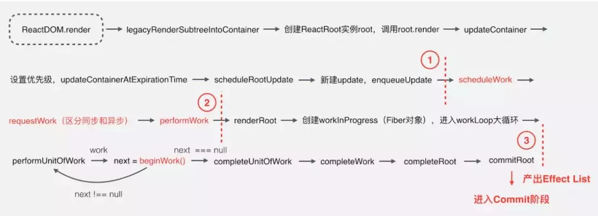
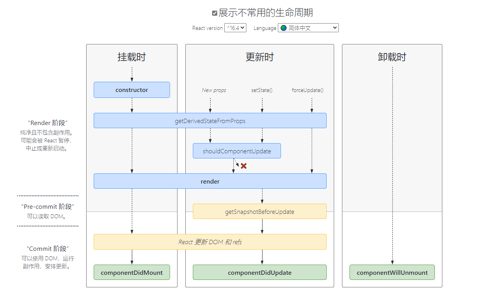

[react](https://zh-hans.reactjs.org/)

[React技术揭秘](https://react.iamkasong.com/)

[React 运行时优化方案的演进](https://juejin.cn/post/7010539227284766751)

[React 是如何工作的](https://mp.weixin.qq.com/s/ifLP36rFhYJsU2RCAi7OZQ)

[图解React](https://7kms.github.io/react-illustration-series/)

[react+typescript](https://github.com/typescript-cheatsheets/react)

[2021年React学习路线图](https://mp.weixin.qq.com/s?__biz=MzUxMzcxMzE5Ng==&mid=2247505750&idx=2&sn=a31164ddf69f49e3761d2a6d660cf316&chksm=f9526215ce25eb031cbb1f8e0137b3fb3e30f6305fb183f028ab12419699695173b51c44b49d&scene=132#wechat_redirect)

[Build your own React](https://pomb.us/build-your-own-react/) | [Build your own React-中文](https://github.com/defpis/build-your-own-react)

[react-面试题](https://github.com/semlinker/reactjs-interview-questions)

-------

[[toc]]

[//]: # (- [概述]&#40;#概述&#41;)

[//]: # (- [React15架构]&#40;#react15架构&#41;)

[//]: # (    - [Reconciler]&#40;#reconciler&#41;)

[//]: # (    - [Renderer]&#40;#renderer-渲染器&#41;)

[//]: # (- [React16架构]&#40;#react16架构&#41;)

[//]: # (- [React16的组件类型]&#40;#react16的组件类型&#41;)

[//]: # (- [函数式组件]&#40;#函数式组件&#41;)

[//]: # (- [JSX简介]&#40;#jsx简介&#41;)

[//]: # (- [Fiber]&#40;#fiber&#41;)

[//]: # (    - [双缓存Fiber树]&#40;#双缓存fiber树&#41;)

[//]: # (    - [Fiber是如何工作的]&#40;#fiber是如何工作的&#41;)

[//]: # (- [生命周期]&#40;#生命周期&#41;)

[//]: # (    - [React16.3.0之前生命周期]&#40;#react16-3-0之前生命周期&#41;)

[//]: # (    - [React16.3.0之后的生命周期]&#40;#react16-3-0之后的生命周期&#41;)

[//]: # (- [受控与非受控组件]&#40;#受控与非受控组件&#41;)

[//]: # (- [setState]&#40;#setstate&#41;)

[//]: # (- [react合成事件]&#40;#react合成事件&#41;)

[//]: # (- [React.PureComponent与React.memo&#40;&#41;]&#40;#react-purecomponent与react-memo&#41;)

[//]: # (- [React组件到底什么时候render]&#40;#react组件到底什么时候render&#41;)

[//]: # (- [高阶组件]&#40;#高阶组件&#41;)

[//]: # (- [render props]&#40;#render-props&#41;)

[//]: # (- [真实DOM操作和Virtual Dom]&#40;#真实dom操作和virtual-dom&#41;)

[//]: # (- [Diff算法]&#40;#diff算法&#41;)

[//]: # (- [React懒加载]&#40;#react懒加载&#41;)

[//]: # (- [React17/18新特性]&#40;#react17-18新特性&#41;)

## 概述

React用于构建用户界面的 JavaScript 库

单项数据流：
把组件相当于一个函数，props 相当于函数的传参。如果组件内部可以改变 props 就相当于，在函数内部改变参数。那么这个函数就产生了副作用，那么这个函数就不是一个 `pure function`。这会使函数变的不可测试，不可测试也就不能预测执行结果，从而降低代码可维护性。

React采用自上而下单向数据流的方式，管理自身的数据与状态。在单向数据流中，数据只能由父组件触发，向下传递到子组件。

可以在父组件中定义state，并通过props的方式传递到子组件。如果子组件想要修改父组件传递而来的状态，则**只能给父组件发送消息，由父组件改变，再重新传递给子组件**。

在React中，**state与props的改变，都会引发组件重新渲染。如果是父组件的变化，则父组件下所有子组件都会重新渲染**。

在class组件中，组件重新渲染，是执行render方法。

**而在函数式组件中，是整个函数重新执行。**

## React15架构

React15架构可以分为两层：

- Reconciler（协调器）—— 负责找出变化的组件
- Renderer（渲染器）—— 负责将变化的组件渲染到页面上

### Reconciler

即便 React DOM 和 React Native 渲染器的区别很大，但也需要共享一些逻辑。特别是协调算法需要尽可能相似，这样可以让声明式渲染，自定义组件，state，生命周期方法和 refs 等特性，保持跨平台工作一致。

在React中可以通过`this.setState`、`this.forceUpdate`、`ReactDOM.render`等API触发更新。

每当有更新发生时，`Reconciler`会做如下工作：

- 调用函数组件、或class组件的render方法，将返回的JSX转化为虚拟DOM
- 将虚拟DOM和上次更新时的虚拟DOM对比
- 通过对比找出本次更新中变化的虚拟DOM
- 通知Renderer将变化的虚拟DOM渲染到页面上

### Renderer（渲染器）
由于React支持跨平台，所以不同平台有不同的`Renderer`。最熟悉的是负责在浏览器环境渲染的Renderer —— ReactDOM

除此之外，还有：

- ReactNative渲染器，渲染App原生组件
- ReactTest渲染器，渲染出纯Js对象用于测试
- ReactArt渲染器，渲染到Canvas, SVG 或 VML (IE8)

在每次更新发生时，Renderer接到`Reconciler`通知，将变化的组件渲染在当前宿主环境。

在`Reconciler`中，mount的组件会调用`mountComponent`，update的组件会调用`updateComponent`。这两个方法都会递归更新子组件。

由于递归执行，所以更新一旦开始，**中途就无法中断**。当层级很深时，递归更新时间超过了16ms，用户交互就会卡顿。

## React16架构

React16架构可以分为三层：

- Scheduler（调度器）—— 调度任务的优先级，高优任务优先进入Reconciler
- Reconciler（协调器）—— 负责找出变化的组件
- Renderer（渲染器）—— 负责将变化的组件渲染到页面上

Scheduler实际上就是`requestIdleCallback` 的polyfill，以浏览器是否有剩余时间作为任务中断的标准，实现了一种机制，当浏览器有剩余时间时通知`Reconciler`。

整个`Scheduler`与`Reconciler`的工作都在内存中进行。**只有当所有组件都完成Reconciler的工作**，才会统一交给`Renderer`。

[完全理解React Fiber](http://www.ayqy.net/blog/dive-into-react-fiber/)

reconcile过程分为2个阶段（phase）：
1. **reconciliation**（diff阶段）, （可中断）render/reconciliation 通过构造workInProgress tree得出change
2. **commit**：（不可中断）commit 应用这些DOM change

- reconciliation阶段：包含的主要工作是对`current tree` 和 `new tree`(`workInProgress`) 做diff计算，找出变化部分。进行遍历、对比等是可以中断，歇一会儿接着再来。
- commit阶段：对上一阶段获取到的变化部分应用到真实的DOM树中，是一系列的DOM操作。不仅要维护更复杂的DOM状态，而且中断后再继续，会对用户体验造成影响。在普遍的应用场景下，此阶段的耗时比diff计算等耗时相对短。
所以，Fiber选择在reconciliation阶段拆分

如何拆分：
- 用户调用ReactDOM.render传入组件，React创建Element树;
- 在第一次渲染时，创建vdom树，用来维护组件状态和dom节点的信息。
- 当后续操作如render或setState时需要更新，通过diff算出变化的部分。
- 根据变化的部分更新vdom树、调用组件生命周期函数等，同步应用到真实的DOM节点中。

**reconciliation具体过程如下：**

以`fiber tree`为蓝本，把每个`fiber`作为一个工作单元，自顶向下逐节点构造`workInProgress tree`（构建中的新`fiber tree`）

以组件节点为例
- 1. 如果当前节点不需要更新，直接把子节点clone过来，跳到5；要更新的话打个tag
- 2. 更新当前节点状态（props, state, context等）
- 3. 调用`shouldComponentUpdate()`，false的话，跳到5
- 4. 调用render()获得新的子节点，并为子节点创建fiber（创建过程会尽量复用现有fiber，子节点增删也发生在这里）
- 5. 如果没有产生`child fiber`，该工作单元结束，把`effect list`归并到`return`，并把当前节点的`sibling`作为下一个工作单元；否则把child作为下一个工作单元
- 6. 如果没有剩余可用时间了，等到下一次主线程空闲时才开始下一个工作单元；否则，立即开始做
- 7. 如果没有下一个工作单元了（回到了workInProgress tree的根节点），第1阶段结束，进入pending Commit状态

实际上是1-6的**工作循环**，7是出口，工作循环每次只做一件事，做完看要不要喘口气。工作循环结束时，`workInProgress tree`的根节点身上的effect list就是收集到的所有side effect（因为每做完一个都向上归并）

所以，构建`workInProgress tree`的过程就是`diff`的过程，通过`requestIdleCallback`来调度执行一组任务，每完成一个任务后回来看看有没有插队的（更紧急的），每完成一组任务，把时间控制权交还给主线程，直到下一次`requestIdleCallback`回调再继续构建`workInProgress tree`。

**commit具体过程如下：**

1. 处理`effect list`（包括3种处理：更新DOM树、调用组件生命周期函数以及更新ref等内部状态）
2. 处理结束，第2阶段结束，所有更新都commit到DOM树上了

注意，真的是**一口气做完**（同步执行，不能喊停）的，这个阶段的实际工作量是比较大的，所以尽量不要在后3个生命周期函数里干重活儿

**生命周期hook**

生命周期函数也被分为2个阶段了：

```
// 第1阶段 render/reconciliation
componentWillMount
componentWillReceiveProps
shouldComponentUpdate
componentWillUpdate

// 第2阶段 commit
componentDidMount
componentDidUpdate
componentWillUnmount
```

第1阶段的生命周期函数可能会被**多次调用**，默认以low优先级（后面介绍的6种优先级之一）执行，被高优先级任务打断的话，稍后重新执行

**fiber tree与workInProgress tree**

`双缓冲`技术（double buffering），就像[redux](http://www.ayqy.net/blog/redux%E6%BA%90%E7%A0%81%E8%A7%A3%E8%AF%BB/#articleHeader7)里的`nextListeners`，以`fiber tree`为主，workInProgress tree为辅

双缓冲具体指的是workInProgress tree构造完毕，得到的就是新的fiber tree，然后喜新厌旧（把current指针指向workInProgress tree，丢掉旧的fiber tree）就好了

这样做的好处：

- 能够复用内部对象（fiber）

- 节省内存分配、GC的时间开销

每个fiber上都有个alternate属性，也指向一个fiber，创建workInProgress节点时优先取alternate，没有的话就创建一个：

```js
let workInProgress = current.alternate;
if (workInProgress === null) {
  //...这里很有意思
  workInProgress.alternate = current;
  current.alternate = workInProgress;
} else {
  // We already have an alternate.
  // Reset the effect tag.
  workInProgress.effectTag = NoEffect;

  // The effect list is no longer valid.
  workInProgress.nextEffect = null;
  workInProgress.firstEffect = null;
  workInProgress.lastEffect = null;
}
```
如注释指出的，fiber与workInProgress互相持有引用，“喜新厌旧”之后，旧fiber就作为新fiber更新的预留空间，达到复用fiber实例的目的

**优先级策略**

每个工作单元运行时有6种优先级：
1. synchronous 与之前的Stack reconciler操作一样，同步执行
2. task 在next tick之前执行
3. animation 下一帧之前执行
4. high 在不久的将来立即执行
5. low 稍微延迟（100-200ms）执行也没关系
6. offscreen 下一次render时或scroll时才执行

`synchronous`首屏（首次渲染）用，要求尽量快，不管会不会阻塞UI线程。`animation`通过`requestAnimationFrame`来调度，这样在下一帧就能立即开始动画过程；后3个都是由`requestIdleCallback`回调执行的；`offscreen`指的是当前隐藏的、屏幕外的（看不见的）元素

高优先级的比如键盘输入（希望立即得到反馈），低优先级的比如网络请求，让评论显示出来等等。另外，**紧急的事件允许插队**

这样的优先级机制存在2个问题：

1. 生命周期函数怎么执行（可能被频频中断）：触发顺序、次数没有保证了

2. starvation（低优先级饿死）：如果高优先级任务很多，那么低优先级任务根本没机会执行（就饿死了）

### [React16的组件类型](https://zhuanlan.zhihu.com/p/55000793)

## 函数式组件

函数式组件与普通的函数几乎完全一样。只不过函数执行完毕时，返回的是一个JSX结构。

```jsx harmony
function Hello() {
  return <div>hello world.</div>
}
```

- **1. 函数式组件接收props作为自己的参数**

```typescript jsx
import React from 'react';

interface Props {
  name: string,
  age: number
}

function Demo({ name, age }: Props) {
  return [
    <div>name: {name}</div>,
    <div>age: {age}</div>
  ]
}

export default Demo;
```

- 2. **props的每次变动，组件都会重新渲染一次，函数重新执行。**

- 3. **没有this。那么也就意味着，之前在class中由于this带来的困扰就自然消失了。**

[React是怎么分辨class或者function 组件的](https://juejin.cn/post/6844903735412391944): 

```jsx harmony
// 类组件
class Greeting extends React.Component {
  render() {
    return <p>Hello</p>;
  }
}
// 函数式组件
function Greeting() {
  return <p>Hello</p>;
}
// 调用
// Class or function — whatever.
<Greeting />
// 但在react内部
// Inside React
const result = Greeting(props); // <p>Hello</p>
// Inside React
const instance = new Greeting(props); // Greeting {}
const result = instance.render(); // <p>Hello</p>
```
**函数组件直接运行，而类组件需要`new`实例化**， 所以函数组件没有`this`，应用是独立调用的，而`new`会强制绑定`this`

实际上React对基础的组件也就是`React.Component`**添加了一个标记**，并通过这个标记来区分一个组件是否是一个类组件。

```js
// Inside React
class Component {}
Component.prototype.isReactComponent = {};

// We can check it like this
class Greeting extends Component {}
console.log(Greeting.prototype.isReactComponent); // ✅ Yes
```

## JSX简介

[React 是如何创建 vdom 和 fiber tree](https://mp.weixin.qq.com/s?__biz=MzI3ODU4MzQ1MA==&mid=2247484766&idx=1&sn=a4f15894db4076c43a7859a5bc77542f&chksm=eb5584abdc220dbd222c5eeb239e0db1cff1385a89381da651476a7730f455f43c9c8d465478&mpshare=1&scene=23&srcid=0205epPsZMYOfNhALNtvAldy&sharer_sharetime=1612515049758&sharer_shareid=1958dfa2b35b63c7a7463d11712f39df#rd)

JSX在编译时会被`Babel`编译为`React.createElement`方法。

`React.createElement`最终会调用`ReactElement`方法返回一个包含组件数据的对象，该对象有个参数`$$typeof: REACT_ELEMENT_TYPE`标记了该对象是个`React Element`。

`props.children`打印出来是个`React.element`
```js
export function createElement(type, config, children) {
  let propName;

  const props = {};

  let key = null;
  let ref = null;
  let self = null;
  let source = null;

  if (config != null) {
    // 将 config 处理后赋值给 props
    // ...省略
  }

  const childrenLength = arguments.length - 2;
  // 处理 children，会被赋值给props.children
  // ...省略

  // 处理 defaultProps
  // ...省略

  return ReactElement(
    type,
    key,
    ref,
    self,
    source,
    ReactCurrentOwner.current,
    props,
  );
}

const ReactElement = function(type, key, ref, self, source, owner, props) {
  const element = {
    // 标记这是个 React Element
    $$typeof: REACT_ELEMENT_TYPE, // 指向 Symbol(React.element)，也承担了安全方面的功能。

    type: type, // 这个元素是一个纯 html 标签元素，例如 div ，那么 type 将会是字符串 div, 如果是一个函数组件或者ClassComponent，则是指向自身，
    key: key, // key 在数组的处理和 diff 过程中有重要作用
    ref: ref, // 引用标识
    props: props, // 包含id 、 className 、 style 、 children 、点击事件等等
    _owner: owner,
  };

  return element;
};
```

React提供了验证合法React Element的全局API`React.isValidElement`

```js
export function isValidElement(object) {
  return (
    typeof object === 'object' &&
    object !== null &&
    object.$$typeof === REACT_ELEMENT_TYPE
  );
}
```
可以看到，`$$typeof === REACT_ELEMENT_TYPE`的非null对象就是一个合法的`React Element`。换言之，在React中，所有JSX在运行时的返回结果（即`React.createElement()`的返回值）都是`React Element`。

## Fiber
Fiber是链表结构
- child 指向当前节点的第一个子元素
- return 指向当前节点的父元素
- sibling 指向同级的下一个兄弟节点

如果是 React16 之前的树状结构，就需要通过 `DFS` 深度遍历来查找每一个节点。而现在只需要将指针按照 `child → sibling → return` 的优先级移动，就可以处理所有的节点。


这样设计还有一个好处就是在 React 工作的时候只需要使用一个全局变量作为指针在链表中不断移动，如果出现用户输入或其他优先级更高的任务就可以 `暂停` 当前工作，其他任务结束后只需要根据指针的位置继续向下移动就可以继续之前的工作。指针移动的规律可以归纳为 **自顶向下，从左到右** 。

fiber可以划分为3层含义分类：
1. 作为Fiber树结构的，链表结构的3个指针
2. 作为一种静态的数据结构，保存了组件相关的信息
3. 作为动态的工作单元的属性
```typescript jsx
function FiberNode(
  tag: WorkTag,
  pendingProps: mixed,
  key: null | string,
  mode: TypeOfMode,
) {
  // 作为静态数据结构的属性
  this.tag = tag; //Fiber对应组件的类型 Function/Class/Host...
  this.key = key; // key属性
  this.elementType = null; // 大部分情况同type，某些情况不同，比如FunctionComponent使用React.memo包裹
  this.type = null; // 对于 FunctionComponent，指函数本身，对于ClassComponent，指class，对于HostComponent，指DOM节点tagName
  // stateNode 代表这个 fiber 节点对应的真实状态
  // 对于原生组件，这个值指向一个 dom 节点（虽然已经被创建了，但不代表就被插入了 document ）
  // 对于类组件，这个值指向对应的类实例
  // 对于函数组件，这个值指向 Null
  // 对于 RootFiber，这个值指向 FiberRoot
  this.stateNode = null; // Fiber对应的真实DOM节点

  // 用于连接其他Fiber节点形成Fiber树
  this.return = null; // 指向父级Fiber节点
  this.child = null; // 指向子Fiber节点
  this.sibling = null; // 指向右边第一个兄弟Fiber节点
  this.index = 0;

  this.ref = null;

  // 作为动态的工作单元的属性
  this.pendingProps = pendingProps; // memorizeState 和 memorizeProps 代表在上次渲染中组件的 props 和 state 。如果成功更新，那么新的 pendingProps 和 newState 将会替代这两个变量的值
  this.memoizedProps = null;
  this.updateQueue = null;
  this.memoizedState = null;
  this.dependencies = null;

  this.mode = mode;

  this.effectTag = NoEffect; // 代表这个 fiber 在下一次渲染中将会被如何处理。例如只需要插入，那么这个值中会包含 Placement ，如果需要被删除，那么将会包含 Deletion 。
  this.nextEffect = null;

  this.firstEffect = null; // firstEffect 和 lastEffect 的类型都和 fiber 一样，同样是链表结构，通过 nextEffect 来连接。代表着即将更新的 fiber 状态
  this.lastEffect = null;

  // 调度优先级相关
  this.lanes = NoLanes;
  this.childLanes = NoLanes;

  // 指向该fiber在另一次更新时对应的fiber
  this.alternate = null;
}
```
### 双缓存Fiber树

在React中最多会同时存在两棵`Fiber`树。当前屏幕上显示内容对应的Fiber树称为`current Fiber`树，正在内存中构建的Fiber树称为`workInProgress Fiber`树。

`current Fiber`树中的Fiber节点被称为current fiber，workInProgress Fiber树中的Fiber节点被称为workInProgress fiber，他们通过`alternate`属性连接。

```javascript
currentFiber.alternate === workInProgressFiber;
workInProgressFiber.alternate === currentFiber;
```

React应用的根节点通过current指针在不同Fiber树的rootFiber间切换来实现Fiber树的切换。

当workInProgress Fiber树构建完成交给Renderer渲染在页面上后，应用根节点的current指针指向workInProgress Fiber树，此时workInProgress Fiber树就变为current Fiber树。

每次状态更新都会产生新的workInProgress Fiber树，通过current与workInProgress的替换，完成DOM更新。

首次执行ReactDOM.render会创建fiberRootNode（源码中叫fiberRoot）和`rootFiber`。其中`fiberRootNode`是整个应用的根节点，`rootFiber`是`<App/>`所在组件树的根节点。

### Fiber是如何工作的

1. ReactDOM.render() 和 setState 的时候开始创建更新。

2. 将创建的更新加入任务队列，等待调度。

3. 在 requestIdleCallback 空闲时执行任务。

4. 从根节点开始遍历 Fiber Node，并且构建 WokeInProgress Tree。

5. 生成 effectList。

6. 根据 EffectList 更新 DOM。



## [生命周期](https://zh-hans.reactjs.org/docs/react-component.html)

### React16.3.0之前生命周期

[文章](https://juejin.cn/post/6844904021233238024)


#### 创建期:

- constructor(props, context)
- componentWillMount()
- render()
- componentDidMount()

#### 运行时:

#### props发生变化时

- componentWillReceiveProps(nextProps, nextContext)
- shouldComponentUpdate(nextProps, nextState, nextContext)
- componentWillUpdate(nextProps, nextState, nextContext)
- render
- componentDidUpdate(prevProps, prevState, snapshot)

#### state发生变化时

- shouldComponentUpdate(nextProps, nextState, nextContext)
- componentWillUpdate(nextProps, nextState, nextContext)
- render
- componentDidUpdate(prevProps, prevState, snapshot)

#### 卸载时

- componentWillUnmount()

### React16.3.0之后的生命周期

#### 创建期:

- constructor(props, context)
- static getDerivedStateFromProps(props, status)
- render()
- componentDidMount()

或者如下生命周期:

- constructor(props, context)
- componentWillMount() / UNSAFE_componentWillMount()
- render()
- componentDidMount()
注意: `getDerivedStateFromProps`/`getSnapshotBeforeUpdate` 和 `componentWillMount`/`componentWillReceiveProps`/`componentWillUpdate` 如果同时存在，React会在控制台给出警告信息，且仅执行 getDerivedStateFromProps/getSnapshotBeforeUpdate 【React@16.7.0】

#### 运行时:

#### props发生变化时

- static getDerivedStateFromProps(props, status)
- shouldComponentUpdate(nextProps, nextState, nextContext)
- render
- getSnapshotBeforeUpdate(prevProps, prevState)
- componentDidUpdate(prevProps, prevState, snapshot)

或者如下生命周期:

- componentWillReceiveProps(nextProps, nextContext)/UNSAFE_componentWillReceiveProps
- shouldComponentUpdate(nextProps, nextState, nextContext)
- componentWillUpdate(nextProps, nextState, nextContext)
- render
- componentDidUpdate(prevProps, prevState, snapshot)

#### state发生变化时

- static getDerivedStateFromProps(props, status)
- shouldComponentUpdate(nextProps, nextState, nextContext)
- render
- getSnapshotBeforeUpdate(prevProps, prevState)
- componentDidUpdate(prevProps, prevState, snapshot)
或者如下生命周期:

- shouldComponentUpdate(nextProps, nextState, nextContext)
- componentWillUpdate(nextProps, nextState, nextContext)/UNSAFE_componentWillUpdate
- render
- componentDidUpdate(prevProps, prevState, snapshot)
#### 销毁时

- componentWillUnmount()

由于 `reconciliation` 阶段是可中断的，一旦中断之后恢复的时候又会重新执行，所以很可能 `reconciliation` 阶段的生命周期方法会被多次调用，所以在 `reconciliation` 阶段的生命周期的方法是不稳定的，
我想这也是 React 为什么要废弃 `componentWillMount` 和 `componentWillReceiveProps`方法而改为静态方法 `getDerivedStateFromProps`的原因吧。

[示意图](https://projects.wojtekmaj.pl/react-lifecycle-methods-diagram/)

新的生命周期图示:




## 受控与非受控组件

受控组件：在 HTML 中，表单元素（如`<input>、 <textarea>、<select>`)通常自己维护 state，并根据用户输入进行更新。
即如Input的value绑定了state，而onChange时使用`setState`更新。

也可以说是组件外部能控制组件内部的状态，则表示该组件为受控组件。

外部想要控制内部的组件，就必须要往组件内部传入props。而通常情况下，受控组件内部又自己维护自己的状态。例如input组件。

如下实现


```typescript jsx
import React, {useState, useEffect} from 'react'

interface Props {
	value?: string,
	maxLength?: number
}

export default function InputItem({value, maxLength}: Props) {
	const [state, setState] = useState('')
	useEffect(() => {
		value && setState(value) // 这里能通过props控制state
	}, [value])
	function updateValue(inputValue: string) {
		if (maxLength !== undefined && inputValue.length > maxLength) return
		else setState(inputValue)
	}
	return (
		<div className='input-item'>
			<input value={state} onInput={(e => updateValue(e.currentTarget.value))} style={{ paddingRight: maxLength !== undefined ? '36px' : '10px'}}/>
			{ maxLength !== undefined &&
				<span>{ state.length + '/' + maxLength}</span>
			}
		</div>
	)
}
```

在大多数情况下，推荐使用 `受控组件` 来处理表单数据。

在一个受控组件中，表单数据是由 `React` 组件来管理的。另一种替代方案是使用非受控组件，这时表单数据将交**由 `DOM` 节点来处理**。

写一个非受控组件，而不是为每个状态更新都编写数据处理函数，使用 `ref` 来从 `DOM`节点中获取表单数据。

如input是file类型的，它的value是只取的，所以它是 React 中的一个非受控组件

```jsx harmony
class NameForm extends React.Component {
  constructor(props) {
    super(props);
    this.handleSubmit = this.handleSubmit.bind(this);
    this.input = React.createRef();
  }

  handleSubmit(event) {
    alert('A name was submitted: ' + this.input.current.value);
    event.preventDefault();
  }

  render() {
    return (
      <form onSubmit={this.handleSubmit}>
        <label>
          Name:
          <input type="text" ref={this.input} />
        </label>
        <input type="submit" value="Submit" />
      </form>
    );
  }
}
```

### note
1. 如果 `input` 的 `value` 是 `undefined` ，则这个`input`是**非受控组件**。

## [setState](https://zhuanlan.zhihu.com/p/39512941)

- setState 只在合成事件和钩子函数中是“异步”的，在原生事件和`setTimeout`中都是同步的。
- setState 的“异步”并不是说内部由异步代码实现，其实本身执行的过程和代码都是同步的，只是合成事件和钩子函数的调用顺序在更新之前，导致在合成事件和钩子函数中没法立马拿到更新后的值，形成了所谓的“异步”，当然可以通过第二个参数 setState(partialState, callback) 中的callback拿到更新后的结果。
- setState 的批量更新优化也是建立在“异步”（合成事件、钩子函数）之上的，在原生事件和setTimeout 中不会批量更新，在“异步”中如果对同一个值进行多次setState，setState的批量更新策略会对其进行覆盖，取最后一次的执行，如果是同时setState多个不同的值，在更新时会对其进行合并批量更新。

## react合成事件

- [一文吃透react事件系统原理](https://juejin.cn/post/6955837254250004511)

首先，React Jsx中写的事件，经过`babel`转换成`React.createElement`形式，放在了props参数`onClick`中，最终转成fiber对象放在了`memoizedProps` 和 `pendingProps`。
真实的dom上的click事件被单独处理，已经被react底层替换成空函数。

合成事件是指在react中，绑定的事件onClick等，并不是原生事件，而是由原生事件合成的React事件，比如 click事件合成为onClick事件。比如blur , change , input , keydown , keyup等 , 合成为onChange。绑定在document上统一管理的。

一方面，将事件绑定在document统一管理，防止很多事件直接绑定在原生的dom元素上。造成一些不可控的情况

另一方面， React 想实现一个全浏览器的框架， 为了实现这种目标就需要提供全浏览器一致性的事件系统，以此抹平不同浏览器的差异。


## React.PureComponent与React.memo()

一个组件重新重新渲染，一般三种情况：

1. 要么是组件自己的状态改变
2. 要么是父组件重新渲染，导致子组件重新渲染，但是父组件的 props 没有改变
3. 要么是父组件重新渲染，导致子组件重新渲染，但是父组件传递的 props 改变


React.PureComponent 中以浅层对比 prop 和 state 的方式来实现`shouldComponentUpdate(nextProps, nextState)`。仅作对象的浅层比较。如果对象中包含复杂的数据结构，则有可能因为无法检查深层的差别，产生错误的比对结果。

其实就是默认实现了`shouldComponentUpdate`，可以判断是否重新渲染。而memo是对函数式组件的高阶运用。

`React.memo` 仅检查 `props` 变更。如果函数组件被` React.memo `包裹，且其实现中拥有 `useState `或 `useContext` 的 Hook，当 context 发生变化时，它仍会重新渲染。
默认情况下其只会对复杂对象做浅层对比，如果想要控制对比过程，那么可以将自定义的比较函数通过第二个参数传入来实现。
```jsx harmony
function MyComponent(props) {
  /* 使用 props 渲染 */
}
function areEqual(prevProps, nextProps) {
  /*
  如果把 nextProps 传入 render 方法的返回结果与
  将 prevProps 传入 render 方法的返回结果一致则返回 true，
  否则返回 false
  */
}
export default React.memo(MyComponent, areEqual);
```
```jsx harmony
class Child extends React.PureComponent {
	// shouldComponentUpdate(nextProps, nextState, nextContext) {
	// 	return nextProps.seconds !== this.props.seconds
	// }
	
	render(){
		console.log('I am rendering');
		return (
			<div>I am update every {this.props.seconds} seconds</div>
		)
	}
}
```

## React组件到底什么时候render

example：点击Parent组件的div，触发更新，Son组件会打印child render!么？
```jsx harmony
function Son() {
  console.log('child render!');
  return <div>Son</div>;
}


function Parent(props) {
  const [count, setCount] = React.useState(0);

  return (
    <div onClick={() => {setCount(count + 1)}}>
      count:{count}
      {props.children}
    </div>
  );
}


function App() {
  return (
    <Parent>
      <Son/>
    </Parent>
  );
}

const rootEl = document.querySelector("#root");
ReactDOM.render(<App/>, rootEl);
```
**不会**

#### render需要满足的条件

React创建`Fiber`树时，每个组件对应的`fiber`都是通过如下两个逻辑之一创建的：
- render。即调用`render`函数，根据返回的JSX创建新的`fiber`。
- bailout。即满足一定条件时，React判断该组件在更新前后没有发生变化，则复用该组件在上一次更新的fiber作为本次更新的fiber。

可以看到，当命中`bailout`逻辑时，是不会调用`render`函数的。

所以，Son组件不会打印child render!是因为命中了bailout逻辑。
#### bailout需要满足的条件
什么情况下会进入bailout逻辑？当同时满足如下4个条件时：
- 1. oldProps === newProps ？
即本次更新的props（newProps）不等于上次更新的props（oldProps）。注意这里是**全等比较**。

组件`render`会返回`JSX`，`JSX`是`React.createElement`的语法糖。

所以`render`的返回结果实际上是`React.createElement`的执行结果，即一个包含`props`属性的对象。

即使本次更新与上次更新`props`中每一项参数都没有变化，但是本次更新是`React.createElement`的执行结果，是一个全新的`props`引用，所以`oldProps !== newProps`。

如果使用了`PureComponent`或`Memo`，那么在判断是进入`render`还是`bailout`时，不会判断`oldProps`与`newProps`是否全等，而是会对`props`内每个属性进行浅比较。

2. context没有变化
即`context`的`value`没有变化。
3. workInProgress.type === current.type ？
更新前后`fiber.type`是否变化，比如`div`是否变为`p`，`functionComponent`变成了`ClassComponent`
4. !includesSomeLane(renderLanes, updateLanes) ？
当前`fiber上`是否存在更新，如果存在那么`更新`的`优先级`是否和本次整棵`fiber树`调度的优先级一致？

如果一致则进入`render`逻辑。

就example来说，`Parent`是整棵树中唯一能触发更新的组件（通过调用`setCount`）。

所以Parent对应的fiber是唯一满足条件4的fiber。

example的详细执行逻辑

所以，Demo中Son进入bailout逻辑，一定是同时满足以上4个条件。

条件2，Demo中没有用到context，满足。

条件3，更新前后type都为Son对应的函数组件，满足。

条件4，Son本身无法触发更新，满足。

所以，重点是条件1。

本次更新开始时，Fiber树存在如下2个fiber：FiberRootNode --- RootFiber    

其中`FiberRootNode`是整个应用的根节点，`RootFiber`是调用`ReactDOM.rende`r创建的fiber。

首先，`RootFiber`会进入`bailout的`逻辑，所以返回的`App fiber`和更新前是一致的。FiberRootNode--RootFiber-- App fiber

由于`App fiber`是`RootFiber`走`bailout`逻辑返回的，所以对于`App fiber`，`oldProps === newProps`。并且`bailout`剩下3个条件也满足。

所以App fiber也会走bailout逻辑，返回Parent fiber。FiberRootNode -- RootFiber -- App fiber --  Parent fiber

由于更新是`Parent fiber`触发的，所以他不满足条件4，会走render的逻辑。

**接下来是关键**

如果render返回的Son是如下形式：`<Son/>`, 会编译为`React.createElement(Son, null)`，执行后返回`JSX`。

由于`props`的引用改变，`oldProps !== newProps`。会走`render`逻辑。

但是在`example`中`Son`是如下形式：`{props.children}`

其中，`props.children`是Son对应的JSX，而这里的`props`是`App fiber`走`bailout`逻辑后返回的。

所以`Son`对应的`JSX`与上次更新时一致，`JSX`中保存的`props`也就一致，满足条件1。

可以看到，`Son`满足`bailout`的所有条件，所以不会`render`。

## 高阶组件

好文章-[React新特性Hooks使用教学，以及与高阶组件、renderProps模式的对比](https://blog.csdn.net/qq_40962320/article/details/87043581)

高阶组件是参数为组件，返回值为新组件的函数。组件是将 props 转换为 UI，而高阶组件是将组件转换为另一个组件。

HOC 是纯函数，没有副作用。

```js
const EnhancedComponent = higherOrderComponent(WrappedComponent);
```
example：

```jsx harmony

const withMouse = (Component) => {
  return class extends React.Component {
    state = { x: 0, y: 0 }

    handleMouseMove = (event) => {
      this.setState({
        x: event.clientX,
        y: event.clientY
      })
    }

    render() {
      return (
        <div onMouseMove={this.handleMouseMove}>
          <Component {...this.props} {...this.state} />
        </div>
      )
    }
  }
}
```
使用
```jsx harmony
const App2= withMouse(({ x, y }) => {
  return (
    <div style={{ height: '100%' }}>
      <div>x: {position.x}, y: {position.y}</div>
    </div>
  )
})
```

问题: 

- 嵌套地狱，每一次HOC调用都会产生一个组件实例
- 可以使用类装饰器缓解组件嵌套带来的可维护性问题(链式调用的时候嵌套太多)，但装饰器本质上还是HOC
- 包裹太多层级之后，可能会带来props属性的覆盖问题

当嵌套使用多个高阶组件时，在代码中无法识别props中的参数，是哪里来的。并且当参数命名重复时一样无法解决。因此高阶组件在使用时会非常小心，以至于在很多场景下，我们放弃共同逻辑片段的封装，因为这会很容易造成滥用。


example
````jsx harmony
import React from 'react'
import { Button } from 'antd'
import GetRandomColor from './util'

// 属性被写死了。如果子组件需求的属性名写得不一样，高阶组件就无能为力了 =》可以用es6解构重命名解决的样子
function Count({ count: newCount, add, minus, theme, changeTheme }) {
    return (
        <div
            style={{
                backgroundColor: theme,
                flex: 1,
                alignItems: 'center',
                justifyContent: 'center',
                padding: 10
            }}
        >
            <p>You clicked {newCount} times</p>
            <Button onClick={add}>add</Button>
            <Button onClick={minus}>minus</Button>
            <Button onClick={changeTheme}>changeTheme</Button>
        </div>
    )
}

const countNumber = (initNumber) => (WrappedComponent) =>
    class CountNumber extends React.Component {
        state = { count: initNumber }

        // eslint-disable-next-line no-invalid-this
        add = () => this.setState({ count: this.state.count + 1 })

        // eslint-disable-next-line no-invalid-this
        minus = () => this.setState({ count: this.state.count - 1 })

        render() {
            return (
                <WrappedComponent
                    {...this.props}
                    count={this.state.count}
                    add={this.add}
                    minus={this.minus}
                />
            )
        }
    }

const changeTheme = (initColor) => (WrappedComponent) => {
    class ChangeTheme extends React.Component {
        state = {
            theme: initColor
        }
        changeTheme = () => this.setState({ theme: GetRandomColor() })

        render() {
            return (
                <WrappedComponent
                    {...this.props}
                    theme={this.state.theme}
                    changeTheme={this.changeTheme.bind(this)}
                />
            )
        }
    }
    
    // 高阶组件会创造一个新的组件，当程序报错的时候，出现在异常信息里的会是这个新创建的组件而不是原本的无状态组件——想想在几十个地方都调用了这个高阶组件的时候，该如何知道错误在哪里？
       
   //解决这个问题的方法是给高阶组件设置displayName
    ChangeTheme.displayName = `changeTheme(${
        WrappedComponent.displayName || WrappedComponent.name || 'Component'
    })`
    return ChangeTheme
}

export default changeTheme('white')(countNumber(0)(Count)) // 链式调用
````


## render props
具有 `render prop` 的组件接受一个函数，该函数返回一个 React 元素并调用它而不是实现自己的渲染逻辑。

其实就是`props`设置一个属性是函数，这个函数是个函数子组件，调用时把定义的组件的`state`，通过props传参给这个函数子组件，所以不一定没要取名为`render props`
```typescript jsx
import React from 'react'

interface Props {
    render: (props: { x: number, y: number }) => React.ReactNode
}

class Mouse extends React.Component<Props>{
    state = {
        x: 0,
        y: 0
    }

    handleMouseMove = (event: React.MouseEvent<HTMLDivElement, any>) => {
        this.setState({
            x: event.clientX,
            y: event.clientY
        })
    }

    render() {
        return (
            <div onMouseMove={this.handleMouseMove} className='mouse-move-container'>
                {this.props.render(this.state)}
            </div>
        )
    }
}
// 使用
export default function () {
    return (
        <Mouse render={
            ({x, y}) => (
                <div>x: {x}, y: {y}</div>
            )
        }/>
    )
}
```

相对高阶组件的优点：
- 不用担心props的命名冲突的问题
- 可以溯源，子组件的props一定来自父组件。
- 是动态构建的，页面在渲染后，可以动态地决定渲染哪个组件。
- 所有能用HOC完成的事情，Render Props都可以做，且更加灵活。
- 除了功能复用，还可以用作两个组件的单向数据传递。

`render props`解决了来源问题，同时也避免了命名冲突。

- 数据流向更直观了，子孙组件可以很明确地看到数据来源
- 但本质上`Render Props`是基于闭包实现的(传入的props是父组件的state)，大量地用于组件的复用将不可避免地引入了`callback hell`问题
- render比高阶组件更为强大，但是也有一个小小的缺点，就是难以优化。因为组件内部是一个匿名函数，这就导致即便传入的属性没有任何变化，内部的子组件还是会整个渲染一遍。解决方法就是将该匿名函数再次包装，不过每次都这样做终究还是比较麻烦的。


问题

1. 可读性不高，直观上比较别扭。我们可以在Mouse组件中处理很多额外逻辑，甚至定义更多的交互样式。因此使用时会造成一些困扰。
2. 存在局限性。我们期望的是能够切割逻辑片段，render props最终仍然是组件化思维的扩展运用

example
```jsx harmony
import React from 'react'
import { Button } from 'antd'
import GetRandomColor from './util'

// call back hell
export default function Example() {
    return (
        <ChangeTheme
            initColor='white'
            render={({ theme, changeTheme }) => (
                <div
                    style={{
                        backgroundColor: theme,
                        flex: 1,
                        alignItems: 'center',
                        justifyContent: 'center',
                        padding: 10
                    }}
                >
                    <CountNumber initNumber={0}>
                        {({ count, add, minus }) => (
                            <>
                                <p>You clicked {count} times</p>
                                <Button onClick={add}>add</Button>
                                <Button onClick={minus}>minus</Button>
                                <Button onClick={changeTheme}>change Theme</Button>
                            </>
                        )}
                    </CountNumber>
                </div>
            )}
        >
            <p>this is props children content</p>
        </ChangeTheme>
    )
}

class CountNumber extends React.Component {
    constructor(props) {
        super(props)
        console.log(props)
    }
    // eslint-disable-next-line no-invalid-this
    state = { count: this.props.initNumber }
    // eslint-disable-next-line no-invalid-this
    add = () => this.setState({ count: this.state.count + 1 })
    // eslint-disable-next-line no-invalid-this
    minus = () => this.setState({ count: this.state.count - 1 })

    render() {
        return this.props.children({
            count: this.state.count,
            add: this.add,
            minus: this.minus
        })
    }
}

class ChangeTheme extends React.Component {
    state = {
        theme: this.props.initColor
    }
    changeTheme = () => {
        this.setState({
            theme: GetRandomColor()
        })
    }
    render() {
        return (
            <div>
                {this.props.children}
                <p>this is props render content</p>
                {this.props.render({
                    theme: this.state.theme,
                    changeTheme: this.changeTheme
                })}
            </div>
        )
    }
}
```

## 真实DOM操作和Virtual Dom

- [从 React 历史的长河里聊虚拟DOM及其价值](https://mp.weixin.qq.com/s/zCGQEpEGJYQWMMvZfyUYHg)

react和vue等框架的出现使得前端的编程方式从**命令式**，即直接操纵 DOM，告诉浏览器该怎么干。这样的问题就是，大量的代码被用于操作 DOM 元素，且代码可读性差，可维护性低。
变成了**声明式**，摒弃了直接操作 DOM 的细节，只关注数据的变动，DOM 操作由框架来完成，从而大幅度提升了代码的可读性和可维护性。

而`diff`的出现，可以避免数据变动的导致整个页面的刷新，所以就有了 `Diff` 过程，将数据变动前后的 `DOM` 结构先进行比较，找出两者的不同处，然后再对不同之处进行更新渲染。

但是由于整个 DOM 结构又太大，所以采用了更轻量级的对 DOM 的描述—**虚拟 DOM**。

优点
- Virtual DOM 在牺牲(牺牲很关键)部分性能的前提下，增加了可维护性，这也是很多框架的通性。
- 实现了对 DOM 的集中化操作，在数据改变时先对虚拟 DOM 进行修改，再反映到真实的 DOM 中，用最小的代价来更新 DOM，提高效率(提升效率要想想是跟哪个阶段比提升了效率，别只记住了这一条)。
- 打开了函数式 UI 编程的大门。
- 可以渲染到 DOM 以外的端，使得框架跨平台，比如 ReactNative，React VR 等。
- 可以更好的实现 SSR，同构渲染等。这条其实是跟上面一条差不多的。
- 组件的高度抽象化。

缺点

- 首次渲染大量 DOM 时，由于多了一层虚拟 DOM 的计算，会比 innerHTML 插入慢。
- 虚拟 DOM 需要在内存中的维护一份 DOM 的副本(更上面一条其实也差不多，上面一条是从速度上，这条是空间上)。
- 如果虚拟 DOM 大量更改，这是合适的。但是单一的，频繁的更新的话，虚拟 DOM 将会花费更多的时间处理计算的工作。所以，如果你有一个 DOM 节点相对较少页面，用虚拟 DOM，它实际上有可能会更慢。但对于大多数单页面应用，这应该都会更快。

尤雨溪大佬知乎的回答


## Diff算法

- [React 和 Vue 的 diff 时间复杂度O(n^3) 和 O(n) 是如何计算出来的](https://mp.weixin.qq.com/s/rd0MjARQcYEPz9FseVgElA)

- [讨论](https://github.com/sisterAn/blog/issues/22)

- [详解 React 16 的 Diff 策略](https://mp.weixin.qq.com/s/_jAW4Z3VR-uW0AEnjHgAEw)

如何将传统O(n^3)Diff算法的时间复杂度降为O(n)

原来的 O(n^3) 的 diff 流程是：

老树的每一个节点都去遍历新树的节点，直到找到新树对应的节点。那么这个流程就是 O(n^2)，再紧接着找到不同之后，再计算最短修改距离然后修改节点，这里是 O(n^3)

相关Leetcode题目[编辑距离](https://leetcode-cn.com/problems/edit-distance/)
```
Diff算法 => O(n^3) => 将两个DOM树的所有节点两两对比，时间复杂度 O(n^2)
      prev                   last   

       A                         A
     /   \                     /   \
    D     B        =>         B     D
  /                                  \
 C                                    C

  所有节点两两相互对比：
  pA => lA
  pA => lB
  pA => lD
  pA => lC
  ...
  pC => lC

再进行树的编辑(插入、替换、删除)需要遍历一次，因此时间复杂度为 O(n^3)
```
React 在以下三个假设的基础之上提出了一套 O(n) 的启发式算法：
1. 只对同级元素进行Diff。如果一个DOM节点在前后两次更新中跨越了层级，那么React不会尝试复用他。
2. 两个不同类型的元素会产生出不同的树；
3. 开发者可以通过 `key prop` 来暗示哪些子元素（同级的节点）在不同的渲染下能保持稳定；

O(n^3)=> O(n) => 简单粗暴，所有的节点按层级比较，只会遍历一次
```
按叶子节点位置比较
 [0,0]           :  pA => lA      #相同，不理会
 [0.0,0.0]       :  pD => lB      #不同，删除pD，添加lB
 [0.1,0.1]      :  pB => lD      #不同，删除pB，添加lD
 [0.1.0,0.1.0]  :  pC => Null   #last树没有该节点，直接删除pC
 [0.1.2,0.1.2]  :  Null => lC    #prev树没有该节点，添加lC到该位置
```


**概念**

一个DOM节点在某一时刻最多会有4个节点和他相关。


1. `current Fiber`。如果该DOM节点已在页面中，`current Fiber`代表该DOM节点对应的Fiber节点。

2. `workInProgress Fiber`。如果该DOM节点将在本次更新中渲染到页面中，`workInProgress Fiber`代表该DOM节点对应的Fiber节点。

3. DOM节点本身。

4. JSX对象。即`ClassComponent`的`render`方法的返回结果，或`FunctionComponent`的调用结果。JSX对象中包含描述DOM节点的信息。

Diff算法的本质是对比1和4，生成2。

`Diff`的入口函数`reconcileChildFibers`出发，该函数会根据`newChild`（即JSX对象）类型调用不同的处理函数。
```flow js
// 根据newChild类型选择不同diff函数处理
// 这个函数不是递归的
function reconcileChildFibers(
  returnFiber: Fiber,
  currentFirstChild: Fiber | null,
  newChild: any,
): Fiber | null {

  const isObject = typeof newChild === 'object' && newChild !== null;

  if (isObject) {
    // object类型，可能是 REACT_ELEMENT_TYPE 或 REACT_PORTAL_TYPE或REACT_LAZY_TYPE
    switch (newChild.$$typeof) {
      case REACT_ELEMENT_TYPE:
        // 调用 reconcileSingleElement 处理
      // // ...省略其他case
    }
  }

  if (typeof newChild === 'string' || typeof newChild === 'number') {
    // 调用 reconcileSingleTextNode 处理
    // ...省略
  }

  if (isArray(newChild)) {
    // 调用 reconcileChildrenArray 处理
    // ...省略
  }

  // 一些其他情况调用处理函数
  // ...省略

  // 以上都没有命中，删除节点
  return deleteRemainingChildren(returnFiber, currentFirstChild);
}
```
可以从同级的节点数量将Diff分为两类：

1. 当`newChild`类型为`object`、`number`、`string`，代表同级只有一个节点

2. 当`newChild`类型为`Array`，同级有多个节点

#### 单节点Diff


第二步判断DOM节点是否可以复用

1. 先判断`key`是否相同（**props没有key值是`null`**，实验打印出Jsx中返回的React Element key是null）
2. 如果key相同则判断type是否相同，只有都相同时一个DOM节点才能复用。

#### 多节点diff

一共3中情况
1. 节点更新
2. 节点新增或减少
3. 节点位置变化

为什么没有像Vue一样使用双指针从数组头和尾同时遍历以提高效率

虽然本次更新的JSX对象 newChildren为数组形式，但是和newChildren中每个组件进行比较的是current fiber，**同级的Fiber节点是由sibling指针链接形成的单链表**，**即不支持双指针遍历**。

在日常开发中，相较于新增和删除，更新组件发生的频率更高。所以Diff会优先判断当前节点是否属于更新。

Diff算法的整体逻辑会经历两轮遍历：

第一轮遍历：处理更新的节点。

第二轮遍历：处理剩下的不属于更新的节点。

#### 第一轮遍历
1. `let i = 0`，遍历`newChildren`，将`newChildren[i]`与`oldFiber`比较，判断DOM节点是否可复用。

2. 如果可复用，`i++`，继续比较`newChildren[i]`与`oldFiber.sibling`，可以复用则继续遍历。

3. 如果不可复用，分两种情况：

  - `key`不同导致不可复用，立即跳出整个遍历，第一轮遍历结束。

  - `key`相同`type`不同导致不可复用，会将`oldFiber`标记为`DELETION`，并继续遍历

4. 如果`newChildren`遍历完（即`i === newChildren.length - 1`）或者`oldFiber`遍历完（即`oldFiber.sibling === null`），跳出遍历，第一轮遍历结束。

当遍历结束后，会有两种结果：
**步骤3跳出的遍历**: 此时`newChildren`没有遍历完，`oldFiber`也没有遍历完。

**步骤4跳出的遍历**: 可能`newChildre`n遍历完，或`oldFiber`遍历完，或他们同时遍历完。

#### 第二轮遍历

- newChildren与oldFiber同时遍历完: 那就是最理想的情况：只需在第一轮遍历进行组件更新。此时`Diff`结束。
- newChildren没遍历完，oldFiber遍历完: 已有的DOM节点都复用了，这时还有新加入的节点，意味着本次更新有新节点插入，只需要遍历剩下的`newChildren`为生成的`workInProgress fiber`依次标记`Placement`。
- newChildren遍历完，oldFiber没遍历完: 意味着本次更新比之前的节点数量少，有节点被删除了。所以需要遍历剩下的`oldFiber`，依次标记`Deletion`。
- newChildren与oldFiber都没遍历完: 这意味着有节点在这次更新中改变了位置。

  由于有节点改变了位置，所以不能再用位置索引i对比前后的节点，那么如何才能将同一个节点在两次更新中对应上呢？
  
  需要使用key。
  
  为了快速的找到`key`对应的`oldFiber`，将所有还未处理的`oldFiber`存入以`key`为`key`，`oldFiber`为`value`的`Map`中。
```javascript
const existingChildren = mapRemainingChildren(returnFiber, oldFiber);
```
 接下来遍历剩余的`newChildren`，通过`newChildren[i].key`就能在`existingChildren`中找到`key`相同的`oldFiber`。

1. `lastPlacedIndex`代表老节点在第一轮遍历完的index，如果第一轮遍历中都不能复用，则是0
2. 开始遍历没有遍历的新节点，并在map中找到那个老节点。如果没有找到则直接新建fiber节点。找到`oldIndex`
3. 如果`oldIndex > lastPlacedIndex`，则代表节点位置不变，并且赋值`lastPlacedIndex = oldIndex`
4. 如果`oldIndex < lastPlacedIndex`，着代表**节点要向右移动**，但`lastPlacedIndex`值不变。


Demo1
```
// 之前
abcd

// 之后
acdb

===第一轮遍历开始===
a（之后）vs a（之前）  
key不变，可复用
此时 a 对应的oldFiber（之前的a）在之前的数组（abcd）中索引为0
所以 lastPlacedIndex = 0;

继续第一轮遍历...

c（之后）vs b（之前）  
key改变，不能复用，跳出第一轮遍历
此时 lastPlacedIndex === 0;
===第一轮遍历结束===

===第二轮遍历开始===
newChildren === cdb，没用完，不需要执行删除旧节点
oldFiber === bcd，没用完，不需要执行插入新节点

将剩余oldFiber（bcd）保存为map

// 当前oldFiber：bcd
// 当前newChildren：cdb

继续遍历剩余newChildren

key === c 在 oldFiber中存在
const oldIndex = c（之前）.index;
此时 oldIndex === 2;  // 之前节点为 abcd，所以c.index === 2
比较 oldIndex 与 lastPlacedIndex;

如果 oldIndex >= lastPlacedIndex 代表该可复用节点不需要移动
并将 lastPlacedIndex = oldIndex;
如果 oldIndex < lastplacedIndex 该可复用节点之前插入的位置索引小于这次更新需要插入的位置索引，代表该节点需要向右移动

在例子中，oldIndex 2 > lastPlacedIndex 0，
则 lastPlacedIndex = 2;
c节点位置不变

继续遍历剩余newChildren

// 当前oldFiber：bd
// 当前newChildren：db

key === d 在 oldFiber中存在
const oldIndex = d（之前）.index;
oldIndex 3 > lastPlacedIndex 2 // 之前节点为 abcd，所以d.index === 3
则 lastPlacedIndex = 3;
d节点位置不变

继续遍历剩余newChildren

// 当前oldFiber：b
// 当前newChildren：b

key === b 在 oldFiber中存在
const oldIndex = b（之前）.index;
oldIndex 1 < lastPlacedIndex 3 // 之前节点为 abcd，所以b.index === 1
则 b节点需要向右移动
===第二轮遍历结束===

最终acd 3个节点都没有移动，b节点被标记为移动

```
demo2
```
// 之前
abcd

// 之后
dabc

===第一轮遍历开始===
d（之后）vs a（之前）  
key改变，不能复用，跳出遍历
===第一轮遍历结束===

===第二轮遍历开始===
newChildren === dabc，没用完，不需要执行删除旧节点
oldFiber === abcd，没用完，不需要执行插入新节点

将剩余oldFiber（abcd）保存为map

继续遍历剩余newChildren

// 当前oldFiber：abcd
// 当前newChildren dabc

key === d 在 oldFiber中存在
const oldIndex = d（之前）.index;
此时 oldIndex === 3; // 之前节点为 abcd，所以d.index === 3
比较 oldIndex 与 lastPlacedIndex;
oldIndex 3 > lastPlacedIndex 0
则 lastPlacedIndex = 3;
d节点位置不变

继续遍历剩余newChildren

// 当前oldFiber：abc
// 当前newChildren abc

key === a 在 oldFiber中存在
const oldIndex = a（之前）.index; // 之前节点为 abcd，所以a.index === 0
此时 oldIndex === 0;
比较 oldIndex 与 lastPlacedIndex;
oldIndex 0 < lastPlacedIndex 3
则 a节点需要向右移动

继续遍历剩余newChildren

// 当前oldFiber：bc
// 当前newChildren bc

key === b 在 oldFiber中存在
const oldIndex = b（之前）.index; // 之前节点为 abcd，所以b.index === 1
此时 oldIndex === 1;
比较 oldIndex 与 lastPlacedIndex;
oldIndex 1 < lastPlacedIndex 3
则 b节点需要向右移动

继续遍历剩余newChildren

// 当前oldFiber：c
// 当前newChildren c

key === c 在 oldFiber中存在
const oldIndex = c（之前）.index; // 之前节点为 abcd，所以c.index === 2
此时 oldIndex === 2;
比较 oldIndex 与 lastPlacedIndex;
oldIndex 2 < lastPlacedIndex 3
则 c节点需要向右移动

===第二轮遍历结束===
```
可以看到，我们以为从 abcd 变为 dabc，只需要将d移动到前面。

但实际上React保持d不变，将abc分别移动到了d的后面。

从这点可以看出，考虑性能，我们**要尽量减少将节点从后面移动到前面的操作**。
 
**React 15的diff和React16的区别**

- React15的虚拟dom是一颗由上至下深度优先遍历的树结构,每一个节点都是虚拟DOM 节点，React16的中是链表形式的虚拟 DOM，链表的每一个节点是 Fiber。
- 15 diff阶段不可中断的递归，16中diff阶段更新时是可中断的循环，通过暂停、终止、复用渲染任务（Alternate）从而使得每一个fiber的diff与patch变的可控。
- diff过程于patch的过程从之前的递归树状结构，变成一个循环遍历链表的形式。
- 工作循环（requestIdleCallback）、优先级策略。
### 笔记

利用scheduler（相当于`requestIdleCallback` API）调度任务，即拆分异步的一个一个得构建fiber节点。待构建完成，再同步遍历fiber树，`appendChild`添加dom


## React懒加载
### 1.代码分割
（1）为什么要进行代码分割？
前端项目基本都采用打包技术，比如 `Webpack`，JS逻辑代码打包后会产生一个 `bundle.js` 文件，而随着引用的第三方库越来越多或业务逻辑代码越来越复杂，相应打包好的 `bundle.js` 文件体积就会越来越大，因为需要先请求加载资源之后，才会渲染页面，这就会严重影响到页面的首屏加载。

而为了解决这样的问题，避免大体积的代码包，则可以通过技术手段对代码包进行分割，能够创建多个包并在运行时动态地加载。现在像 Webpack等打包器都支持代码分割技术

（2）什么时候应该考虑进行代码分割？

这里举一个平时开发中可能会遇到的场景，比如某个体积相对比较大的第三方库或插件（比如JS版的PDF预览库）只在单页应用（SPA）的某一个不是首页的页面使用了，这种情况就可以考虑代码分割，增加首屏的加载速度。

### 2.React的懒加载
example：
```jsx harmony
import React, { Suspense } from 'react';

const OtherComponent = React.lazy(() => import('./OtherComponent'));

function MyComponent() {
  return (
    <div>
      <Suspense fallback={<div>Loading...</div>}>
        <OtherComponent />
      </Suspense>
    </div>
  );
}
```

如上代码中，通过 `import()`、`React.lazy` 和 `Suspense` 共同一起实现了 `React` 的懒加载，也就是常说了运行时动态加载，即 `OtherComponent` 组件文件被拆分打包为一个新的包（bundle）文件，并且只会在 OtherComponent 组件渲染时，才会被下载到本地。

### 3. import() 原理

import() 函数是由TS39提出的一种动态加载模块的规范实现，其返回是一个 promise。在浏览器宿主环境中一个`import()`的参考实现如下：
```js
function import(url) {
  return new Promise((resolve, reject) => {
    const script = document.createElement("script");
    const tempGlobal = "__tempModuleLoadingVariable" + Math.random().toString(32).substring(2);
    script.type = "module";
    script.textContent = `import * as m from "${url}"; window.${tempGlobal} = m;`;

    script.onload = () => {
      resolve(window[tempGlobal]);
      delete window[tempGlobal];
      script.remove();
    };

    script.onerror = () => {
      reject(new Error("Failed to load module script with URL " + url));
      delete window[tempGlobal];
      script.remove();
    };

    document.documentElement.appendChild(script);
  });
}
```
当 Webpack 解析到该import()语法时，会自动进行代码分割。

### 4. React.lazy 原理
```flow js
export function lazy<T, R>(ctor: () => Thenable<T, R>): LazyComponent<T> {
  let lazyType = {
    $$typeof: REACT_LAZY_TYPE,
    _ctor: ctor,
    // React uses these fields to store the result.
    _status: -1,
    _result: null,
  };

  return lazyType;
}
```
可以看到其返回了一个 `LazyComponent` 对象。

而对于 LazyComponent 对象的解析：
 ::: details 实现
```js
case LazyComponent: {
  const elementType = workInProgress.elementType;
  return mountLazyComponent(
    current,
    workInProgress,
    elementType,
    updateExpirationTime,
    renderExpirationTime,
  );
}
function mountLazyComponent(
  _current,
  workInProgress,
  elementType,
  updateExpirationTime,
  renderExpirationTime
) { 
  // ...
  let Component = readLazyComponentType(elementType);
  // ...
}

// Pending = 0, Resolved = 1, Rejected = 2
export function readLazyComponentType<T>(lazyComponent: LazyComponent<T>): T {
  const status = lazyComponent._status;
  const result = lazyComponent._result;
  switch (status) {
    case Resolved: {
      const Component: T = result;
      return Component;
    }
    case Rejected: {
      const error: mixed = result;
      throw error;
    }
    case Pending: {
      const thenable: Thenable<T, mixed> = result;
      throw thenable;
    }
    default: { // lazyComponent 首次被渲染
      lazyComponent._status = Pending;
      const ctor = lazyComponent._ctor;
      const thenable = ctor();
      thenable.then(
        moduleObject => {
          if (lazyComponent._status === Pending) {
            const defaultExport = moduleObject.default;
            lazyComponent._status = Resolved;
            lazyComponent._result = defaultExport;
          }
        },
        error => {
          if (lazyComponent._status === Pending) {
            lazyComponent._status = Rejected;
            lazyComponent._result = error;
          }
        },
      );
      // Handle synchronous thenables.
      switch (lazyComponent._status) {
        case Resolved:
          return lazyComponent._result;
        case Rejected:
          throw lazyComponent._result;
      }
      lazyComponent._result = thenable;
      throw thenable;
    }
  }
}
```
 ::: 
注：如果 `readLazyComponentType` 函数多次处理同一个 `lazyComponent`，则可能进入`Pending、Rejected`等 case 中。

从上述代码中可以看出，对于最初 React.lazy() 所返回的 LazyComponent 对象，其 _status 默认是 -1，所以首次渲染时，会进入 readLazyComponentType 函数中的 default 的逻辑，这里才会真正异步执行 import(url)操作，由于并未等待，随后会检查模块是否 Resolved，如果已经Resolved了（已经加载完毕）则直接返回moduleObject.default（动态加载的模块的默认导出），否则将通过 throw 将 thenable 抛出到上层。

为什么要 throw 它？这就要涉及到 Suspense 的工作原理。

### 5. Suspense 原理
React 捕获到异常之后，会判断异常是不是一个 `thenable`，如果是则会找到 `SuspenseComponent` ，如果 `thenable` 处于 pending 状态，则会将其 children 都渲染成 fallback 的值，一旦 `thenable` 被 resolve 则 `SuspenseComponent` 的子组件会重新渲染一次。

为了便于理解，我们也可以用 `componentDidCatch` 实现一个自己的 `Suspense` 组件，如下：
```jsx harmony
class Suspense extends React.Component {
  state = {
    promise: null
  }

  componentDidCatch(err) {
    // 判断 err 是否是 thenable
    if (err !== null && typeof err === 'object' && typeof err.then === 'function') {
      this.setState({ promise: err }, () => {
        err.then(() => {
          this.setState({
            promise: null
          })
        })
      })
    }
  }

  render() {
    const { fallback, children } = this.props
    const { promise } = this.state
    return <>{ promise ? fallback : children }</>
  }
}
```


## React17/18新特性

### React17

React17 是一个用以稳定CM的过渡版本。

- 实现多版本共存: 事件委托从attach到document的代理，变成了事件 `attach` 到 React 渲染树的根 `DOM` 容器中
- 新的优先级算法 - lanes

### React 18

- createRoot，默认开启了并发渲染，createBlockingRoot 函数创建的 blocking 模式
- 批处理的优化
- startTransition
- useDeferredValue
- SSR 下的懒加载支持


#### [StrictMode](https://zh-hans.reactjs.org/docs/strict-mode.html#detecting-unexpected-side-effects)

react17 其实也是执行了两次render phase ，会调用两次render，constructor方法。但是由于我们经常用`console.log` 去认为就是执行次数，而react又对第二次调用做了静默处理。用`alert`代替，或者`debugger`就可以看到调用两次的效果。

而对于react17，只是重新调用render phase（constructor跟render等生命周期），所以componentDidMount，useEffect都只调用一次，而react18是直接unmounting and remounting the component，所以componentDidMount，useEffect也会执行两次

```js
function ExampleComponent(props) {
  useEffect(() => {
    // Effect setup code...

    return () => {
      // Effect cleanup code...
    };
  }, []);

  useLayoutEffect(() => {
    // Layout effect setup code...

    return () => {
      // Layout effect cleanup code...
    };
  }, []);

  // Render stuff...
}
```
This component declares some effects to be run on mount and unmount. Normally these effects would only be run once (after the component is initially mounted) and the cleanup functions would be run once (after the component is unmounted). In React 18 Strict Mode, the following will happen:

- React renders the component. 
- React mounts the component 
 - Layout effect setup code runs. 
 - Effect setup code runs.
- React simulates the component being hidden or unmounted. 
  - Layout effect cleanup code runs
  - Effect cleanup code runs
- React simulates the component being shown again or remounted.
  - Layout effect setup code runs
  - Effect setup code runs
  
## React fast refresh

- [Fast Refresh原理剖析](http://www.ayqy.net/blog/fast-refresh-under-the-hood/)

## re-render

- [React re-renders guide: everything, all at once](https://www.developerway.com/posts/react-re-renders-guide)

翻译：[React 重新渲染：最佳实践](https://zhuanlan.zhihu.com/p/554118692)

nested form field getByrole cannot find