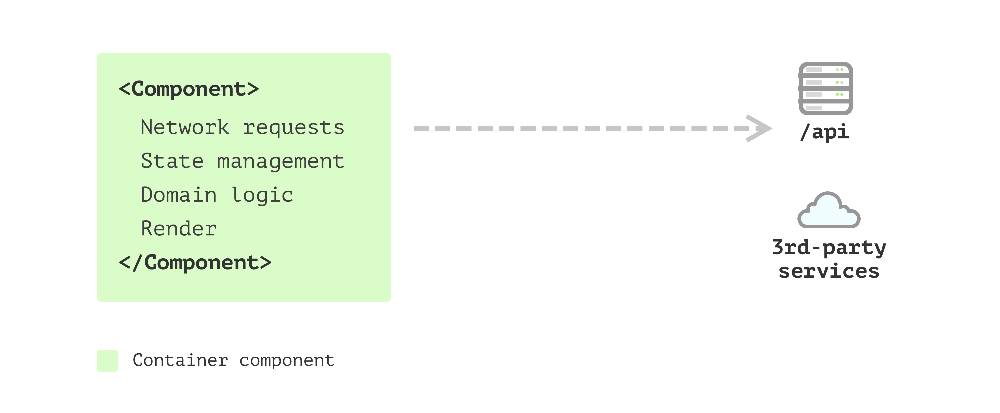
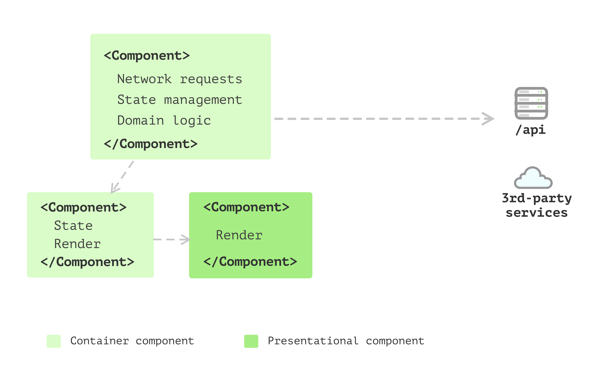
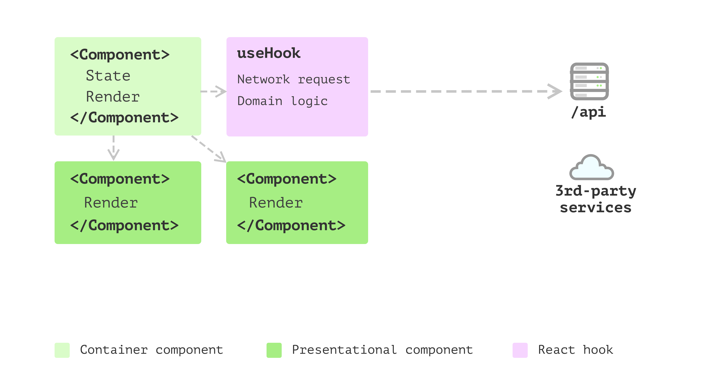
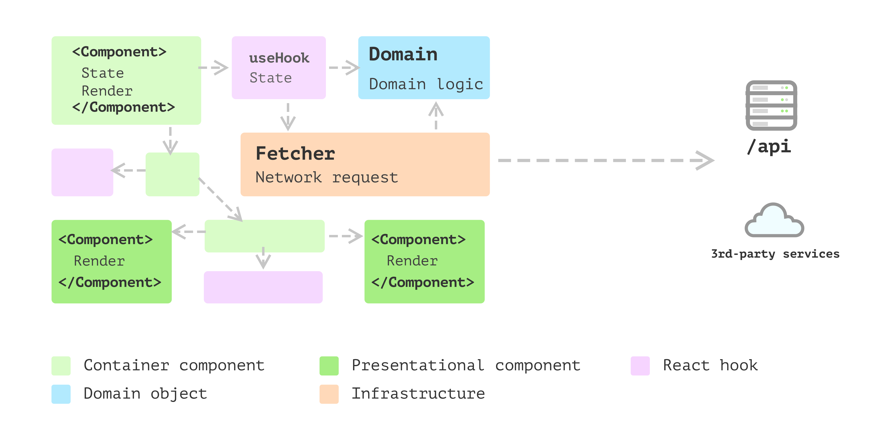
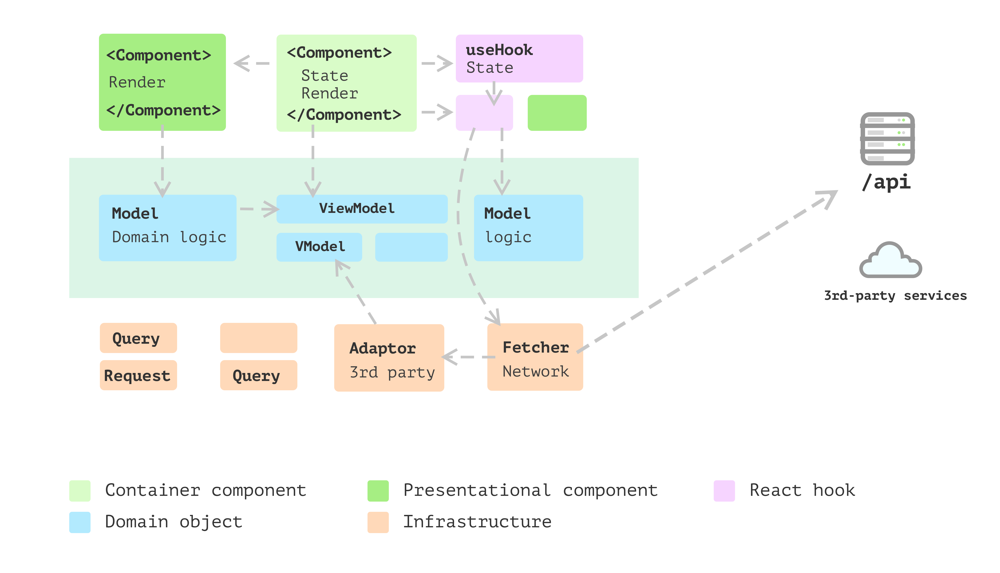

# React Around Collections

## Framework

- [nextjs](https://nextjs.org/docs)
- [remix](https://remix.run/)
- [Astro](https://astro.build/) Astro powers the world's fastest websites, client-side web apps, dynamic API endpoints, and everything in-between.

## 重构、项目架构

- [React 开发思想纲领](https://github.com/mithi/react-philosophies) - [翻译](https://juejin.cn/post/7076244324614144014)
- [bulletproof-react](https://github.com/alan2207/bulletproof-react) - A simple, scalable, and powerful architecture for building production ready React applications.
- [React 项目文件分层原则](https://mp.weixin.qq.com/s/INNwbrax3NHiC5fganeFlQ)

### 核心分层原则

#### 1. 单一职责原则 (Single Responsibility Principle)
- **组件**：只负责UI渲染
- **Hook**：专注逻辑复用
- **Service**：只负责API调用

#### 2. 依赖方向原则 (Dependency Direction)

高层模块(业务层)可以依赖低层模块(通用层),但低层模块不应依赖高层模块。依赖关系应该是单向的、自上而下的。

依赖关系单向自上而下：
> 页面路由层 → 业务功能层 → 业务组件层 → 通用组件层 → 工具函数层

#### 3. 就近原则 (Colocation Principle)

相关联的文件应该物理位置靠近,只在需要跨模块共享时才提升到更高层级。

决策流程:

1. 代码只在一个组件内使用 → 写在组件内部
2. 代码在一个功能模块内多处使用 → 放在该功能目录下
3. 代码被多个功能模块使用 → 提升到全局 `components/` 或 `hooks/`
4. 代码被多个项目使用 → 考虑抽取为独立 npm 包

#### 4. 显式命名原则 (Explicit Naming)
文件名和目录名应该清晰表达其内容和用途,避免缩写和模糊命名。


### 组件分组策略

#### 按功能分组 (Feature-Based)
::: details 点击查看目录
```markdown
src/
├── features/                    # 业务功能模块
│   ├── authentication/         # 用户认证功能
│   │   ├── components/
│   │   │   ├── LoginForm.jsx
│   │   │   ├── SignupForm.jsx
│   │   │   └── OAuthButton.jsx
│   │   ├── hooks/
│   │   │   └── useAuth.js
│   │   ├── services/
│   │   │   └── authAPI.js
│   │   ├── LoginPage.jsx       # 功能入口页面
│   │   └── index.js             # 导出接口
│   ├── product/
│   │   ├── components/
│   │   │   ├── ProductCard.jsx
│   │   │   ├── ProductList.jsx
│   │   │   └── ProductFilter.jsx
│   │   ├── hooks/
│   │   │   ├── useProducts.js
│   │   │   └── useProductFilters.js
│   │   ├── ProductListPage.jsx
│   │   ├── ProductDetailPage.jsx
│   │   └── index.js
│   └── order/
│       ├── components/
│       ├── OrderPage.jsx
│       └── index.js
├── components/                  # 全局通用组件
│   ├── Button/
│   │   ├── Button.jsx
│   │   ├── Button.module.css
│   │   └── index.js
│   ├── Input/
│   └── Modal/
```
:::
#### 按类型分组 (Atomic Design)

1. Atoms 原子组件 - 最小的可复用单元
2. Molecules 分子组件 - 简单的组合单元
3. Organisms 组织组件 - 复杂的功能块
4. Templates 模板 - 页面布局结构
5. Pages 页面 - 具体实例

::: details 点击查看目录
```markdown
src/
├── components/
│   ├── atoms/
│   │   ├── Button/
│   │   │   ├── Button.jsx
│   │   │   ├── Button.module.css
│   │   │   └── Button.test.js
│   │   ├── Input/
│   │   ├── Icon/
│   │   └── Label/
│   ├── molecules/
│   │   ├── SearchBar/
│   │   ├── FormField/
│   │   └── Pagination/
│   ├── organisms/
│   │   ├── Header/
│   │   ├── Footer/
│   │   ├── ProductCard/
│   │   └── CommentList/
│   └── templates/
│       ├── DashboardTemplate/
│       └── AuthTemplate/
├── pages/
│   ├── HomePage.jsx
│   ├── LoginPage.jsx
│   └── ProductListPage.jsx
```
:::
#### 混合方案推荐 (最佳实践)

::: details 点击查看目录
```markdown
src/
├── components/                  # 通用组件按 Atomic Design 分类
│   ├── atoms/                  # 基础组件
│   ├── molecules/              # 组合组件
│   └── organisms/              # 复杂组件
├── features/                    # 业务功能按 Feature 分组
│   ├── authentication/
│   │   ├── components/         # 该功能专用组件
│   │   ├── hooks/
│   │   └── services/
│   └── product/
├── pages/                       # 页面组件
```
:::

### 样式文件组织

#### 基础原则

样式组织的核心是:就近原则 + 层级分离。样式应该和对应组件放在一起,同时全局样式和组件样式要有清晰边界。

#### 全局样式分层

无论使用哪种方案,全局样式都应该分层管理

## State Manage

- [zustand](https://github.com/pmndrs/zustand)
  - [关于zustand的一些最佳实践](https://mp.weixin.qq.com/s/QRM5A_Q-kOlSumfeUm_Gvw)
  - [手写一个 Zustand，只要 60 行](https://juejin.cn/post/7313242064195797001)

实现：

::: details 点击查看代码

```ts
import { useSyncExternalStore } from 'react'

const createStore = (createState) => {
  let state
  const listeners = new Set()

  const setState = (partial, replace) => {
    const nextState = typeof partial === 'function' ? partial(state) : partial

    if (!Object.is(nextState, state)) {
      const previousState = state

      if (!replace) {
        state =
          typeof nextState !== 'object' || nextState === null
            ? nextState
            : Object.assign({}, state, nextState)
      } else {
        state = nextState
      }
      listeners.forEach((listener) => listener(state, previousState))
    }
  }

  const getState = () => state

  const subscribe = (listener) => {
    listeners.add(listener)
    return () => listeners.delete(listener)
  }

  const destroy = () => {
    listeners.clear()
  }

  const api = { setState, getState, subscribe, destroy }

  state = createState(setState, getState, api)

  return api
}

function useStore(api, selector) {
  function getState() {
    return selector(api.getState())
  }

  return useSyncExternalStore(api.subscribe, getState)
}

export const create = (createState) => {
  const api = createStore(createState)

  const useBoundStore = (selector) => useStore(api, selector)

  Object.assign(useBoundStore, api)

  return useBoundStore
}
```

:::

- [Xstate](https://github.com/statelyai/xstate) - 很复杂的业务可以用！
  - [状态管理新思路：有限状态机在前端的应用](https://mp.weixin.qq.com/s/qgomiACv4VgTkn7rPGoT1A) 文章用到的版本API有些过时了
  - [研发协同利器：XState调研与应用](https://mp.weixin.qq.com/s/atX0OiU4CTRU2Ur6W0HSXg)

::: details official start example

```ts
import { createMachine, createActor, assign } from 'xstate'

// State machine
const toggleMachine = createMachine({
  id: 'toggle',
  initial: 'inactive',
  context: {
    count: 0
  },
  states: {
    inactive: {
      on: {
        TOGGLE: { target: 'active' }
      }
    },
    active: {
      entry: assign({ count: ({ context }) => context.count + 1 }),
      on: {
        TOGGLE: { target: 'inactive' }
      }
    }
  }
})

// Actor (instance of the machine logic, like a store)
const toggleActor = createActor(toggleMachine)
toggleActor.subscribe((state) => console.log(state.value, state.context))
toggleActor.start()
// => logs 'inactive', { count: 0 }

toggleActor.send({ type: 'TOGGLE' })
// => logs 'active', { count: 1 }

toggleActor.send({ type: 'TOGGLE' })
// => logs 'inactive', { count: 1 }
```

:::

::: details Xstate实现红绿灯有限状态机

```ts
import { createMachine, createActor } from 'xstate'

const lightMachine = createMachine({
  id: 'light',
  initial: 'red',
  states: {
    red: {
      on: {
        TRANS: 'green'
      }
    },
    green: {
      on: {
        TRANS: 'yellow'
      }
    },
    yellow: {
      on: {
        TRANS: 'red'
      }
    }
  }
})

const lightService = createActor(lightMachine).start()

lightService.subscribe((state) => {
  console.log(state.value)
})

// 发送事件
lightService.send('TRANS') // 'green'
lightService.send('TRANS') // 'yellow'
lightService.send('TRANS') // 'red'

// 批量发送事件
lightService.send({ type: 'TRANS' }) // 单个事件
lightService.send({ type: 'TRANS' }) // 单个事件

// 终止状态机
lightService.stop()
```

:::

### server api state

- [React query](https://tanstack.com/query/v5/docs/react/overview)
  - [作者博客系列文章](https://tkdodo.eu/blog/placeholder-and-initial-data-in-react-query)

## CSS

- [styled-components](https://styled-components.com/) Css in Js
- [emotion](https://emotion.sh/docs/introduction) Css in Js
- [vanilla-extract](https://github.com/vanilla-extract-css/vanilla-extract)，Css in Js but Zero-runtime Stylesheets in TypeScript.
- [panda-css](https://panda-css.com/) CSS-in-JS with build time generated styles, RSC compatible, multi-variant support, and best-in-class developer experience

## UI library

- [nextui](https://nextui.org/)
- [shadcn/ui](https://ui.shadcn.com/) headless
- [Mantine](https://mantine.dev/)
- [chakra ui](https://v2.chakra-ui.com/)

### 动画

- [Framer Motion](https://www.framer.com/motion/)
- [reactbits](https://www.reactbits.dev/text-animations/blur-text) 提供各种带动效的组件，可以直接copy code使用
- [fancy components*](https://www.fancycomponents.dev/docs/introduction) Fancy Components is a collection of fun and weird, ready-to-use components and microinteractions

## Project

- [Turbopack](https://github.com/vercel/turbo)
- [Bit.dev](https://bit.dev/docs/quick-start) Bit.dev是一种快速、动态化、协同式构建团队组件库的解决方案
- [Better-T-Stack](https://github.com/AmanVarshney01/create-better-t-stack) A modern CLI tool for scaffolding end-to-end type-safe TypeScript projects with best practices and customizable configurations

## Articles

- [How to fetch data in React [2024]](https://www.robinwieruch.de/react-fetching-data/)， [self summary](./next_latest#data-fetch)

- [React系列（二）：单元测试最佳实践与前端TDD](https://ethan.thoughtworkers.me/#/post/2023-12-10-react-unit-testing-best-practices-v2)，实践证明，在前端以细粒度的UI组件为单元做测试不能很好地支撑重构和需求变化。本文将介绍一种能更好地支撑重构和开发、更能支撑前端TDD的单元测试方案。
- [Modularizing React Applications with Established UI Patterns](https://martinfowler.com/articles/modularizing-react-apps.html)

核心：React如官网所述，只是一个构建UI的库，但对一个复杂的React Application来说，如何构建，处理却没有很好的说明，当然不止是react，下面只是结合React展开，其实对于一个前端应用来说都可以复用这些思想。

如何组织代码，组装，存放计算/业务，数据交互/联动等逻辑，大概就是根据不同的关注点，划分到不同的文件/夹结构，`view-model-data`的分层设计，而不是在组件/hooks中搞定一切

**Single Component Application**


**Multiple Component Application**


问题： there are things like sending network requests, converting data into different shapes for the view to consume, and collecting data to send back to the server. And having this code inside components doesn’t feel right as they’re not really about user interfaces. Also, some components have too many internal states.

**State management with hooks**



使用自定义hooks抽取这些逻辑到单独的地方，The only problem is that in hooks, apart from the side effect and state management, some logic doesn’t seem to belong to the state management but pure calculations.

**Business models emerged**


**Layered frontend application**



- [PresentationDomainDataLayering](https://martinfowler.com/bliki/PresentationDomainDataLayering.html)

It’s good practice to split view and non-view code into separate places. The reason is, in general, views are changing more frequently than non-view logic. Also, as they deal with different aspects of the application, separating them allows you to focus on a particular self-contained module that is much more manageable when implementing new features.
