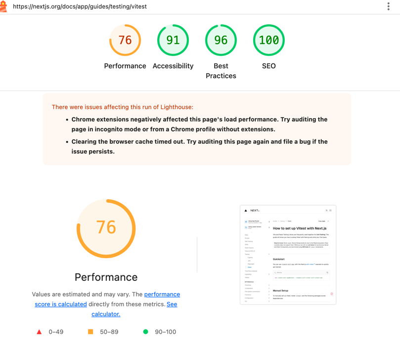

# Next.js - latest(v14 & V15)

## RSC与SSR、SSG, ISR, Partial Prerendering

SSG是后端**编译时**方案。使用SSG的业务，后端代码在编译时会生成HTML（通常会被上传CDN）。当前端发起请求后，后端（或CDN）始终会返回编译生成的HTML。

RSC与SSR则都是后端**运行时**方案。也就是说，他们都是前端发起请求后，后端对请求的实时响应。根据请求参数不同，可以作出不同响应。

同为后端运行时方案，RSC与SSR的区别主要体现在输出产物：

- 类似于SSG，SSR的输出产物是HTML，浏览器可以直接解析
- RSC会流式输出一种类JSON的数据结构，由前端的React相关插件解析

### SSG

Static Site Generation, SSG 会在构建阶段，就将页面编译为静态的 HTML 文件。

### SSR

在`app`路由下，只要我们的组件是使用 `async` 进行了修饰的，都会默认开启SSR.

### ISR

SSG 的优点就是快，部署不需要服务器，任何静态服务空间都可以部署，而缺点也是因为静态，不能动态渲染，每添加一篇博客，就需要重新构建。所以有了`ISR`，**增量静态生成**，可以在一定时间后重新生成静态页面，不需要手动处理。

app路由实现ISR，需要利用到`fetch`的缓存策略，在请求接口的时候，添加参数`revalidate`，来指定接口的缓存时间，让它在一定时间过后重新发起请求。

```tsx
export default async function PokemonName({
  params
}: {
  params: { name: string }
}) {
  const { name } = params
  // revalidate表示在指定的秒数内缓存请求，和pages目录中revalidate配置相同
  const res = await fetch('http://localhost:3000/api/pokemon?name=' + name, {
    next: { revalidate: 60, tags: ['collection'] },
    headers: { 'Content-Type': 'application/json' }
  })

  return <p>...</p>
}
```

但是在通常情况下，静态页面更新实际上没有那么频繁，但是有些情况有需要连续更新（发布博客有错别字），这个时候其实需要一种能手动更新的策略，来发布指定的静态页面。

### On-demand Revalidation（按需增量生成）

NextJS提供了更新静态页面的方法，可以在 `app` 目录下新建一个 `app/api/revalidate/route.ts`接口，用于实现触发增量更新的接口。

为了区分需要更新的页面，可以在调接口的时候传入更新的页面路径，也可以传入在fetch请求中指定的`collection`变量。

```ts
import { NextRequest, NextResponse } from 'next/server'
import { revalidatePath, revalidateTag } from 'next/cache'

// 手动更新页面
export async function GET(request: NextRequest) {
  // 保险起见，这里可以设置一个安全校验，防止接口被非法调用 simple way, 不能设置为NEXT_PUBLIC_xx，会被打包到浏览器可访问
  if (request.query.secret !== process.env.UPDATE_SSG_SECRET) {
    return NextResponse.json(
      { data: error, message: 'Invalid token' },
      {
        status: 401
      }
    )
  }
  const path = request.nextUrl.searchParams.get('path') || '/pokemon/[name]'

  // 这里可以匹配fetch请求中指定的collection变量
  const collection =
    request.nextUrl.searchParams.get('collection') || 'collection'

  // 触发更新
  revalidatePath(path)
  revalidateTag(collection)

  return NextResponse.json({
    revalidated: true,
    now: Date.now(),
    cache: 'no-store'
  })
}
```

如果数据库中的内容有修改，访问`http://localhost:3000/api/revalidate?path=/pokemon/Charmander`, 就可以实现`/pokemon/Charmander`这个路由的手动更新。

### 兜底策略

静态页面在生成期间，如果用户访问对应路由会报错，这时需要有一个兜底策略来防止这种情况发生。

Next.js在组件中指定了`dynamicParams`的值（true默认），当`dynamicParams`设置为true时，当请求尚未生成的路由段时，页面将通过SSR这种方式来进行渲染。

```js
export const dynamicParams = true
```

### [Partial Prerendering](https://nextjs.org/docs/app/getting-started/partial-prerendering)

Combine static and dynamic content in the same route. This improves the initial page performance while still supporting personalized, dynamic data.


## ENV

- 默认情况下，环境变量只能在`server`端获取
- 以`NEXT_PUBLIC_`开始的环境变量，会在打包的时候替换成固定的值。一定要按这种格式获取`process.env.[variable]`，variable不能是dynamic的
- 非`NEXT_PUBLIC_`会保留原始的代码，比如打包后的代码也是`process.env.DB_PASSWORD`

load Order

1. `process.env`
2. `.env.$(NODE_ENV).local`
3. `.env.local (Not checked when NODE_ENV is test.)`
4. `.env.$(NODE_ENV)`
5. `.env`

`.env` 文件会如果有会被打包进去， local文件不会

比如`DB_PASSWORD="123" NEXT_PUBLIC_API_URL="1231" node dist/standalone/server.js`启动服务，`DB_PASSWORD="123"`优先级最高，但`NEXT_PUBLIC_API_URL`不会变，还是打包时的替换值

## Data fetch

- [How to fetch data in React [2024]](https://www.robinwieruch.de/react-fetching-data/)

#### (RSC) 数据获取

- 特点：在服务器端执行，直接返回HTML给客户端，并且是 Streaming UI。
- 适用场景：使用支持RSC的框架（如Next.js）。
- 优势：避免客户端-服务器通信往返，直接访问服务器端数据源。

```tsx
import { getPosts } from '@/features/post/queries/get-posts'

const PostsPage = async () => {
  const posts = await getPosts()

  return (
    <div>
      <h1>React Server Component</h1>

      <ul>{posts?.map((post) => <li key={post.id}>{post.title}</li>)}</ul>
    </div>
  )
}

export default PostsPage
```

#### React Query

在client, 即RCC组件中使用

- 特点：客户端数据获取，提供hooks用于数据获取、缓存和更新。
- 适用场景：客户端渲染的React应用（SPA）。
- 优势：处理缓存、竞态条件和陈旧数据
- 不能实现stream ui(也不用提，本身就是client发起请求的)

这里的`getPosts`和服务端的有所区别：要使用a remote API over HTTP / endpoint

```tsx
export const getPosts = async () => {
  const response = await fetch('/api/posts')
  return response.json()
}
```

而RSC就可以直接访问数据库：

```ts
export const getPosts = async () => {
  return await db.query('SELECT * FROM posts')
}
```

---

```tsx
'use client'

import { getPosts } from '@/features/post/queries/get-posts'
import { useQuery } from '@tanstack/react-query'

const PostsPage = () => {
  const { data: posts } = useQuery({
    queryKey: ['posts'],
    queryFn: getPosts
  })

  return (
    <div>
      <h1>React Query</h1>

      <ul>{posts?.map((post) => <li key={post.id}>{post.title}</li>)}</ul>
    </div>
  )
}

export default PostsPage
```

#### RSC + RCC

- 特点：服务器端获取初始数据，客户端继续使用React Query获取数据。初始化时是 streaming ui
- 适用场景：需要初始数据快速加载和客户端无限滚动等高级数据获取模式。
- 优势：结合服务器端和客户端数据获取的优势。

```tsx
import { getPosts } from '@/features/post/queries/get-posts'
import { PostList } from './_components/post-list'

const PostsPage = async () => {
  const posts = await getPosts()

  return (
    <div>
      <h1>React Server Component + React Query</h1>

      <PostList initialPosts={posts} />
    </div>
  )
}

export default PostsPage
```

---

```tsx
'use client'

import { getPosts } from '@/features/post/queries/get-posts'
import { Post } from '@/features/post/types'
import { useQuery } from '@tanstack/react-query'

type PostListProps = {
  initialPosts: Post[]
}

const PostList = ({ initialPosts }: PostListProps) => {
  const { data: posts } = useQuery({
    queryKey: ['posts'],
    queryFn: getPosts,
    initialData: initialPosts
  })

  return <ul>{posts?.map((post) => <li key={post.id}>{post.title}</li>)}</ul>
}

export { PostList }
```

**可以用Server Actions, 在server和client重复使用，这样就不用反复声明了**，但要注意鉴权如果接口需要的话

**也可以从RSC中传入一个promise到RCC,当作init promise, 并用`Suspense` wrap RCC, 也能实现streaming UI，并且client也能update data**

> 但 client update promise时，组件也会fallback 到最近的`Suspense`，组件就会消失而显示Suspense 的fallback，可以通过 [useTransition](https://19.react.dev/reference/react/useTransition), refer: [Preventing unwanted loading indicators ](https://19.react.dev/reference/react/useTransition#preventing-unwanted-loading-indicators)

```ts
// in RCC
const [promise, setPromise] = useState(initPromise)
const data = use(promise)
// update promise to get new data due to some user interaction
const onClick = () => {
  setPromise()
}
```

#### use Api

`use(Promise)`

- 允许将Promise从服务器组件传递到客户端组件。
- 适用场景：需要在客户端组件中解析服务器组件的异步操作。
- 优势：避免阻塞服务器组件的渲染，也能实现streaming UI。
- 也可以将Promise管理为state，更新promise 重新获取数据
- use会找最近的`Suspense`组件显示`fallback`

```tsx
import { Suspense } from 'react'
import { getPosts } from '@/features/post/queries/get-posts'
import { PostList } from './_components/post-list'

const PostsPage = () => {
  const postsPromise = getPosts()

  return (
    <div>
      <h1>use(Promise) RSC</h1>

      <Suspense>
        <PostList promisedPosts={postsPromise} />
      </Suspense>
    </div>
  )
}

export default PostsPage
```

---

```tsx
'use client'

import { use } from 'react'
import { Post } from '@/features/post/types'

type PostListProps = {
  promisedPosts: Promise<Post[]>
}

const PostList = ({ promisedPosts }: PostListProps) => {
  const posts = use(promisedPosts)

  return <ul>{posts?.map((post) => <li key={post.id}>{post.title}</li>)}</ul>
}

export { PostList }
```

Another example:

```tsx
const UseHookExample = () => {
  const [findPetsByStatusPromise, setFindPetsByStatusPromise] = useState(() =>
    findPetsByStatus({ status: undefined })
  )
  return (
    <div>
      <h3 className="my-2">Find Pets By Status</h3>
      <Select
        onValueChange={(value: FindPetsByStatusStatus) => {
          setFindPetsByStatusPromise(findPetsByStatus({ status: value }))
        }}
      >
        <SelectTrigger className="w-[230px]">
          <SelectValue placeholder="Select Status" />
        </SelectTrigger>
        <SelectContent>
          <SelectGroup>
            <SelectLabel>Status</SelectLabel>
            {Object.entries(FindPetsByStatusStatus).map(([key, text]) => (
              <SelectItem value={key} key={key}>
                {text}
              </SelectItem>
            ))}
          </SelectGroup>
        </SelectContent>
      </Select>
      <Separator className="mt-4" />
      <Suspense
        fallback={
          <p className="my-4 text-sm text-muted-foreground">loading...</p>
        }
      >
        <PetsStatusList findPetsByStatusPromise={findPetsByStatusPromise} />
      </Suspense>
    </div>
  )
}

const PetsStatusList = ({
  findPetsByStatusPromise: initP
}: {
  findPetsByStatusPromise: ReturnType<typeof findPetsByStatus>
}) => {
  const [counter, setCounter] = useState(0)
  // 也可以内部自己管理promise
  // const [findPetsByStatusPromise, setFindPetsByStatusPromise] = useState(initP)
  const resp = use(findPetsByStatusPromise)
  return (
    <div>
      <Button
        onClick={() =>
          // 自己更新
          setFindPetsByStatusPromise(
            findPetsByStatusPromise({ status: FindPetsByStatusStatus.sold })
          )
        }
      >
        update
      </Button>
      {resp.map(({ name, status, photoUrls }) => (
        <ul className="my-2 gap-1 py-2" key={name}>
          <li>name: {name}</li>
          <li>status: {status}</li>
          <li className="text-sm text-muted-foreground">
            photoUrls: {photoUrls.join(',')}
          </li>
        </ul>
      ))}
      <p>counter: {counter}</p>
      <Button onClick={() => setCounter(counter + 1)}>add</Button>
    </div>
  )
}
```

#### tRPC

tRPC 类型安全数据获取

- 特点：提供类型安全的API层。
- 适用场景：需要类型安全的全栈解决方案。
- 优势：避免运行时错误，提升开发体验。


## Chore

### Streaming Server Rendering with Suspense

想要streaming一定要加`Suspense`，如果不在对应的`async` 组件套`suspense`，会一直冒泡到上层去找`Suspense`，可能就没有streaming的效果

react use和 Suspense

- https://react.dev/reference/react/Suspense
- https://react.dev/reference/react/use

### NextJS 代理服务器阻塞了SSE的流式数据传输

SSE 与 WebSocket 作用相似，都是建立浏览器与服务器之间的通信渠道，然后服务器向浏览器推送信息。WebSocket 更强大和灵活。因为它是全双工通道，可以双向通信；SSE 是单向通道，只能服务器向浏览器发送，因为流信息本质上就是下载。

解决办法：服务端接口的 Response Header 内通过设置`Cache-Control` 为 `no-cache`, `no-transform`

`revalidatePath`是在server action使用

### createPortal not working

使用`createPortal` api, 第二个参数是`document.body`时可用，但当是`document.getElementById('customer_id')`，`customer_id`的dom是一个组件，添加在layout时，就添加不上了，
即使组件是`use client`也不行，并且还判断了也不work
```tsx
function AnchorIndicator() {
  const portalNode =
    typeof window !== 'undefined'
      ? document.getElementById(SECTION_ANCHOR_DOM_ID)
      : null
  return (
    <div>
      something
      {
        portalNode
          ? createPortal(<div>xx</div>, portalNode)
          : null
      }
      </div>
  )
}

```
报错： `Hydration failed because the server rendered HTML didn't match the client....`, 组件加了`use client`，**也会ssr**。

解决参考[examples/with-portals/](https://github.com/vercel/next.js/blob/canary/examples/with-portals/components/ClientOnlyPortal.js)

::: details 点击查看代码
```tsx
"use client"
import { useRef, useEffect, useState } from "react";
import { createPortal } from "react-dom";

export default function ClientOnlyPortal({ children, selector }) {
  const ref = useRef();
  const [mounted, setMounted] = useState(false);

  useEffect(() => {
    ref.current = document.querySelector(selector);
    setMounted(true);
  }, [selector]);

  return mounted ? createPortal(children, ref.current) : null;
}
```

```tsx
'use client'

import { useEffect, useId, useRef, useState } from 'react'
import { createPortal } from 'react-dom'

import { cn } from '@/lib/utils'

import {
  Tooltip,
  TooltipContent,
  TooltipProvider,
  TooltipTrigger,
} from '../ui/tooltip'
import { SECTION_ANCHOR_DOM_ID } from './constant'

type SectionTitleProps = {
  title: string
  className?: string
}

export function SectionTitle({ title, className }: SectionTitleProps) {
  const id = useId()
  const [mounted, setMounted] = useState(false)

  const portalNode =
    typeof window !== 'undefined'
      ? document.getElementById(SECTION_ANCHOR_DOM_ID)
      : null

  console.log('portalNode', portalNode)

  useEffect(() => setMounted(true), [])

  const handleClick = () => {
    const element = document.getElementById(id)
    if (!element) return

    // const top = element.getBoundingClientRect().top + window.scrollY
    element.scrollIntoView({
      behavior: 'smooth',
      block: 'start',
    })
  }

  return (
    <h2
      id={id}
      className={cn(
        'scroll-m-16 text-xl font-semibold tracking-tight text-gray-800',
        className,
      )}
      data-section-title={title}
    >
      {title}
      {portalNode
        ? createPortal(
            <div
              className="flex flex-col items-center"
              data-section-id={id}
            >
              <TooltipProvider>
                <Tooltip>
                  <TooltipTrigger asChild>
                    <button
                      type="button"
                      className="-m-2 cursor-pointer p-2"
                      onClick={handleClick}
                    >
                      <span
                        className={cn(
                          'inline-block size-3 rounded-full border-2 transition-colors duration-200',
                          'border-gray-300 bg-white data-[active=true]:border-primary data-[active=true]:bg-primary',
                        )}
                        data-active="false"
                      />
                    </button>
                  </TooltipTrigger>
                  <TooltipContent side="left">
                    <p>{title}</p>
                  </TooltipContent>
                </Tooltip>
              </TooltipProvider>
            </div>,
            portalNode,
          )
        : null}
    </h2>
  )
}
```
:::

## 原理

- [How Do Server Actions Work in NextJS?](https://codelynx.dev/posts/how-work-server-actions)

## Libraries

- [nuqs](https://github.com/47ng/nuqs) Type-safe search params state manager for Next.js - Like React.useState, but stored in the URL query string.
- [next-safe-action](https://github.com/TheEdoRan/next-safe-action) Type safe and validated Server Actions in your Next.js project.

## [Hydration Failed](https://juejin.cn/post/7365793739892228096)
水合错误，“水合（Hydration）指 React 在客户端把预渲染的 HTML 与组件树进行匹配，重建内部状态并绑定事件处理器，从而将其激活为完全可交互应用的过程。”

常见原因
- HTML 元素错误嵌套
  - `<p>` 嵌套在另一个 `<p>` 元素中
  - `<div>` 嵌套在 `<p>` 元素中
  - `<ul>` 或 `<ol>` 嵌套在 `<p>` 元素中
  - 交互式内容（interactive-content）不能嵌套，比如 `<a>` 不能嵌套在 `<a>` 标签中，`<button>` 不能嵌套在 `<button>` 标签中等等。

- 渲染时使用 `typeof window !== 'undefined'` 等判断。
eg:
```jsx
'use client'

export default function App() {
  const isClient = typeof window !== 'undefined';
  return <h1>{isClient ? 'Client' : 'Server'}</h1>
}
```
这个错误只会出现在客户端组件中，服务端渲染的时候，因为在 Node 环境，isClient 为 false，返回 Server，而在客户端的时候，会渲染成 Client，渲染内容不一致导致出现水合错误。

- 渲染时使用客户端 API 如 window、localStorage 等
```jsx
'use client'

export default function App() {
  return <h1>{typeof localStorage !== 'undefined' ? localStorage.getItem("name") : ''}</h1>
}
```
- 使用时间相关的 API，如 Date
```jsx
'use client'

export default function App() {
  return <h1>{+new Date()}</h1>
}
```
原因在于服务端渲染和客户端渲染的时间不一致。客户端组件它会先在服务端进行一次预渲染，传给客户端后还要进行一次水合，添加事件处理程序，最后根据客户端事件进行更新。

- 浏览器插件导致
- 比如 IOS 的网页会尝试检测文本内容中的电话号码、邮箱等数据，将它们转为链接，方便用户交互，这也会导致水合错误。

如果遇到这个问题，可以使用 meta 标签禁用：
```jsx
<meta
  name="format-detection"
  content="telephone=no, date=no, email=no, address=no"
/>
```

### 解决办法

#### 使用 useEffect

```jsx
'use client'

import { useState, useEffect } from 'react'

export default function App() {
  const [isClient, setIsClient] = useState(false)
 
  useEffect(() => {
    setIsClient(true)
  }, [])
  
  return <h1>{isClient ? 'Client' : 'Server'}</h1>
}
```
#### 禁用特定组件的 SSR 渲染
需要借助 Next.js 提供的 `dynamic` 函数。

```jsx
import dynamic from 'next/dynamic'
 
const NoSSR = dynamic(() => import('./no-ssr'), { ssr: false })
 
export default function Page() {
  return (
    <div>
      <NoSSR />
    </div>
  )
}
```

#### 使用 `suppressHydrationWarning` 取消错误提示

#### 自定义hooks
其实就是使用`useEffect`，对客户端的api做封装，比如`useWindowSize`, `useLocalStorage`等。

`useMounted`，当挂载的时候再渲染内容:
```jsx
'use client'

import { useState, useEffect } from 'react'

export function useMounted() {
  const [mounted, setMounted] = useState(false)

  useEffect(() => {
    setMounted(true)
  }, [])

  return mounted
}

export default function Page() {
  const mounted = useMounted()
  if (!mounted) return null

  return (
    <div>
      <h1>{+new Date()}</h1>
      <h1>{localStorage.getItem("name")}</h1>
    </div>
  )
}
```

## Error: `document is not defined`

或者`window is not defined`

本质原因是在服务端调用了客户端 API 导致报错。但使用 'use client' 指令并不一定能够解决问题，`'use client'`指令只能说明组件可以运行在客户端，但并不说明组件只运行在客户端。客户端组件会在服务端进行预渲染，如果要取消掉这个预渲染，可以使用 `dynamic` 这个函数动态加载客户端组件。
同时，在自己的项目中使用客户端 API 如 window、document 的时候，也要注意避免出现这类错误。可以使用 `useEffect`、`typeof window`、`dynamic`、`useMounted` 等方式进行妥善处理。

- 使用客户端组件，即添加`'use client'`，但要注意：Moving Client Components Down the Tree。最佳实践的角度来看，我们应该尽可能减少客户端组件的范围（对应组件树中的位置下移）
- 动态导入
```jsx
import dynamic from 'next/dynamic'
 
const WithCustomLoading = dynamic(
  () => import('../components/WithCustomLoading'),
  {
    loading: () => <p>Loading...</p>,
  }
)
 
export default function Page() {
  return (
    <div>
      <WithCustomLoading />
    </div>
  )
}
```
动态加载本质上是 `Suspense` 和 `React.lazy` 的复合实现。

## 性能优化

- Moving Client Components Down the Tree

先分析

### 使用工具

- google控制台的lighthouse，类似体检报告，可以看到各项的打分，包括performance，Accessibility，Best Practices，SEO
- 
- google控制台的performance，可以Record，DevTools 会生成一张瀑布图 + 主线程火焰图。
  - Network/Waterfall 看每个资源的加载时机、阻塞时间
  - Timings 轨道：FP、FCP、LCP、TTI 自动打点
  - Main 火焰图：找右上角带 红色小三角 的长任务（>50 ms）
  - Frames 轨道：若出现红色长条 → 丢帧，需优化脚本执行
- google控制台的网络network，check资源加载情况
- 选择专业性能指标检测工具，比如 [pagespeed.web.dev/](https://pagespeed.web.dev/)

- `@next/bundle-analyzer`可视化的检查页面和打包的资源大小
- [react scan](https://github.com/aidenybai/react-scan) Scan for React performance issues and eliminate slow renders in your app

### 方法

- 合理的拆分组件，搭配React server component + Suspense，实现streaming ui，是用户更快的看到页面。
- 要精细话区分`critical data` 还是 `non critical data`，避免server block http response

#### 缓存

- `React.cache`，Server Component 中使用，把昂贵的数据获取或计算函数包一层 cache，同一 HTTP 请求里无论被多少个 Server Component 调用，都只执行一次，其余直接读缓存。
- Next.js的缓存策略。`fetch`等[Caching in Next.js](https://nextjs.org/docs/app/guides/caching)，“Next.js 默认帮你缓存到极致，你需要做的只是告诉它什么时候不要缓存。”
- 静态资源缓存，CDN缓存，http缓存

#### 图片,css进行优化

- 提供大小合适的图片可节省移动数据网络流量并缩短加载用时，图片压缩，转化为`webp`格式减小体积
- 懒加载 Lazy load
- 小图片用base64代替
- 多使用nextjs的Image组件,提供了多个优化配置，比如`priority`, `decoding`
- 减少重排和重绘,避免布局偏移例如:动态设置css导致的布局偏移,可以使用占位符来解决或者固定

#### [组件进行懒加载](https://nextjs.org/docs/app/guides/lazy-loading)

在client组件中使用，按需加载nextjs提供了`dynamic`，它包含了`React.lazy`和`Suspense`，是需要时再去加载，而不是可视区内在加载，适合对子组件进行使用。

```tsx
import dynamic from "next/dynamic";
const FedeInSection = dynamic(() => import('@/components/FedeInSection'));
```

比如，可能通过`@next/bundle-analyzer`首屏的资源打包了，用户登录formModal，改为用户点击Log In时再去加载对应展示的组件 。

```tsx
'use client'
 
import { useState } from 'react'
import dynamic from 'next/dynamic'
 
// Client Components:
const ComponentA = dynamic(() => import('../components/A'))
const ComponentB = dynamic(() => import('../components/B'))
const ComponentC = dynamic(() => import('../components/C'), { ssr: false })
 
export default function ClientComponentExample() {
  const [showMore, setShowMore] = useState(false)
 
  return (
    <div>
      {/* Load immediately, but in a separate client bundle */}
      <ComponentA />
 
      {/* Load on demand, only when/if the condition is met */}
      {showMore && <ComponentB />}
      <button onClick={() => setShowMore(!showMore)}>Toggle</button>
 
      {/* Load only on the client side */}
      <ComponentC />
    </div>
  )
}
```

#### 第三方库包大小的优化

- 比如Moment替换为dayjs
- 确保tree shaking 是work的，使用`lodash/es`，nextjs也提供`optimizePackageImports`配置。

#### 组件拆分精量化

将首屏的组件模块进行拆分复用在通过dynamic函数加载

#### 第三方脚本工具script优化

- defer延迟加载

#### preload 预加载

#### [Partial Prerendering](https://nextjs.org/docs/app/getting-started/partial-prerendering) 但15还是实验阶段

#### [Enable http2](https://github.com/vercel/next.js/discussions/10842)

HTTP/2 最大的好处是 显著提升了页面加载性能

1. 多路复用 (Multiplexing)，这是 HTTP/2 最核心的改进。 
   1. HTTP/1.1: 存在“队头阻塞”问题。在单个 TCP 连接上，浏览器一次只能处理一个请求，必须等上一个请求响应后才能发送下一个。尽管浏览器会开启多个连接（通常是6个）来缓解，但依然有上限。 
   2. HTTP/2: 允许在同一个 TCP 连接上同时发送和接收多个请求和响应，它们可以交错进行而不会相互阻塞。

对 Next.js 的好处：
>Next.js 应用通过代码分割（Code Splitting）会产生许多小的 JavaScript 和 CSS 文件块。使用 HTTP/1.1 时，加载这些大量的小文件效率很低。而 HTTP/2 的多路复用机制可以一次性、高效率地并行加载所有这些资源，极大地缩短了页面渲染完成的时间。

2. 头部压缩 (Header Compression)
   1. HTTP/1.1: 每次请求都会发送大量重复的、未经压缩的纯文本头部信息，造成了不必要的网络开销。 
   2. HTTP/2: 使用 HPACK 算法对请求头进行压缩，大大减少了数据传输量，尤其是在一个页面有数十个资源请求时，效果非常显著。

对 Next.js 的好处：
> Next.js 应用不仅请求 JS/CSS，还可能包含大量的 API 请求、图片等资源。头部压缩降低了每个请求的开销，累积起来可以节省可观的带宽和时间。

3. 二进制协议 (Binary Protocol)
   1. HTTP/1.1: 是一个纯文本协议，可读性好但处理起来效率较低，且容易出错。 
   2. HTTP/2: 采用二进制格式传输数据，计算机解析起来更快、更高效、更不容易出错。

对 Next.js 的好处：
> 这是底层协议的优化，直接提升了数据传输和处理的效率，为整体性能带来了增益。

--- 

##### 实现方式

1. 部署到vercel的话：deployment is **automatically** served over HTTP/2, compressed with Brotli/Gzip, and downloaded from a CDN edge nearest to your end-user.
2. self-hosting
   1. 通过Nginx暴露和`HTTP/2`服务，然后nginx和node之间还是`HTTP/1.1`, 这样next.js就不需要修改:Configure your application behind Nginx (or another reverse proxy) for optimum performance. Nginx should handle HTTP/2, the HTTPS termination, Gzip compression, etc.
      Only the localhost traffic (between Nginx and Node) would be over HTTP/1.1, where the latency is effectively zero.
   2. 使用自定义node serve with http2: Serve your application in production directly from a Node.js server, example: [with-http2](https://github.com/vercel/next.js/blob/canary/examples/with-http2/server.js)

http2 `server.js`

```js
/**
 * package.json script:
   "dev": "node server.js",
   "build": "next build",
   "start": "cross-env NODE_ENV=production node server.js"
 */
const next = require("next");
const http2 = require("node:http2");
const { parse } = require("node:url");
const fs = require("node:fs");

const port = parseInt(process.env.PORT, 10) || 3000;
const dev = process.env.NODE_ENV !== "production";

// Init the Next app:
const app = next({ dev });

// Create the secure HTTPS server:
// Don't forget to create the keys for your development
const server = http2.createSecureServer({
  key: fs.readFileSync("localhost-privkey.pem"),
  cert: fs.readFileSync("localhost-cert.pem"),
});

const handler = app.getRequestHandler();

app.prepare().then(() => {
  server.on("error", (err) => console.error(err));
  server.on("request", (req, res) => {
    const parsedUrl = parse(req.url, true);
    handler(req, res, parsedUrl);
  });
  server.listen(port);

  console.log(`Listening on HTTPS port ${port}`);
});
```

## 国际化i18n

- [lingui](https://lingui.dev/tutorials/react) 核心就是写一个语言，然后它自动生成其他多语言适配。
