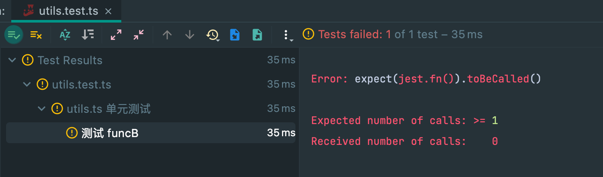

# Jest

[[toc]]

[Jest](https://jestjs.io) 是 Facebook 出品的一个 JavaScript 开源测试框架。相对其他测试框架，其一大特点就是就是内置了常用的测试工具，比如零配置、自带断言、测试覆盖率工具等功能，实现了开箱即用。

单元测试还有其他比如Mocha、Ava等，但在`React`中选Jest + React Testing Library就完事儿.

## basic

先以经典的sum函数为例子讲解下基本概念。

```js
// sum.js
export function sum(a, b) {
  return a + b
}
```

测试脚本

```js
// sum.test.js
import { sum } from './sum'

describe('sum function', () => {
  test('adds 1 + 2 to equal 3', () => {
    expect(sum(1, 2)).toBe(3)
  })
})
```

- `describe` 是 test suite（测试套件）;
- test方法称做测试用例，接收两个参数，第一个参数是测试的名称，第二个参数是个函数，在函数内可以写一些测试逻辑;
- `expect`顾名思义就是期望的意思，`expect(sum(1, 2)).toBe(3)`意思就是期望这个`sum(1, 2)`的返回值和3相等，整体称做为`断言`;
- `toBe`就是一个匹配器matcher，匹配`expect`的值是否和匹配器中的值相等。
  > 断言指的是一些布尔表达式，在程序中的某个特定点该表达式值为真，判断代码的实际执行结果与预期结果是否一致，而断言库则是将常用的方法封装起来

### [匹配器matchers](https://jestjs.io/zh-Hans/docs/expect)

其实这部分内容查询官方的[文档](https://jestjs.io/zh-Hans/docs/expect) 入门更好，写的很详细。

#### `.toBe(value)`：匹配值，相当于`===`

注意点：

- 不能用于测试浮点数比如`expect(0.1+0.2).toBe(0.3)`，如果需要这样测试，可以使用`toBeCloseTo`
- 不能用于引用类型的检查

#### `.toEqual(value)`：两个对象的原始值是否相等，只检查内容，不检查引用

```js
const can1 = {
  flavor: 'grapefruit',
  ounces: 12
}
const can2 = {
  flavor: 'grapefruit',
  ounces: 12
}

describe('the La Croix cans on my desk', () => {
  test('have all the same properties', () => {
    expect(can1).toEqual(can2)
  })
  test('are not the exact same can', () => {
    expect(can1).not.toBe(can2)
  })
})
```

注意：不能用于两个抛出异常的匹配，而该使用`toThrow`

#### others

- `.toBeNull()`：匹配null， 即`toBe(null)`

- `.toBeUndefined()`：匹配undefined

- `.toBeNaN()`：匹配NaN

- `toBeTruthy()`：匹配结果为true的值

- `.toBeFalsy()`：匹配结果为false的值

在js中`false, 0, '', null, undefined, NaN`都会被自动转换成false

- `.not`：对后续的匹配取反

- `.toBeGreaterThan(number)`：匹配大于number的数字
- .toBeGreaterThanOrEqual(number)：匹配大于等于number的数字
- .toBeLessThan(number)：匹配小于number的数字
- toBeLessThanOrEqual(number)：匹配小于等于number的数字
- .toBeCloseTo(number, numDigits?)：匹配指定位数的浮点数
- toMatch(regexpOrString)：检查字符串是否匹配
- .toMatchObject(object)：匹配对象/数组是否属于子集
- .toContain(item)：匹配数组/Set/字符串中是否包含item,不能检查arr/set中的对象，比如[{ name: 'Jsoning' }]
- .toContainEqual(item)：和.toContain类似，必须完全匹配，但是可以匹配数组内对象
- .toHaveLength(number)：判断对象是否有length属性，并检查是否匹配
- .toBeInstanceOf(Class)：匹配实例是否通过class构造函数实例出来
- .toThrow(error?)/.toThrowError(error?)：匹配异常
- .toHaveBeenCalled()/.toBeCalled()：检查函数是否被执行
- .toHaveBeenCalledWith(arg1, arg2, ...)/.toBeCalledWith(arg1, arg2, ...)：检查调用函数传入值是否匹配
- .toHaveBeenLastCalledWith(arg1, arg2, ...)/.lastCalledWith(arg1, arg2, ...)：检查最后一次调用函数传入值是否匹配
- .toHaveBeenNthCalledWith(nthCall, arg1, arg2, ....)/.nthCalledWith(nthCall, arg1, arg2, ...)：检查第nth次调用函数传入值是否匹配
- .toHaveBeenCalledTimes(number)/.toBeCalledTimes(number)：检查函数被调用次数是否匹配
- .toHaveReturned()/.toReturn()：检查函数是否有返回值
- .toHaveReturnedTimes(number)/.toReturnTimes(number)：检查函数返回值得次数
- .toHaveReturnedWith(value)/.toReturnWith(value)：检查函数返回值是否匹配
- .toHaveLastReturnedWith(value)/.lastReturnedWith(value)：检查最后一次函数返回值是否匹配
- .toHaveNthReturnedWith(nthCall, value)/.nthReturnedWith(nthCall, value)：检查第nth次调用函数返回值是否匹配
- [expect api](https://www.jestjs.cn/docs/expect)

### [异步代码测试](https://jestjs.io/zh-Hans/docs/asynchronous)

js中的异步常用的无非就是[回调、`promise`和`async/await`](https://sanyuan0704.top/blogs/javascript/js-async/012.html)

#### `callback`回调函数异步

对于回调函数异步（如`setTimeout`回调），如果像同步函数一样进行测试，是没办法获取正确地断言结果的：

```ts
export const funcA = (callback: (data: number) => void): void => {
  setTimeout(() => {
    callback(1)
  }, 1000)
}
```

```ts
test('funcA', () => {
  funcA((data) => expect(data).toEqual(2))
})
```

像上面那样，`funcA`会在回调里传入`1`，单测里就算是直接断言结果为`2`，可却直接通过单测，这是因为`jest`在运行完`funcA`后就直接结束了，不会等待`setTimeout`的回调，自然也就没有执行`expect`断言。正确的做法是，传入一个`done`参数：

```ts
test('funcA', (done) => {
  funcA((data) => {
    expect(data).toEqual(2)
    done()
  })
})
```

#### Promises

```js
test('测试 fetchList 的返回值为 { code: 200 } using return', () => {
  return fetchList().then((res) => {
    expect(res).toEqual({ code: 210 })
  })
})

test('测试 fetchList 的返回值包含 404', () => {
  return fetchList(false).catch((err) => {
    expect.assertions(1)
    expect(err.toString()).toMatch('404')
  })
})
```

在测试成功返回值的时候，需要在`.then`里面执行测试用例，而且必须在开头加上`return`，返回整个异步代码，否则这个测试是没有意义的。如果忽略了这个`return`，测试将在异步函数返回的 `promise` 解析之前完成。

在测试失败返回值的时候，需要在`.catch`里面执行测试用例，但是这样做的话，如果请求发送成功，异步函数走进了`.then`回调，`.catch`里面的内容不会被执行，相当于这个测试用例没有做任何事情，还是照样能通过测试。

要解决这个问题，需要在前面加上`expect.assertions(1)`，用来断言这个测试用例调用了一定数量的`expect`。如果调用次数不够，测试用例就不会通过。

#### 还有`Async/Await`,`.resolves` / `.rejects`，回调等，可查阅官网

### 钩子函数

- beforeAll：在所有测试用例执行之前调用（调用一次）
- afterAll：在所有测试用例执行之后调用（调用一次）
- beforeEach：在每个测试用例执行之前调用（调用多次）
- afterEach：在每个测试用例执行之后调用（调用多次）

#### 作用域

`beforeAll`和`afterAll`应用于文件中的每个测试用例。

还可以使用`describe`方法将测试用例进行分组。当它们位于`describe`中时，`beforeAll`和`afterAll`只应用于当前分组中的测试用例。

- 每一个 `describe` 都可以有自己的钩子函数
- 每一个 `describe` 都有自己的作用域
- 每一个 钩子函数也有自己的作用域，就是当前所在的 describe
- 每一个 describe 里面的钩子函数对自己作用域下面所有的测试用例都生效
- 如果 describe 是多层嵌套的，那么测试用例执行的顺序是由外到内

### Mock

在单元测试中,我们一般对代码进行最小单元的测试 , 并不会关心模块/业务之间的耦合 , 所以我们会使用mock工具进行数据/方法的模拟实现, 节约不必要的测试用例代码。
jest对象上有`fn`,`mock`,`spyOn`三个方法，在实际项目的单元测试中，`jest.fn()`常被用来进行某些有回调函数的测试；`jest.mock()`可以mock整个模块中的方法，当某个模块已经被单元测试100%覆盖时，使用`jest.mock()`去mock该模块，节约测试时间和测试的冗余度是十分必要；当需要测试某些必须被完整执行的方法时，常常需要使用`jest.spyOn()`。

#### jest.fn()

jest.fn()是创建 Mock 函数最简单的方式，如果没有定义函数内部的实现，jest.fn() 会返回 undefined 作为返回值。

```ts
test('测试jest.fn()调用', () => {
  const mockFn = jest.fn()
  const result = mockFn(1, 2, 3)

  // 断言mockFn的执行后返回undefined
  expect(result).toBeUndefined()
  // 断言mockFn被调用
  expect(mockFn).toBeCalled()
  // 断言mockFn被调用了一次
  expect(mockFn).toBeCalledTimes(1)
  // 断言mockFn传入的参数为1, 2, 3
  expect(mockFn).toHaveBeenCalledWith(1, 2, 3)
})
```

jest.fn()所创建的Mock函数还可以设置返回值，定义内部实现或返回Promise对象。

```ts
test('测试jest.fn()返回固定值', () => {
  const mockFn = jest.fn().mockReturnValue('default')
  // 断言mockFn执行后返回值为default
  expect(mockFn()).toBe('default')
})

test('测试jest.fn()内部实现', () => {
  const mockFn = jest.fn((num1, num2) => {
    return num1 * num2
  })
  // 断言mockFn执行后返回100
  expect(mockFn(10, 10)).toBe(100)
})

test('测试jest.fn()返回Promise', async () => {
  const mockFn = jest.fn().mockResolvedValue('default')
  const result = await mockFn()
  // 断言mockFn通过await关键字执行后返回值为default
  expect(result).toBe('default')
  // 断言mockFn调用后返回的是Promise对象 ❌
  expect(Object.prototype.toString.call(mockFn())).toBe('[object Promise]')
  // 上面这个实际上返回的是String对象，返回Promise对象的写法要怎么做呢？
})
```

#### `.mock`属性

所有的 mock 函数都有一个特殊的 .mock 属性，它保存了关于此函数`如何被调用`、调用时的`返回值`的信息。

#### mock模块

使用`jest.mock`即可mock模块，主要是有两种情况：

1. 只mock模块中的非default导出

对于只有非`default`导出的情况（如`export const`、`export class`等），只需要使用`jest.mock`，返回一个对象即可，对象中包含有你想要mock的函数或者变量：

```ts
// mock 'moduleName' 中的 foo 函数
jest.mock('../moduleName', () => ({
  foo: jest.fn().mockReturnValue('mockValue')
}))
```

2. mock模块中的default导出

对于`default导出`的mock，则不能返回一个简单的对象，而是需要在对象中包含一个`default属性`，同时添加`__esModule: true`。

> When using the factory parameter for an ES6 module with a default export, the \_\_esModule: true property needs to be specified. This property is normally generated by Babel / TypeScript, but here it needs to be set manually. When importing a default export, it's an instruction to import the property named default from the export object

```ts
import moduleName, { foo } from '../moduleName'

jest.mock('../moduleName', () => {
  return {
    __esModule: true,
    default: jest.fn(() => 10),
    foo: jest.fn(() => 11)
  }
})

moduleName() // Will return 10
foo() // Will return 11
```

#### mock模块部分内容

如果只想mock模块中的部分内容，对于其他部分保持原样，可以使用`jest.requireActual`来引入真实的模块：

```ts
import { getRandom } from '../myModule'

jest.mock('../myModule', () => {
  // Require the original module to not be mocked...
  const originalModule = jest.requireActual('../myModule')

  return {
    __esModule: true, // Use it when dealing with esModules
    ...originalModule,
    getRandom: jest.fn().mockReturnValue(10)
  }
})

getRandom() // Always returns 10
```

#### mock模块内部函数

设想一种情况，有一个`utils.t`s文件，内部导出了两个函数`funcA`和`funcB`，然后在`funcB`中引用了`funcA`:

```ts
// utils.ts
export const funcA = () => {
  // ...
}

export const funcB = () => {
  funcA()
  // ...
}
```

这个时候在对`funcB`进行单元测试时，如果想要对`funcA`进行mock，会发现mock失败：

```ts
import { funcA, funcB } from './utils'

jest.mock('../src/utils', () => {
  const originalModule = jest.requireActual('../src/utils')
  return {
    ...originalModule,
    funcA: jest.fn()
  }
})

describe('utils.ts 单元测试', () => {
  test('测试 funcB', () => {
    funcB()
    expect(funcA).toBeCalled()
  })
})
```

运行单测会得到一个报错



从模块外部导入的`funcA`引用和模块内部直接使用的`funcA`引用并不是同一个，通过jest.mock修改`funcA`并不会影响内部的调用。对于这种情况，建议的解决方法有两种：

- 拆分文件，将`funcA`拆分到不同的文件。这种做法可能会造成文件过多且分散的问题。
- 将相互调用的函数，作为一个工具类的方法来实现。即将互相调用的函数，放到同一个工具类中。

#### mock类（class）构造函数中对其他成员函数的调用

在mock一个`class`的方法的时候，很简单地将类对象的对应方法赋值为`jest.fn()`即可，但是对于在构造函数中调用的成员方法，却不能这样做。因为类里面的方法只能在实例化完成之后再进行mock，不能阻止`constructor`中执行原函数。

这时可以想一下，`class`的本质是什么? `class`是ES6中的语法糖，本质上还是ES5中的原型`prototype`，所以类的成员方法本质上也是挂载到类原型上的方法，所以我们只需要mock类构造函数的原型上的方法即可：

```ts
class Person {
  constructor() {
    this.init()
    // ...
  }
  public init() {}
}
```

```ts
Person.prototype.init = jest.fn()
```

#### mock对象的只读属性（`getter`）

在单测中，对于可读可写属性我们可以比较方便地进行mock，直接赋值为对应的mocK值即可，如`Platform.OS`。但是对于只读属性（getter）的mock却不能直接这样写。通常对于只读属性（此处以`document.body.clientWidth`为例）有以下两种mock方式：

1. 通过`Object.defineProperty`

```ts
Object.defineProperty(document.body, 'clientWidth', {
  value: 10,
  set: jest.fn()
})
```

2. 通过`jest.spyOn`

```ts
const mockClientWidth = jest.spyOn(document.body, 'clientWidth', 'get')
mockClientWidth.mockReturnValue(10)
```

#### Mock Location/localStorage/indexedDB

如`localStorage`是浏览器环境下的一个全局变量，挂载在`window`下，在单测运行时（Node环境）是获取不到的。可以自己实现如

```ts
class LocalStorageMock {
  private store: Record<string, string> = {}

  public setItem(key: string, value: string) {
    this.store[key] = String(value)
  }

  public getItem(key: string): string | null {
    return this.store[key] || null
  }

  public removeItem(key: string) {
    delete this.store[key]
  }

  public clear() {
    this.store = {}
  }

  public key(index: number): string | null {
    return Object.keys(this.store)[index] || null
  }

  public get length(): number {
    return Object.keys(this.store).length
  }
}

global.localStorage = new LocalStorageMock()
```

还是使用第三方包更快，比如[`jest-localstorage-mock`](https://www.npmjs.com/package/jest-localstorage-mock)

#### `test.each`

有时会遇到这种情况，要写大量单测用例，但是每个用例结构一样或相似，只有细微不同，比如测试某个`format函数`对于不同的字符串的返回结果，或者调用一个类不同的成员方法但返回的结果类似（如都抛出错误或`return null`等），对于这些情况，可以在单测内写一个数组然后遍历执行一下，但其实`jest已经提供了应对这种情况的方法，即`test.each`，举几个例子：

```ts
// each.ts
export const checkString = (str: string): boolean => {
  if (str.length <= 0) {
    throw new Error('mockError 1')
  } else if (str.length > 5) {
    throw new Error('mockError 2')
  } else {
    return true
  }
}

// each.test.ts
describe('each.ts 单元测试', () => {
  test.each<{ param: string; expectRes: boolean | string }>([
    {
      param: '',
      expectRes: 'mockError 1'
    },
    {
      param: '123456',
      expectRes: 'mockError 2'
    },
    {
      param: '1234',
      expectRes: true
    }
  ])('checkString', (data) => {
    const { param, expectRes } = data
    try {
      const result = checkString(param)
      expect(result).toEqual(expectRes)
    } catch (error) {
      expect(error.message).toEqual(expectRes)
    }
  })
})
```

除了`test.each`外，还有`describe.each`，更多具体用法可以参考[test.each](https://jestjs.io/docs/api#testeachtablename-fn-timeout) 和`describe.each`

#### `mockFunction` 的类型错误

[Using Jest mock functions in TypeScript]https://www.benmvp.com/blog/using-jest-mock-functions-typescript/)

## Jest 架构

From[Jest Architecture](https://www.youtube.com/watch?v=3YDiloj8_d0), Jest作者非常详细地讲述整个 `Jest` 执行流程.


从上图可以看到，最影响 Jest 性能的有 3 个地方：

1. **使用 `jest-haste-map` 生成虚拟文件系统**
2. **多线程执行测试任务**
3. **转译 JavaScript 代码**

### 虚拟文件系统

如果要在热更新时修改文件，脚手架都要遍历一次项目文件，非常损耗性能。特别在一些文件特别多的巨石应用中，电脑分分钟就卡得动不了。

为了解决这个问题，Facebook 团队就想到了一个方法 —— **虚拟文件系统**。原理很简单：**在第一次启动时遍历整个项目，把文件存储成 Map 的形式，
之后文件做了改动，那么只需增量地修改这个 Map 就可以了。** 他们把这个工具命名为 **Haste Map**，中文翻译可以理解为快速生成 Map 的东西。

**这种思路不仅可以用于热更新场景，还能应用在所有监听文件改动的场景，其中一种就是 `npx jest --watch` 这个场景。**


因此，上面图中刚开始时，Jest 就用 `jest-haste-map` 生成了一次虚拟文件系统，这样后续的过滤、搜索文件就非常快速了。这也是为什么执行第一个测试用例时速度比较慢的原因。
这一步的性能我们无法优化。

### 多线程

Jest 还有一个非常强大的功能，利用 Node.js 的 `Worker` 开启多个线程来执行测试用例。对于一些大型项目（几千个测试用例）来说，这能提升不少效率。

但线程不是越多越好，每开一个线程都需要额外的开销。如果不做任何配置，那么 Jest 默认最大的 `Worker` 数是 `CPU 数 - 1`。其中的 `1` 用于运行 `jest-cli`，
剩下的都拿来执行测试用例。由于之前一直没有对 `maxWorkers` 进行配置，所以默认会用最多的 Worker，执行这么几十个简单的测试会非常慢。

通常来说，单个测试用例速度应该要做到非常快的，尽量不写一些耗时的操作，比如不要加 `setTimeout`，`n` 个 `for` 循环等。
所以，理论上，测试数量不多的情况下单线程就足够了。可以把 `jest.config.js` 配置改为用单线程：

```js
// jest.config.js
module.exports = {
  maxWorkers: 1
}
```

在流水线中，Jest 也推荐使用单线程来跑单测和集成测试：`jest --runInBand`，其中 `runInBand` 和 `maxWorkers: 1` 效果是一样的。

::: warning
**试了一下Intel Mac 里单线程的速度比多线程快了一倍，而 M1 的 Mac 上则是相反，多线程比单线程快。所以，还是要自己的机器的情况来决定使用多少个 Worker。**
:::

**M1 Macbook Pro，单线程：**


**M1 Macbook Pro，多线程：**


### 文件转译

最后一个性能优化点就是转译速度（图中第 11 步）。需要注意的是 Jest 是会边执行测试用例边转译 JavaScript。


但既然 Jest 刚开始遍历项目来生成虚拟文件系统，为什么不顺便把转译的工作做了呢？**当然是因为慢了。**
首先，对于很多业务项目来说，测试并不会很多。可能就测几个 `utils` 下的函数，那如果把项目的文件都转译一次，会把很多没用到测试的业务代码也转译。

那可以在拿到测试文件后，分析出这个文件的依赖，再来做转译（在第 7，8 步）了，然后再执行测试？理论上是可以的。但是，
**JavaScript 引入模块的方式实在是太多了**，先不说 `amd`, `es6`, `umd`, `cmd`, `abcd` 这么多的引入方式了，单单这个就很难处理：

```ts
// ├── index.ts
// └── instances
//     ├── api1.ts
//     ├── api2.ts
//     ├── api3.ts
//     └── api4.ts

// index.ts
const services = (require as any).context('./instances', false, /.*/)

console.log(services) // api1, api2, api3, api4
```

**所以说，通过文件找依赖的方式不是很可靠，有太多不确定因素，最终 Jest 还是选择 “执行到那个文件再做转译” 的方法。**

原理说完了，下面来看看怎么提高转译效率。之前提过 JavaScript 的转译器有很多种，不仅可以用 `tsc` 和 `babel` 来转，
还能用别的语言写的转译器 `swc` 以及 `esbuild` 来转。

如果想用 `esbuild` 做转译，可以看 [esbuild-jest](https://github.com/aelbore/esbuild-jest) 这个库，下面用 [@swc/jest](https://swc.rs/docs/usage/jest) 做例子，
先安装依赖：

```shell
pnpm i -D @swc/core@1.2.165 @swc/jest@0.2.20
```

然后在 `jest.config.js` 里添加：

```js
module.exports = {
  // 不用 ts-jest
  // preset: "ts-jest",

  transform: {
    // 使用 swc 转译 JavaScript 和 TypeScrit
    '^.+\\.(t|j)sx?$': ['@swc/jest'],
    // 静态资源 stub 转译
    '.+\\.(css|styl|less|sass|scss|png|jpg|ttf|woff|woff2)$':
      'jest-transform-stub'
  }
}
```

大功告成，配置非常简单，来看看使用 `ts-jest` 以及 `@swc/jest` 两者的对比。

**ts-jest：**


**@swc/jest：**


- [Jest 实践指南](https://github.yanhaixiang.com/jest-tutorial/)
- [从零开始实现一个 Jest 单元测试框架](https://github.com/wscats/jest-tutorial)
- [手撕Jest弄清原理](https://juejin.cn/post/7080493139764461605)
