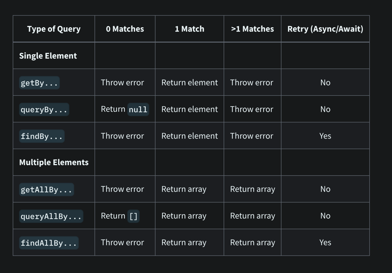

# React Testing Library

[[toc]]

## Guide

[React Testing Library](https://testing-library.com/docs/react-testing-library/intro/) 在`DOM Testing Library`的基础上添加一些API，主要用于测试React组件。如果是其它的技术栈，可以选择对应的[`Testing Library`](https://testing-library.com/) 库。该库在使用过程并不关注组件的内部实现，而是更关注测试。该库基于`react-dom`和`react-dom/test-utils`，是以上两者的轻量实现。

### Vs Jest

`RTL`并不是`Jest`的替代选择，两者不是二选一的关系，`Jest`是`Javascript`最流行的测试框架，`Jest`就是一个`test runner`，可以命令行式的跑所有的测试用例，并且
提供测试suites、cases、断言的函数，还有`spies, mocks, stubs`等。而`RTL`，只是testing library中为`React`定制的一个分支,其他的还有`Vue`、`Angular`等，测试库其他比如还有[`Enzyme`](https://github.com/enzymejs) 等。

### 安装

同`Jest`一样，如果`create-react-app`创建的，`RTL`已内置好，但比如专门用于测试`hooks`的[`@testing-library/react-hooks`](https://react-hooks-testing-library.com/) 还是要自己添加安装。

```shell
pnpm i @testing-library/react @testing-library/user-event @testing-library/jest-dom -D
# 基于eslint和testing library的最佳实践去提示，避免一些常见的错误
pnpm i eslint-plugin-testing-library -D
```

- [`@testing-library/dom`](https://testing-library.com/docs/dom-testing-library/intro): 一个轻量级的(DOM 查询、交互)测试解决方案，它使用了一种与 ”用户的在页面中查找元素" 类似的DOM查询方式，以保证准确性;
- [`@testing-library/react`](https://testing-library.com/docs/react-testing-library/intro) : 在 `@testing-library/dom` 基础上，将 `React组件`渲染为 `DOM` 便于后边测试;
- [`@testing-library/user-event`](https://testing-library.com/docs/user-event/intro/) : 提供了更加高级的浏览器交互模拟 – 即事件;
- [`@testing-library/jest-dom`](https://github.com/testing-library/jest-dom) ：追加一系列辅助测试 DOM 的 `matchers` 匹配器，需要在每个 `react test`文件的顶部引用，否则类似 `expect(dom).toBeInTheDocument()` 这样的断言则没法用，可以在`setup`中统一导入。
- [`@testing-library/react-hooks`](https://react-hooks-testing-library.com/): 专门用于测试hooks的库。在` @testing-library/react@13.1.0` 以上的版本已经把 `renderHook` 内置到里面了，但这个版本需要和 `react@18` 一起使用。
- [`eslint-plugin-testing-library`](https://github.com/testing-library/eslint-plugin-testing-library) : 基于`eslint`和`testing library`的最佳实践去做提示，避免一些常见的错误。

### Basic

#### 基本能力

- 组件渲染(render)
- 元素查找(get/query/find)
- 事件触发(fireEvent/userEvent)

#### 基本使用

在编写单元测试过程中，可以按照[AAA模式](https://blog.devgenius.io/the-three-as-of-unit-testing-3b8b4bf0d087) 实现。即：

- Arrange 编排，使用[render](https://testing-library.com/docs/react-testing-library/api#render)

```js
render(component)
```

- Act 执行，使用[fireEvent](https://testing-library.com/docs/dom-testing-library/api-events/#fireevent) 或者 [useEvent](https://testing-library.com/docs/ecosystem-user-event/) 去触发用户行为。

```js
fireEvent.click(element)
```

- Assert 断言，对期望的结果予以判断。

```js
expect(result).matcher()
```

example:

```tsx
//Search.tsx
import React from 'react'

export const Search: React.FC<
  React.PropsWithChildren<{
    value: string
    onChange: (e: React.ChangeEvent) => void
  }>
> = ({ value, onChange, children }) => {
  return (
    <div>
      <label htmlFor="search">{children}</label>
      <div>
        <label htmlFor="search">{children}</label>
        <input id="search" type="text" value={value} onChange={onChange} />
      </div>
    </div>
  )
}
```

test file

```tsx
//Search.test.tsx
import React from 'react'
// 引入@testing-library/react提供的方法
import { render, fireEvent, screen } from '@testing-library/react'
import { Search } from './Search'

describe('Search', () => {
  test('calls the onChange callback handler', () => {
    const onChange = jest.fn()
    // Arrange 编排
    render(
      <Search value="" onChange={onChange}>
        Search:
      </Search>
    )
    // Act 执行
    fireEvent.change(screen.getByRole('textbox'), {
      target: { value: 'JavaScript' }
    })
    // Assert 断言
    expect(onChange).toHaveBeenCalledTimes(1)
  })
})
```

#### 常用API

- [`render`](https://testing-library.com/docs/react-testing-library/api/#render)

render的参数：

```
render(
    ui: React.ReactElement<any>,
    options?: {
      container, // ui 渲染的位置，默认是创建个div并append到document.body上
      baseElement,
      hydrate,,
      legacyRoot
      wrapper, // 常用于注入类似React-Router、Redux、或者自定义的Provider
      queries //用于自定义选择器
    }
)
```

render的结果：

```js
const {
    ...queries, // 选择器，例如(get/query/find)By(Text/Label/...)
    container: HTMLDivElement, // 默认自动创建一个div,并插入到body中
    baseElement: HTMLBodyElement, // 相当于document.body
    debug: Function, // 打印当前document.body
    rerender: Function, //重新渲染组件
    unmount: Function, //组件卸载，此时container.innerHTML === ''
    asFragment:Function //记录某个时刻的dom
} = render()
```

render的例子：

```ts
// 列出的是常用的
const { queryByText, container, baseElement, debug, rerender, unmount } =
  render(conponent)
```

- `cleanup`

相当于给组件置成`unmount`,一般在`afterEach()`中执行，如果使用的`Jest`,不需要在`afterEach`中手动设置，框架已默认每次test结束后执行`cleanup`。

- [`Queries`](https://testing-library.com/docs/queries/about/)

| search type<br/>（单个元素） | search type<br/>（多个元素） | function<br/>（查询单个元素）                                                                                          | 适用场景                                          |
| ---------------------------- | ---------------------------- | ---------------------------------------------------------------------------------------------------------------------- | ------------------------------------------------- |
| getBy                        | getAllBy                     | getByText<br/>getByRole<br/>getByLabelText<br/>getByPlaceholderText<br/>getByAltText<br/>getByDisplayValue             | 由于只返回元素或error，适用于确定该元素存在的情况 |
| queryBy                      | queryAllBy                   | queryByText<br/>queryByRole<br/>queryByLabelText<br/>queryByPlaceholderText<br/>queryByAltText<br/>queryByDisplayValue | 用于元素可能不存在                                |
| findBy                       | findAllBy                    | findByText<br/>findByRole<br/>findByLabelText<br/>findByPlaceholderText<br/>findByAltText<br/>findByDisplayValue       | 用于异步元素                                      |

examples:

```
LabelText: getByLabelText: <label for="search" />
PlaceholderText: getByPlaceholderText: <input placeholder="Search" />
AltText: getByAltText: 
DisplayValue: getByDisplayValue: <input value="JavaScript" />
TestId: getByTestId: <div data-testid='search'></div>
```

1. `getBy*`: 只用于确定该元素存在的情况。
2. ` query*`: 只用于断言当前元素不能被找到(可以在找不到元素的情况下不会抛出异常（返回 null）。唯一的好处是可以用来判断这个元素是否没有被渲染到页面上）。
   因为类似 `get*` 和 `find*` 相关的 API 在找不到元素时都会自动抛出异常 —— 这样你就可以看到渲染的内容以及为什么找不到元素的原因。然而，`query*` 只会返回 `null`，
3. `findBy*`: `findBy`主要是查找最终会出现在`dom`中的异步元素，如果能确定一个元素不会出现在dom里，则使用`queryBy`，否则使用`getBy`。

- `fireEvent`

```js
fireEvent(node, event)
```

[events API](https://testing-library.com/docs/dom-testing-library/api-events)

- [`act`](https://testing-library.com/docs/react-testing-library/api/#act)

**后面会详细讲解**。

对react-dom/test-utils中的[act](https://reactjs.org/docs/test-utils.html#act) 函数进行了一层包装。act的作用是在你进行断言之前，保证所有由组件渲染、用户交互以及数据获取产生的**更新**全部在dom实现。

```js
act(() => {
  // render components
})
act(() => {
  // fireEvent
})
// make assertions
```

- `waitFor`

用于异步

```js
waitFor(Promise)
```

`waitFor `的目的是可以让你等一些指定的事情发生。在 waitFor 里等待指定的断言，不要传空 `callback`，如果传了空的 callback，可能它在今天还能 Work，因为你只是想在 `Event Loop` 等一个 `Tick` 就好了。但这样你也会留下一个脆弱的测试用例，一旦改了某些异步逻辑它很可能就崩了。

`waitFor` 适用的情况是：在执行的操作和断言之间存在不确定的时间量。因此，`callback` 可在不确定的时间和频率（在间隔以及 DOM 变化时调用）被调用（或者检查错误）。所以这也意味着你的副作用可能会被多次调用！

同时，这也意味着你不能在 waitFor 里面使用快照断言（SnapShot Assertion）。如果你想要用快照断言，首先要等待某些断言走完了，然后再拍快照。

建议：把副作用放在 `waitFor` 回调的外面，回调里只能有断言。

- `screen`

`screen`的方法继承自queries, queries有的能力都有，此外还增加了`debug()`的能力.

#### 补充

- 关于更多自定义的东西，例如render、选择器以及与Jest有的配置，查阅[官方文档](https://testing-library.com/docs/react-testing-library/setup/) 吧，写得很清楚.

- 对于dom的一些断言，可以添加`testing-library`库提供的`@testing-library/jest-dom`来更好得对dom进行断言。

```
// In your own jest-setup.js (or any other name)
import '@testing-library/jest-dom'

// In jest.config.js add (if you haven't already)
setupFilesAfterEnv: ['<rootDir>/jest-setup.js']
```

匹配器概览：

```
//Custom matchers
toBeDisabled
toBeEnabled
toBeEmptyDOMElement
toBeInTheDocument
toBeInvalid
toBeRequired
toBeValid
toBeVisible
toContainElement
toContainHTML
toHaveAccessibleDescription
toHaveAccessibleName
toHaveAttribute
toHaveClass
toHaveFocus
toHaveFormValues
toHaveStyle
toHaveTextContent
toHaveValue
toHaveDisplayValue
toBeChecked
toBePartiallyChecked
toHaveErrorMessage
//Deprecated matchers
toBeEmpty
toBeInTheDOM
toHaveDescription
```

具体用法，可以[查阅文档](https://github.com/testing-library/jest-dom)

## 详细教程

### render a component

以一个最简单例子的开始
src/App.tsx

```tsx
import React from 'react'

const title = 'Hello React'

function App() {
  return <div>{title}</div>
}

export default App
```

src/App.test.tsx

```tsx {1,9}
import React from 'react'
import { render, screen } from '@testing-library/react'

import App from './App'

describe('App', () => {
  test('renders App component', () => {
    render(<App />)
    screen.debug()
  })
})
```

```html
<body>
  <div>
    <div>Hello React</div>
  </div>
</body>
```

下面是一个稍微复杂一点的搜索input，使用了`useState, event handler, props`，是一个受控组件 (controlled component):

// todo

### [act](https://reactjs.org/docs/testing-recipes.html#act)

当写UI测试时，像`react dom render`, `user events`, or `data fetching - promise`的任务都会被看作用户与View的交互。
`react-dom/test-utils`提供`act`方法，确保所有这些动作在断言前，都更新并且作用到dom上。
`act()`接收一个函数作为第一个参数，并应用（apply）到`Dom`（jsdom）上，当`act()`函数被执行，可以使用断言，确保测试运行更贴近用户的真实体验。所以React测试希望所有是由状态变化导致的更新都被[act包裹住](https://reactjs.org/docs/test-utils.html#act) （如果是用原始的react测试方法的话）。

```js
import { act } from 'react-dom/test-utils'

act(() => {
  // render components
})
// make assertions
```

然而从`react-dom/test-utils`导入并使用是比较冗余的（因为一般不会从其倒入方法了），可以从`testing-library/react`导入。

```js
import { act } from '@testing-library/react'
test('Testing', () => {
  act(() => {
    /* Codes you want to apply to the DOM */
    // eg:
    ReactDOM.render(<Counter />, container)
  })
  /* assume that the code is applied to the DOM */
})
```

#### Wrap By act

`RTL`中的`render() `, `userEvent()` , `fireEvent()`都已经被`act`包裹了。 也就意味这当你使用这些方法时，组件相关的state都会更新，额外添加的同步`act`不会改变任何东西。
(It means that every time you use one of these utilities, all component’s relevant state updates are flushed. An additional synchronous act() is not going to change anything.)

`testing-library/react` 覆盖了`eventWrapper()`，所以事件函数不用再使用act。可见[code source](https://github.com/testing-library/react-testing-library/blob/main/src/pure.js#L31)

```js
import { configure as configureDTL } from '@testing-library/dom'
import act from './act-compat' // overried
configureDTL({
  eventWrapper: (cb) => {
    // like userEvent.click()
    let result
    act(() => {
      result = cb()
    })
    return result
  }
})
```

因此就不用再用act去包裹userEvent了

```js
// ❌
act(() => {
  userEvent.click(screen.getByText('Component'))
})
// ✅
userEvent.click(screen.getByText('Component'))
```

当然，RTL的`render`也wrap了

```js
function render(ui, { hydrate = false, ...rest }) {
  // ...
  act(() => {
    if (hydrate) {
      ReactDOM.hydrate(wrapUiIfNeeded(ui), container)
    } else {
      ReactDOM.render(wrapUiIfNeeded(ui), container)
    }
  })
}
```

简单的列子比如：

```tsx
// ActOne.tsx
import { useState } from 'react'

const ActOne = () => {
  const [title, setTitle] = useState('')

  const handleClick = () => {
    setTitle('Clicked') // act() in RTL render() makes this update happen
  }

  return (
    <>
      <button onClick={handleClick}>Click me</button>
      {title}
    </>
  )
}

export default ActOne

// ActOne.test.tsx
import { render, screen, waitFor } from '@testing-library/react'
import userEvent from '@testing-library/user-event'
import ActOne from './ActOne'

// fail
it('renders title when clicked', () => {
  render(<ActOne />) // this is wrapped in act()

  userEvent.click(screen.getByRole('button'))

  expect(screen.getByText('Clicked')).toBeInTheDocument()
})

// success
it('renders title when clicked with findByText', async () => {
  render(<ActOne />) // this is wrapped in act()

  userEvent.click(screen.getByRole('button'))

  expect(await screen.findByText('Clicked')).toBeInTheDocument()
})

// success
it('renders title when clicked with waitfor', async () => {
  render(<ActOne />) // this is wrapped in act()

  userEvent.click(screen.getByRole('button'))

  await waitFor(() => {
    expect(screen.getByText('Clicked')).toBeInTheDocument()
  })
})
```

再如：

```tsx
import { useEffect, useState } from 'react'

const UseAsyncInEffect = () => {
  const [title, setTitle] = useState('')

  useEffect(() => {
    const fetchData = async () => {
      const response = await fetch(
        'https://jsonplaceholder.typicode.com/posts/1'
      )
      const { title } = await response.json()

      setTitle(title) // this happens after the test is done
    }

    fetchData()
  }, [])

  return <h3>{title}</h3>
}
export default UseAsyncInEffect
```

test:

```tsx
import { render, screen, act, waitFor } from '@testing-library/react'
import UseAsyncInEffect from './UseAsyncInEffect'

global.fetch = jest.fn(() =>
  Promise.resolve({
    json: () => Promise.resolve({ test: 100 })
  })
) as jest.Mock

describe('test use async comp', () => {
  // fail  ❌
  it('renders title', () => {
    jest.spyOn(window, 'fetch').mockResolvedValue({
      json: async () => ({ title: 'Fetched' })
    } as any)

    render(<UseAsyncInEffect />)

    // this happens before the state update is scheduled
    expect(screen.getByText('Fetched')).toBeInTheDocument()
  })
  // success ✅
  it('renders title with findBy', async () => {
    jest.spyOn(window, 'fetch').mockResolvedValue({
      json: async () => ({ title: 'Fetched' })
    } as any)

    render(<UseAsyncInEffect />)

    // this happens before the state update is scheduled
    expect(await screen.findByText('Fetched')).toBeInTheDocument()
  })

  // success ✅
  it('renders title with waitFor', async () => {
    jest.spyOn(window, 'fetch').mockResolvedValue({
      json: async () => ({ title: 'Fetched' })
    } as any)

    render(<UseAsyncInEffect />)

    // eslint: Prefer `findByText` query over using `waitFor` + `getByText`(testing-library/prefer-find-by)
    await waitFor(() => expect(screen.getByText('Fetched')).toBeInTheDocument())
  })

  // pass but not good
  it('renders title 3', async () => {
    jest.spyOn(window, 'fetch').mockResolvedValue({
      json: async () => ({ title: 'Fetched' })
    } as any)
    // eslint error
    await act(() => {
      render(<UseAsyncInEffect />)
    })

    // this happens before the state update is scheduled
    expect(screen.getByText('Fetched')).toBeInTheDocument()
  })
})
```

测试会失败，并且由以下`warning`，具体原因可见后面的解析部分，简而言之就是由于跑测试时都是同步的，而React的更新却是由异步更新队列完成的。所以`expect(screen.getByText('Fetched')).toBeInTheDocument()`
这行其实是在状态更新之前运行的。(尽管render被act包裹了，但是`UseAsyncInEffect`中的`setState`是在`promise`中，render中`act`也只能确保是同步代码式写法的状态更新)。


```tsx
it('renders title', async () => {
  jest.spyOn(window, 'fetch').mockResolvedValue({
    json: async () => ({ title: 'Fetched' })
  })

  // 不要这样写
  await act(async () => {
    render(<UseAsyncInEffect />)
  })

  expect(screen.getByText('Fetched')).toBeInTheDocument()
})
```

这样虽然会通过测试并且消除警告，但却由2个问题

1. 这种只会在状态更新是发生在下一次事件循环才会奏效；
2. `act`啥也没干，只是把警报隐藏罢了。

比如在`fetchData`添加再一个`promise`，上面的测试就会**失败**

```ts
const fetchData = async () => {
  const response = await fetch('https://jsonplaceholder.typicode.com/posts/1')
  const { title } = await response.json()

  await new Promise((resolve) => setTimeout(resolve, 0))

  setTitle(title) // this happens after the test is done
}
```

所以使用[eslint-plugin-testing-library](https://github.com/testing-library/eslint-plugin-testing-library) 去避免没有必要的act包裹和错误用法是有必要的。


##### 如何解决

可以使用RTL的[Async Methods](https://testing-library.com/docs/dom-testing-library/api-async/) 即`waitFor` , `waitForElementToBeRemoved` 和` findBy queries`解决。如上成功的case。

#### Deep Excavate

比如这样一个简单的组件

```ts
import * as React from 'react'
const ExampleOne: React.FC = () => {
  const [ctr, setCtr] = React.useState(0)
  React.useEffect(() => {
    setCtr(1)
  }, [])
  return <div>{ctr}</div>
}

export default ExampleOne
```

测试

```tsx
import * as ReactDOM from 'react-dom'
import ExampleOne from './ExampleOne'
it('should render 1', () => {
  const el = document.createElement('div')
  ReactDOM.render(<ExampleOne />, el)
  expect(el.innerHTML).toBe('1') // fail!
})
```

报错如下：


在页面的正常变现是会显示为 "1"，但测试却显示的 "0"

为什么这样子，就要涉及到React相关的原理知识，React并不是同步的渲染UI的，React会把任务切片，并形成一个任务队列，然后按优先级等执行。


使用`act`包裹后可以pass

```tsx
import * as ReactDOM from 'react-dom'
import ExampleOne from './ExampleOne'
import { act } from 'react-dom/test-utils'
it('should render 1', () => {
  const el = document.createElement('div')
  // eslint-disable-next-line testing-library/no-unnecessary-act
  act(() => {
    ReactDOM.render(<ExampleOne />, el)
  })
  expect(el.textContent).toBe('1') // fail!
})
```


#### 什么时候得用act

1. 当使用`jest.useFakeTimers()`时
2. 当使用测试自定义hooks时
3. 当使用`useImperativeHandle`时

可以在[这里-Fix the "not wrapped in act(...)" warning](https://kentcdodds.com/blog/fix-the-not-wrapped-in-act-warning#other-use-cases-for-manually-calling-act)查看详细的case。

### 什么时候用`userEvent`和`fireEvent`

关于这2个API，可以认为`fireEvent`是一个更底层更基础的API，而`userEvent`基于事件动作/类型更上层的封装，更符合用户在真实的浏览器的行为表现。可以看其源码[userEvent.click code](https://github.com/testing-library/user-event/blob/5feaa942f46bb37d96c2f2fbeb4b33e8beff75ad/src/click.js#L87-L103)

可以看到`useEvent`触发的事件行为更像用户在真实的浏览器触发的，比如`fireEvent.change()`只会触发一次change事件，`userEvent.type`也会触发一次change事件，但也会触发`keyDown, keyPress, keyUp events`.

以这个例子为例：

```tsx {18,22}
describe('Search', () => {
  test('calls the onChange callback handler', async () => {
    const onChange = jest.fn()

    render(
      <Search value="" onChange={onChange}>
        Search:
      </Search>
    )

    fireEvent.change(screen.getByRole('textbox'), {
      target: { value: 'JavaScript' }
    })

    // success
    expect(onChange).toHaveBeenCalledTimes(1)

    await userEvent.type(screen.getByRole('textbox'), 'JavaScript')
    // success
    expect(onChange).toHaveBeenCalledTimes(10)
  })
})
```

断言都pass了，但明显使用`userEvent`时，`onchange`执行10次更加符合真实的场景。

`@testing-library/user-event` 是在 `fireEvent` 基础上实现的，但它提供了一些更接近用户交互的方法。上面这个例子中，`fireEvent.change` 其实只触发了 `Input` 的一个 `Change `事件。但是 `type` 则可以对每个字符都会触发 `keyDown、keyPress 和 keyUp` 一系列事件。这能更接近用户的真实交互场景。好处是可以很好地和你当前那些没有监听 `Change` 事件的库一起使用。

所以：

```js
// ❌
fireEvent.change(input, { target: { value: 'hello world' } })

// ✅
userEvent.type(input, 'hello world')
```

### 正确地查找元素

查找元素是在写测试是一个最基本的操作，查找出的元素一般会用来使用`user-event`触发事件或者使用 Jest/jest-dom 来做断言判断。建议可以完整的看下[官方文档](https://testing-library.com/docs/queries/about) ，这部分写的很详细。这里做下内容提炼和注意点笔记。



#### [优先级](https://testing-library.com/docs/queries/about#priority)

**尽量使用无障碍的特效去查找**

- getByRole，[Roles](https://developer.mozilla.org/en-US/docs/Web/Accessibility/ARIA/)
- getByLabelText
- getByText
- getByDisplayValue

**尽量使用语义话去查找**

- getByAltText
- getByTitle

使用**Test IDs**

- getByTestId

* 一般情况下，当你在想我该用那个query方法时，首选的都是`*ByRole`，其他的情况可以参考下面的[some case](#some-case)

#### `getBy` vs `queryBy`

`getBy`会返回**一个元素**或者一个错误，这个方法是很明确的，就是Dom中要么找的到，要么报错，唯一的毛病就是不能检查一个元素不应该在Dom中。

```tsx
import React from 'react'
import { render, screen } from '@testing-library/react'

import TestQueryOne from './TestQueryOne'

describe('App', () => {
  test('renders TestQueryOne component', () => {
    render(<TestQueryOne />)

    screen.debug()

    // fails
    expect(screen.getByText(/Searches for JavaScript/)).toBeNull()
  })
})
```

如上，上面的测试会失败，因为`getBy` 找不到就会报错啊，所以这个时候，`queryBy`就改派上用场了。所以上面的断言换成这样就可以了。因为queryBy找不到不会报错而是返回`Null`

```tsx
expect(screen.queryByText(/Searches for JavaScript/)).toBeNull()
```

所以，到底使用`getBy` 还是 `queryBy`，只需要看你是不是需要断言一个元素不该存在于Dom上。

#### `findBy`

`findBy`就是用于异步查找咯，`findBy`会返回一个`Promise`，**这个`Promise`默认在1秒内没有找到这个元素或者找到了不止一个，就会`Reject`**。比如：
::: details 点击查看代码

```tsx
import * as React from 'react'

type User = {
  id: string
  name: string
}

function getUser(): Promise<User> {
  return Promise.resolve({ id: '1', name: 'Robin' })
}

function SearchInput() {
  const [search, setSearch] = React.useState<string>('')
  const [user, setUser] = React.useState<null | User>(null)

  React.useEffect(() => {
    const loadUser = async () => {
      const user = await getUser()
      setUser(user)
    }
    // setTimeout(() => loadUser(), 1500)
    loadUser()
  }, [])

  function handleChange(event: React.ChangeEvent<HTMLInputElement>) {
    setSearch(event.target.value)
  }

  return (
    <div>
      {user ? <p>Signed in as {user.name}</p> : null}

      <Search value={search} onChange={handleChange}>
        Search:
      </Search>

      <p>Searches for {search || '...'}</p>
    </div>
  )
}

type SearchInputProps = {
  value: string
  onChange: (e: React.ChangeEvent<HTMLInputElement>) => void
  children: React.ReactNode
}

export function Search({ value, onChange, children }: SearchInputProps) {
  return (
    <div>
      <label htmlFor="search">{children}</label>
      <input id="search" type="text" value={value} onChange={onChange} />
    </div>
  )
}

export default SearchInput
```

test file

```tsx
import SearchInput, { Search } from './index'
import React from 'react'
import { render, screen, fireEvent } from '@testing-library/react'
import userEvent from '@testing-library/user-event'

describe('SearchInput', () => {
  test('renders SearchInput component', async () => {
    render(<SearchInput />)

    // succeeds
    expect(screen.getByText(/Searches for/)).toBeInTheDocument()
    expect(screen.queryByText(/Signed in as/)).not.toBeInTheDocument()
    // 会error，如果是 setTimeout(() => loadUser(), 1500)
    expect(await screen.findByText(/Signed in as Robin/i)).toBeInTheDocument()

    fireEvent.change(screen.getByRole('textbox'), {
      target: { value: 'JavaScript' }
    })

    expect(screen.getByText(/Searches for JavaScript/)).toBeInTheDocument()
  })
})

describe('Search', () => {
  test('calls the onChange callback handler', () => {
    const onChange = jest.fn()

    render(
      <Search value="" onChange={onChange}>
        Search:
      </Search>
    )

    fireEvent.change(screen.getByRole('textbox'), {
      target: { value: 'JavaScript' }
    })

    expect(onChange).toHaveBeenCalledTimes(1)
  })
})

describe('Search', () => {
  test('calls the onChange callback handler', async () => {
    const onChange = jest.fn()

    render(
      <Search value="" onChange={onChange}>
        Search:
      </Search>
    )

    fireEvent.change(screen.getByRole('textbox'), {
      target: { value: 'JavaScript' }
    })

    expect(onChange).toHaveBeenCalledTimes(1)

    await userEvent.type(screen.getByRole('textbox'), 'JavaScript')

    expect(onChange).toHaveBeenCalledTimes(10)
  })
})
```

:::

如果把`loadUser()`替换为`setTimeout(() => loadUser(), 1500)`，`findByText`的case那里测试就会失败。

#### 查找多个元素

- getAllBy
- queryAllBy
- findAllBy

#### some case

##### `text is broken up by multiple elements`

html如：`<h3>Hello <span>World</span></h3>`，h3 中的text被标签分割了。

```js
// Error: TestingLibraryElementError: Unable to find an element with the text: /hello world/i. This could be because the text is broken up by multiple elements. In this case, you can provide a function for your text matcher to make your matcher more flexible.
screen.getByText(/hello world/i)

screen.getByRole('heading', { name: /hello world/i })
// or more precisely for h3 tag
screen.getByRole('heading', { name: /hello world/i, level: 3 })
```

##### Finding multiple elements

比如在一个组件中html如：

```html
<h3>Login now</h3>
<button>Login</button>
```

如果这样去query，对于测试用例来说，是很脆弱的，轻易的改动就可能fail。

```ts
const logins = screen.getAllByText(/login/i)
const loginButton = logins[1]
```

更好的写法是：

```ts
const loginButton = screen.getByText(/login/i, { selector: 'button' })
// or
const loginButton2 = screen.getByRole('button', { name: '/login/i' })
```

即使用的`options`参数去缩小范围。比如第一个case中用[`heading` 和`level`](https://developer.mozilla.org/en-US/docs/Web/Accessibility/ARIA/Roles/heading_role) 而不是 `h1`...`h6 `标签.

##### 查找空元素

比如图标这样的

```html
<style>
  /* default class for fonts-face with icons */
  .icon {
    font-family: 'IconFontRoleImg' !important;
  }

  /* specific class for icon */
  .icon-star-bg:before {
    content: '\e982';
  }
</style>
<p>
  <span class="icon icon-star-bg"></span>
</p>
```

其实，html结构应该为

```html
<p>
  <span class="icon icon-star-bg" role="img" aria-label="Favorite"></span>
</p>
```

这样就可以使用`getByRole('img', { name: /favorite/i })`。

- [Semantically identifying a font icon with role="img"](https://www.w3.org/WAI/WCAG21/Techniques/aria/ARIA24)

##### 查询没有`role`对应的

`*ByRole`也不是银弹，有些场景也是不能用`*ByRole`的，比如查找一个没有role的元素，如密码输入input，可以从[官网](https://testing-library.com/docs/queries/about/#priority) 上找到其他对于的API，已可以利用这个
网站：[testing-playground](https://testing-playground.com/) ，粘贴对于的Html结构，就看到该使用那个了。

使用浏览器插件更加方便 [Chrome](https://chrome.google.com/webstore/detail/testing-playground/hejbmebodbijjdhflfknehhcgaklhano) or [Firefox](https://addons.mozilla.org/en-US/firefox/addon/testing-playground/) .

## reference

- [React单元测试策略及落地](https://insights.thoughtworks.cn/react-strategies-for-unit-testing/)
- [React Testing Library Tutorial](https://www.robinwieruch.de/react-testing-library/)
- [Making sure you're using the correct query](https://timdeschryver.dev/blog/making-sure-youre-using-the-correct-query)
- [使用 `React Testing Library` 的 15 个常见错误](https://mp.weixin.qq.com/s/pgdcDNjDGPgNq76Zh_dZxg)
- [Act Deep Excavate](https://github.com/threepointone/react-act-examples/blob/master/sync.md)
- [You Probably Don’t Need act() in Your React Tests](https://javascript.plainenglish.io/you-probably-dont-need-act-in-your-react-tests-2a0bcd2ad65c)
- [When should I use act() in react-testing-library?](https://flyingsquirrel.medium.com/when-should-i-use-act-in-react-testing-library-d7dd22a3340e)

---
