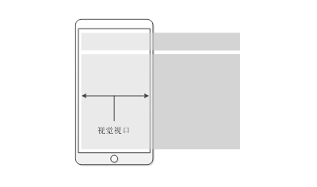

[移动端适配](http://www.conardli.top/blog/article/%E5%A4%9A%E7%AB%AF%E5%BC%80%E5%8F%91/%E7%A7%BB%E5%8A%A8%E7%AB%AF%E9%80%82%E9%85%8D%E6%80%BB%E7%BB%93%EF%BC%88%E4%BA%8C%EF%BC%89%E5%BA%94%E7%94%A8%E7%AF%87.html#%E5%AF%BC%E8%AF%BB)

## 1px问题

[文章](https://juejin.cn/post/6896713964848152589)

### 伪类+transform实现

```scss
.border_1px {
    position: relative;
    &::after{
        content: '';
        position: absolute;
        display: block;
        bottom: 0;
        height: 1px;
        width: 100%;
        background-color: #ddd;
    }
    @media only screen and (-webkit-min-device-pixel-ratio:2){
        .border_1px:after{
            transform: scaleY(0.5);
        }
    }
    @media only screen and (-webkit-min-device-pixel-ratio:3){
        .border_1px:after{
            transform: scaleY(0.33);
        }
    }
}
```

## 总结

- 英寸：物理固定单位，1英寸 = 2.54 厘米；
- 像素：像素即一个小方块，它具有特定的位置和颜色。图片、电子屏幕（手机、电脑）就是由无数个具有特定颜色和特定位置的小方块拼接而成。像素可以作为图片或电子屏幕的最小组成单位，比如说4.7英寸iphone 6的PPI是326。
- 屏幕分辨率：屏幕分辨率指一个屏幕具体由多少个像素点组成。
- 图像分辨率： 其实是指图片含有的像素数，比如一张图片的分辨率为800 x 400。这表示图片分别在垂直和水平上所具有的像素点数为800和400。
- `PPI`(Pixel Per Inch)：每英寸包括的像素数。使用PPI描述图片时，PPI越高，图片质量越高，使用PPI描述屏幕时，PPI越高，屏幕越清晰。
- `DPI`(Dot Per Inch)：每英寸包括的点数。这里的点是一个抽象的单位，它可以是屏幕像素点、图片像素点也可以是打印机的墨点。[区别](https://99designs.com/blog/tips/ppi-vs-dpi-whats-the-difference/)，pixel和dot：Pixel是一个带颜色的方块，一个图片其实就是由这些方块组成的。dot就是一个点，打印机或屏幕通过这些点把图片print出来。例如：一个150ppi的图片在600dpi的设备上显示，每个pixel有16(4*4)个dot (600 dots/150 pixels)

- 设备独立像素：用一种单位来同时告诉不同分辨率的手机，它们在界面上显示元素的大小是多少，这个单位就是设备独立像素(`Device Independent Pixels`)简称`DIP`或`DP`。打开chrome的开发者工具，可以模拟各个手机型号的显示情况，每种型号上面会显示一个尺寸，比如iPhone X显示的尺寸是`375x812`，实际iPhone X的分辨率会比这高很多，这里显示的就是设备独立像素。
- 设备像素比：设备像素比`device pixel ratio`简称`dpr`，即物理像素和设备独立像素的比值。既window.devicePixelRatio，css中，可以使用媒体查询`min-device-pixel-ratio`，区分`dpr`(`@media min-device-pixel-ratio: 2){ }`)
- CSS像素`px`: 当页面缩放比例为100%时，一个CSS像素等于一个`设备独立像素`。

移动设备上的视口viewport
- viewport: 
- 布局视口(layout viewport)：布局视口是指网页的宽度，一般移动端浏览器都默认设置了布局视口的宽度。根据设备的不同，布局视口的默认宽度有可能是768px、980px或1024px等，这个宽度并不适合在手机屏幕中展示。移动端浏览器之所以采用这样的默认设置，是为了解决早期的PC端页面在手机上显示的问题。
- 视觉视口(visual viewport)：用户通过屏幕真实看到的区域。
- 理想视口(ideal viewport)：用户通过屏幕真实看到的区域。

#### devicePixelRatio属性


该 `Window` 属性 `devicePixelRatio` 能够返回当前显示设备的物理像素分辨率与 `CSS` 像素分辨率的比率。此值也可以解释为像素大小的比率：一个 CSS 像素的大小与一个物理像素的大小的比值。简单地说，这告诉浏览器应该使用多少个屏幕的实际像素来绘制单个 CSS 像素。devicePixelRatio 属性值为一个 double（MDN）

物理像素一般指屏幕的分辨率，设备出厂就设定好了，当然操作系统可以改显示的分辨率，一个像素就是一个点，也就是厂家在生产显示设备时就决定的实际点的个数。
上对于不同的设备而言，物理像素点的大小是不一样的，这样就会带来问题：举个例子，21英寸显示器的分辨率是1440x1080，5.8英寸的iPhone X的分辨率是2436×1125，
用CSS画一条线，其长度是20px，如果都以物理像素作为度量单位，那么在显示器上看起来正常，在iPhone X屏幕上就变得非常小，不是想要的结果。所以呢，为了解决这个问题，还需要一个新的度量单位，
这个度量单位必须是与设备无关的，采用这个单位，无论在何种设备上，相同长度的线看起来都应该差不多，这就是**设备独立像素(device-independent pixels, dips )**

物理像素可以理解为硬件设备，设备独立像素可以认为是程序员控制显示器的接口，中间会经过操作系统来将设备独立像素转换成物理像素，用实际的物理像素点来显示。
所以，在编程中能获取到的都是设备独立像素，如CSS中的获取的所有像素都是设备独立像素，而物理像素对于程序员来说是透明的，没法在代码中看到的。

不管何种设备，一般都满足：设备独立像素 <= 物理像素

`window.devicePixelRatio` = 设备物理像素 / 设备独立像素

通过`window.devicePixelRatio`，可以知道一个设备独立像素用几个物理像素点来表示。如iPhone X中，`devicePixelRation`为3，iPhone6/7/8中`devicePixelRatio`的为2。当然，devicePixelRation并不一定是整数，也有可能是1.5，2.25这些小数值。

#### 缩放

说完上面的概念，也许会有个疑惑：有一张400x300的图片，分别放到400x300和800x600的显示器上全屏显示，会怎么样呢？

先来看400x300的显示器，由于是全屏显示，正好图片也是400x300的分辨率，两者相等，于是很愉快的，显示器上一个像素点就显示照片上的一个像素，整个图片完美的显示出来了

而在800x600的显示器上全屏时，图片上点的数目不够用了，这时，屏幕上的4个像素点只能显示照片的一个像素点（为什么是4呢，因为一个像素点可以看成是一个正方形，横向和纵向都是2倍，所以2x2=4）。由于像素已经是最小的单位了，不能再往下分了，所以就只能就近取色，所以最后的图片看起来就会模糊。

这个原理与Retina屏幕显示是一样的。比如，对于一幅400x300的图片，用CSS设定其宽高为400x300，CSS设定的是设备独立像素。在普通屏幕上，CSS指定的400x300像素大小区域正好是400x300个物理像素点，图片完美显示，对应上面的情况一；在Retina屏上，devicePixelRatio为2，CSS指定的400x300像素大小区域有800x600个物理像素点，对应的就是上面的情况2，所以就会有模糊的情况。具体原理可以参考下面的图（来自网络）：


为了解决Retina屏幕的显示问题，往往会用更高分辨率的图片来代替，比如对于上面的情况，如果用800x600的图片，那么在Retina屏幕上显示就会非常完美，但是换到普通屏幕上，问题又来了：显示器上的一个物理像素点要显示照片上的4个像素点，装不下了。这时候，会自动下采样。下采样之后的，看起来也不会有太大问题，但可能会有点色差或者缺少锐利度。


#### CSS的单位
CSS的单位分两种：绝对长度单位和相对长度单位。

**绝对单位：**
- cm：厘米
- mm：毫米
- in：英寸
- pc(picas):一英寸的1/6
- pt(points)：一英寸的1/72
- **px(pixels)：一英寸的1/96**

之所以叫绝对长度单位，是因为在只有普通屏幕的时代，相同的单位无论在何种设备上，显示出来的长度都是一致的，并且1cm就是等于物理长度1厘米。而后来，由于Retina显示屏的出现，**绝对长度单位里面的“绝对”，是指单位之间关系是绝对固定的**
。比如，`1in = 72pt`和`1in = 96px`是永远固定不变的。关系不变，就需要选取其中一个作为基准：

- 在打印机设备中，一般是以物理单位作为基准，即1in对应物理单位的1in，此时，1px的长度就是1/96in。所有单位都是与物理长度对应的
- 而在显示设备（电脑和手机）中，一般是以像素作为基准的。比如在iPhone X中，设备的宽度是2.79in（物理宽度），屏幕分辨率是1125物理像素，window.devicePixelRatio = 3，也就是3个物理像素表示一个CSS像素，所以iPhone X宽度的CSS像素是375px。此时，CSS单位的1in表示的实际长度是2.79 / 375 * 96in = 0.71424in，此时，CSS的1in并不表示物理长度1in

**相对长度单位：**

相对于预定义的长度或特征，一般是相对于字体或者viewport，在移动端适配中有很重要的作用

相对于字体
- ex (x-height)：等于所用字体的小写字母x的高度
- ch (character)：等于所用字体的数字0的宽度
- em：相对于最近父级font-size，所以会有层层嵌套的问题，每一层都是相对于最近父级。
- rem ：相对于html标签的font-size

相对于viewport
- vh：viewport高度的1/100
- vw：viewport宽度的1/100
- vmin：viewport宽高较小者的1/100
- vmax：viewport宽高较大者的1/100

#### layout viewport、visual viewport和ideal viewport介绍


**layout viewport**

Layout viewport的大小可以通过`document.documentElement.clientWidth`和`document.document.clientHeight`
```javascript
document.documentElement.clientWidth
document.documentElement.clientHeight
```
布局视口是指网页的宽度，一般移动端浏览器都默认设置了布局视口的宽度。根据设备的不同，布局视口的默认宽度有可能是768px、980px或1024px等，这个宽度并不适合在手机屏幕中展示。
移动端浏览器之所以采用这样的默认设置，是为了解决早期的PC端页面在手机上显示的问题。布局视口如图所示。


当移动端浏览器展示PC端网页内容时，由于移动端设备屏幕比较小，不能像PC端浏览器那样完美地展示网页，这正是布局视口存在的问题。这样的网页在手机的浏览器中会出现左右滚动条，用户需要左右滑动才能查看完整的一行内容。

[**visual viewport**](https://developer.mozilla.org/zh-CN/docs/Web/API/VisualViewport)

与布局视口（layout viewport）不同的是：只有最上层的 window 才有视觉视口（visual viewport）这一概念。因此只有最上层 window 的 VisualViewport 属性才是有效的，其他层的视觉视口属性可看作是布局视口属性的别名。比如，对于一个` <iframe> `，其对应的视觉视口属性 `VisualViewport.width` 相当于对应的布局视口属性，如 `document.documentElement.clientWidth`。--MDN

视觉视口是指用户正在看到的网站的区域，这个区域的宽度等同于移动设备的浏览器窗口的宽度，当在手机中缩放网页的时候，操作的是视觉视口，而布局视口仍然保持原来的宽度。视觉视口如图。



这个是浏览器给我们用的、能真正用来显示网页内容的区域，可以通过下面的js命令获取：
```javascript
window.innerWidth
window.innerHeight
```
正如上面所说的，前端里面能获取到的像素基本上都是CSS像素，所以这个的单位也是CSS像素。对于iPhone X，浏览器全屏状态下，其`window.innerWidth`的值为375。

而`screen.width`和`screen.height`，主要是用来获取整个屏幕的大小的，而`window.innerWidth`和`window.innerHeight`
只是获取浏览器可用显示区域的大小，也就是浏览器中间负责显示的部分。当浏览器全屏时，要去掉状态栏、标签栏、任务栏等区域，当浏览器非全屏时，其值更小。由于在移动端，浏览器一般都是全屏的，所以大多数情`screen.width`和`windows.innerWidth`相等。


**ideal viewport**

移动设备的理想viewport是指对设备来讲最理想的视口尺寸。采用理想视口的方式，可以使网页在移动端浏览器上获得最理想的浏览和阅读的宽度。

Layout viewport是为了能将电脑上的网页正确的显示到手机上。当浏览器拿到一个网页时，首先会渲染到这个layout viewport里面。可是现在有很多网页会针对手机做专门的设计，比如现在的一些H5活动页，设计的尺寸就是在手机上看的。此时如果还是把网页渲染到这个大的layout viewport上，实在是有点不合适了。所以，还应该有个ideal viewport，这个ideal viewport应该与手机屏幕大小的相同，确切来说，等于visual viewport的大小。把页面渲染到这个ideal viewport里面，就能在visual viewport中完美显示。

在开发中，为了实现理想视口，需要给移动端页面添加标签配置视口，通知浏览器来进行处理。
```html
<meta name="viewport" content="width=device-width; initial-scale=1; maximum-scale=1; minimum-scale=1; user-scalable=no;">
```

#### [使用meta标签设置viewport](https://segmentfault.com/a/1190000020218602)

#### 获取浏览器大小

- window.innerHeight：获取浏览器视觉视口高度（包括垂直滚动条）。
- window.outerHeight：获取浏览器窗口外部的高度。表示整个浏览器窗口的高度，包括侧边栏、窗口镶边和调正窗口大小的边框。
- window.screen.height：获取获屏幕取理想视口高度，这个数值是固定的，设备的分辨率/设备像素比
- window.screen.availHeight：浏览器窗口可用的高度，在windows上是window.screen.availHeight = window.screen.height - 任务栏。
- document.documentElement.clientHeight：获取浏览器布局视口高度，包括内边距，但不包括垂直滚动条、边框和外边距。
- document.documentElement.offsetHeight：包括内边距、滚动条、边框和外边距。
- document.documentElement.scrollHeight：在不使用滚动条的情况下适合视口中的所有内容所需的最小宽度。测量方式与clientHeight相同：它包含元素的内边距，但不包括边框，外边距或垂直滚动条。


## 移动端适配问题

在html根元素上设定了设计稿相关的vw后，后面都是用rem单位的。比如:

750px（iPhone6(750×1334)）的设计稿 则100vw/750px == 0.133333333vw/px

13.3333333vw即等于100px == 1rem

1px === 0.01rem

100vw == 750px == 7.5rem

font-size: 13.33333vw; 

那后面的width,height都是可以用rem来用了。比如设计搞上的header的height是120px，里面的字体大小是32px，那么写css的时候就是1.2rem，0.32rem。

然后限制大小的问题，比如设计两个极限点： 
```css
 @media screen and (max-width: 320px) { 
     html { 
        font-size: 32px;
     }
 } 
 @media screen and (min-width: 540px) { 
     html { 
        font-size: 54px; 
     } 
 }
```
那么，小于320px或者大于540px（比如直接PC端显示）的时候，header的高度会一直保持在：`1.2rem*32px/1rem = 38.4px`，屏幕再缩小，这个高度也一直是38.4px了；`1.2rem*54px/1rem = 64.8px`，屏幕再变大，这个高度也一直是64.8px了。
可以理解成，小于或者大于某个极限点，那么就让其失去自适应，固定其大小。同理字体的大小会保持在：最小`0.32*32 =10.24px`；最大`0.32*54 = 17.28px`。
