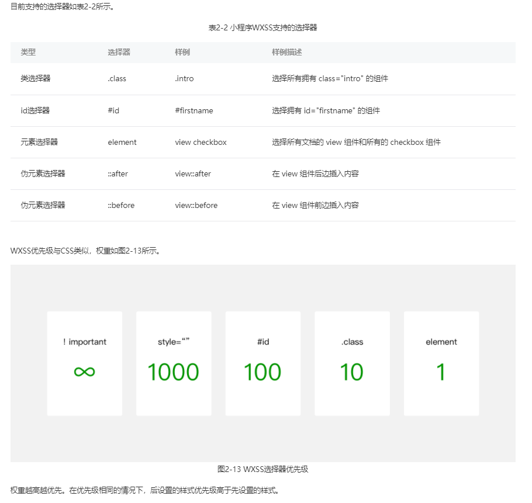
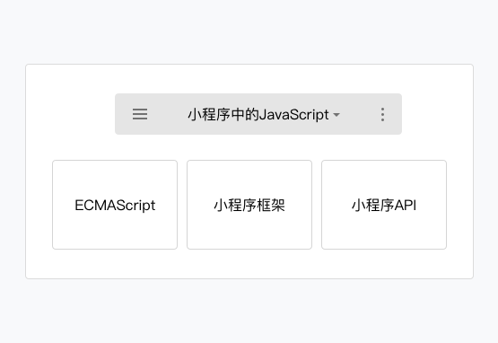

- [深入浅出主流的几款小程序跨端框架原理](https://juejin.cn/post/6881597846307635214)
- [文档](https://developers.weixin.qq.com/ebook?action=get_post_info&docid=0008aeea9a8978ab0086a685851c0a)
## 微信小程序

网页开发渲染线程和脚本线程是互斥的，这也是为什么长时间的脚本运行可能会导致页面失去响应，而在小程序中，二者是分开的，分别运行在不同的线程中。网页开发者可以使用到各种浏览器暴露出来的 DOM API，进行 DOM 选中和操作。

而**小程序的逻辑层和渲染层是分开的**，逻辑层运行在 `JSCore` 中，并没有一个完整浏览器对象，因而缺少相关的`DOM API`和`BOM API`。
这一区别导致了前端开发非常熟悉的一些库，例如 jQuery、 Zepto 等，在小程序中是无法运行的。同时 JSCore 的环境同 NodeJS 环境也是不尽相同，所以一些 NPM 的包在小程序中也是无法运行的。
[深入理解JavaScriptCore](https://zhuanlan.zhihu.com/p/42859905)

小程序的运行环境


#### 渲染层和逻辑层

整个小程序框架系统分为两部分：**逻辑层（App Service）和 视图层（View）**。小程序提供了自己的视图层描述语言 WXML 和 WXSS，以及基于 JavaScript 的逻辑层框架，并在视图层与逻辑层间提供了数据传输和事件系统，让开发者能够专注于数据与逻辑。

小程序的**运行环境分成渲染层和逻辑层，其中 `WXML` 模板和 `WXSS` 样式工作在渲染层，`JS` 脚本工作在逻辑层**。

小程序的渲染层和逻辑层分别由**2个线程管理**：**渲染层的界面使用了`WebView` 进行渲染**；**逻辑层采用JsCore线程运行JS脚本**。一个小程序存在多个界面，所以渲染层存在**多个WebView线程**，
这两个线程的通信会经由微信客户端（下文中也会采用Native来代指微信客户端）做中转，逻辑层发送网络请求也经由Native转发，小程序的通信模型下图所示。


当前，视图层和逻辑层的数据传输，实际上通过两边提供的 `evaluateJavascript` 所实现。即用户传输的数据，**需要将其转换为字符串形式传递**，同时把转换后的数据内容拼接成一份 JS 脚本，再通过执行 JS 脚本的形式传递到两边独立环境。

而 `evaluateJavascript` 的执行会受很多方面的影响，数据到达视图层并不是实时的。所以我们的`setData`函数将数据从逻辑层发送到视图层，是**异步的**。

#### wxss

小程序编译后，`rpx`会做一次px换算。换算是以375个物理像素为基准，也就是在一个宽度为375物理像素的屏幕下，`1rpx = 1px`。

举个例子：iPhone6屏幕宽度为375px，共`750个物理像素`，那么`1rpx = 375 / 750 px = 0.5px`。


选择器和优先级



#### JavaScript 

小程序中 JavaScript 构成如图



小程序中的 JavaScript 是由**ECMAScript 以及小程序框架和小程序 API 来实现的**。同浏览器中的JavaScript 相比没有 BOM 以及 DOM 对象，所以类似 JQuery、Zepto这种浏览器类库是无法在小程序中运行起来的，同样的缺少 Native 模块和NPM包管理的机制，小程序中无法加载原生库，也无法直接使用大部分的 NPM 包。

不同的平台的小程序的脚本执行环境也是有所区别的。

小程序目前可以运行在三大平台：

1. iOS平台，包括iOS9、iOS10、iOS11，iOS12
2. Android平台
3. 小程序IDE

模块化: 同浏览器不同，小程序中可以将任何一个JavaScript 文件作为一个模块，通过`module.exports` 或者 `exports` 对外暴露接口。使用 `require(path)` 将公共代码引入。
类似于node.js的CMD

**脚本的执行顺序**
浏览器中，脚本严格按照加载的顺序执行，而在小程序中的脚本执行顺序**有所不同**。小程序的执行的入口文件是 app.js 。并且会根据其中 `require` 的模块顺序决定文件的运行顺序。

当 app.js 执行结束后，小程序会按照开发者**在 app.json 中定义的 pages 的顺序，逐一执行**。

**作用域**

同浏览器中运行的脚本文件有所不同，小程序的脚本的作用域同 NodeJS 更为相似。

**在文件中声明的变量和函数只在该文件中有效，不同的文件中可以声明相同名字的变量和函数，不会互相影响**

### 数据驱动

WXML结构实际上等价于一棵Dom树，通过一个JS对象也可以来表达Dom树的结构，如图

WXML结构和JS对象均可以表示一棵Dom树


WXML可以先转成JS对象，然后再渲染出真正的Dom树,转换的过程如图


**WXML结构转JS对象，再转Dom树**

通过setData把msg数据从“Hello World”变成“Goodbye”，产生的JS对象对应的节点就会发生变化，此时可以对比前后两个JS对象得到变化的部分，然后把这个差异应用到原来的Dom树上，从而达到更新UI的目的，这就是“数据驱动”的原理，如图


小程序的逻辑层和渲染层是分开的两个线程。在渲染层，宿主环境会把WXML转化成对应的JS对象，在逻辑层发生数据变更的时候，我们需要通过宿主环境提供的setData方法把数据从逻辑层传递到渲染层，再经过对比前后差异，把差异应用在原来的Dom树上，渲染出正确的UI界面, 如图


### 程序的生命周期和打开场景

初次进入小程序的时候，微信客户端初始化好宿主环境，同时从网络下载或者从本地缓存中拿到小程序的代码包，把它注入到宿主环境，初始化完毕后，微信客户端就会给App实例派发onLaunch事件，App构造器参数所定义的onLaunch方法会被调用。
进入小程序之后，用户可以点击右上角的关闭，或者按手机设备的Home键离开小程序，此时小程序并没有被直接销毁，我们把这种情况称为“小程序进入后台状态”，App构造器参数所定义的onHide方法会被调用。
当再次回到微信或者再次打开小程序时，微信客户端会把“后台”的小程序唤醒，我们把这种情况称为“小程序进入前台状态”，App构造器参数所定义的onShow方法会被调用。
我们可以看到，App的生命周期是由微信客户端根据用户操作主动触发的。为了避免程序上的混乱，我们不应该从其他代码里主动调用App实例的生命周期函数。
在微信客户端中打开小程序有很多途径：从群聊会话里打开，从小程序列表中打开，通过微信扫一扫二维码打开，从另外一个小程序打开当前小程序等，针对不同途径的打开方式，小程序有时需要做不同的业务处理，所以微信客户端会把打开方式带给onLaunch和onShow的调用参数options

小程序的JS脚本是运行在JsCore的线程里，小程序的每个页面各自有一个WebView线程进行渲染，所以小程序切换页面时，小程序逻辑层的JS脚本运行上下文依旧在同一个JsCore线程中。
在上文中说道App实例是单例的，因此**不同页面直接可以通过App实例下的属性来共享数据**。**App构造器可以传递其他参数作为全局属性以达到全局共享数据的目的**。

### 事件

target和currentTarget的区别，currentTarget为当前事件所绑定的组件，而target则是触发该事件的源头组件。

```vue
<!-- page.wxml -->
<view id="outer" catchtap="handleTap">
  <view id="inner">点击我</view>
</view>
```
```javascript
// page.js
Page({
  handleTap: function(evt) {
       // 当点击inner节点时
       // evt.target 是inner view组件
       // evt.currentTarget 是绑定了handleTap的outer view组件
       // evt.type == “tap”
       // evt.timeStamp == 1542
       // evt.detail == {x: 270, y: 63}
       // evt.touches == [{identifier: 0, pageX: 270, pageY: 63, clientX: 270, clientY: 63}]
       // evt.changedTouches == [{identifier: 0, pageX: 270, pageY: 63, clientX: 270, clientY: 63}]
  }
})
```
bind和capture-bind的含义分别代表事件的冒泡阶段和捕获阶段


每个小程序的缓存空间上限为10MB，如果当前缓存已经达到10MB，再通过wx.setStorage写入缓存会触发fail回调。


引入### 原生组件

小程序是 Hybrid 应用，除了 Web 组件的渲染体系（上面讲到），还有由客户端原生参与组件（原生组件）的渲染。

引入原生组件主要有 3 个好处：

1. 绕过 setData、数据通信和重渲染流程，使渲染性能更好。

2. 扩展 Web 的能力。比如像输入框组件（input, textarea）有更好地控制键盘的能力。

3. 体验更好，同时也减轻 WebView 的渲染工作。比如像地图组件（map）这类较复杂的组件，其渲染工作不占用 WebView 线程，而交给更高效的客户端原生处理。

而原生组件的渲染过程：

1. 组件被创建，包括组件属性会依次赋值。

2. 组件被插入到 DOM 树里，浏览器内核会立即计算布局，此时我们可以读取出组件相对页面的位置（x, y坐标）、宽高。

3. 组件通知客户端，客户端在相同的位置上，根据宽高插入一块原生区域，5.之后客户端就在这块区域渲染界面。

4. 当位置或宽高发生变化时，组件会通知客户端做相应的调整。

简单来说，就是 原生组件在 WebView 这一层只需要渲染一个占位元素，之后客户端在这块占位元素之上叠了一层原生界面。

有利必有弊，原生组件也是有限制的：最主要的限制是一些 CSS 样式无法应用于原生组件，由于客户端渲染，原生组件的层级会比所有在 WebView 层渲染的普通组件要高。

### 通讯

视图图与逻辑层分别是如何与底层通讯的。

#### 视图层与底层是如何通信的？

这层通信机制在 iOS 和安卓系统的实现方式并不一样，iOS 是利用了`WKWebView `的提供` messageHandlers` 特性，而在安卓则是往 `WebView` 的 `window` 对象注入一个原生方法。

最终会封装成 `WeiXinJSBridge` 这样一个兼容中间层，这个中间层主要提供了调用（`invoke`）和监听（`on`）这两种方法。

#### 逻辑层与底层是如何通讯的？

逻辑层与客户端原生通信机制与视图层类似。

不同在于，iOS平台可以往`JavaScripCore`框架注入一个全局的原生方法，而安卓方面则是跟渲染层一致的。也往 `WebView`的 `window` 对象注入一个原生方法。

相同的是，最终会封装成 WeiXinJSBridge 这样一个兼容中间层，这个中间层主要提供了调用（invoke）和监听（on）这两种方法。

运行机制、清除机制: 

1，小程序没有重启的概念，当小程序进入后台，客户端会维持一段时间的运行状态，超过一定时间后，目前是5分钟，会被微信主动销毁。在此之间被重复打开，被视为热启动，是不检查版本更新的。只有能启动才会从服务器上检查版本。

2，当短时间内（5s）连续收到两次以上系统内存告警，会进行小程序的销毁。

### 同层渲染

- [小程序同层渲染原理剖析](https://developers.weixin.qq.com/community/develop/article/doc/000c4e433707c072c1793e56f5c813)

指通过一定的技术手段把原生组件直接渲染到 WebView 层级上，此时「原生组件层」已经不存在，原生组件此时已被直接挂载到 WebView 节点上。

几乎可以像使用非原生组件一样去使用「同层渲染」的原生组件，比如使用 view、image 覆盖原生组件、使用 `z-index` 指定原生组件的层级、把原生组件放置在 `scroll-view`、`swiper`、`movable-view` 等容器内，通过 `WXSS` 设置原生组件的样式等等。

小程序的同层渲染在 iOS 和 Android 平台下的实现不同

#### ios

小程序在 iOS 端使用 `WKWebView` 进行渲染的，WKWebView 在内部采用的是分层的方式进行渲染，它会将 WebKit 内核生成的 `Compositing Layer`（合成层）渲染成 iOS 上的一个 WKCompositingView，这是一个客户端原生的 View

内核一般会将多个 DOM 节点渲染到一个 Compositing Layer 上，因此合成层与 DOM 节点之间不存在一对一的映射关系。

当把一个 DOM 节点的 CSS 属性设置为 `overflow: scroll` （低版本需同时设置 `-webkit-overflow-scrolling: touch`）之后，WKWebView 会为其生成一个 WKChildScrollView，与 DOM 节点存在映射关系，这是一个原生的 UIScrollView 的子类，也就是说 WebView 里的滚动实际上是由真正的原生滚动组件来承载的

小程序 iOS 端的「同层渲染」也正是基于 WKChildScrollView 实现的，原生组件在 attached 之后会直接挂载到预先创建好的 WKChildScrollView 容器下，大致的流程如下：

1. 创建一个 DOM 节点并设置其 CSS 属性为 overflow: scroll 且 -webkit-overflow-scrolling: touch；
2. 通知客户端查找到该 DOM 节点对应的原生 WKChildScrollView 组件；
3. 将原生组件挂载到该 WKChildScrollView 节点上作为其子 View。
通过上述流程，小程序的原生组件就被插入到 WKChildScrollView 了，也即是在 步骤1 创建的那个 DOM 节点对应的原生 ScrollView 的子节点。此时，修改这个 DOM 节点的样式属性同样也会应用到原生组件上。因此，「同层渲染」的原生组件与普通的内置组件表现并无二致。


#### Android 端
小程序在 Android 端采用 chromium 作为 WebView 渲染层，与 iOS 不同的是，Android 端的 WebView 是单独进行渲染而不会在客户端生成类似 iOS 那样的 Compositing View (合成层)，经渲染后的 WebView 是一个完整的视图，因此需要采用其他的方案来实现「同层渲染」。

chromium 支持 WebPlugin 机制，WebPlugin 是浏览器内核的一个插件机制，主要用来解析和描述embed 标签。Android 端的同层渲染就是基于 `embed` 标签结合 chromium 内核扩展来实现的。

Android 端「同层渲染」的大致流程如下:

1. WebView 侧创建一个 embed DOM 节点并指定组件类型；
2. chromium 内核会创建一个 WebPlugin 实例，并生成一个 RenderLayer；
3. Android 客户端初始化一个对应的原生组件；
4. Android 客户端将原生组件的画面绘制到步骤2创建的 RenderLayer 所绑定的 SurfaceTexture 上；
5. 通知 chromium 内核渲染该 RenderLayer；
6. chromium 渲染该 embed 节点并上屏。


这种方式可以用于 map、video、canvas、camera 等原生组件的渲染，对于 input 和 textarea，采用的方案是直接对 chromium 的组件进行扩展，来支持一些 WebView 本身不具备的能力。

对比 iOS 端的实现，Android 端的「同层渲染」真正将原生组件视图加到了 WebView 的渲染流程中且 embed 节点是真正的 DOM 节点，理论上可以将任意 WXSS 属性作用在该节点上。Android 端相对来说是更加彻底的「同层渲染」，但相应的重构成本也会更高一些。

### 性能优化

主要的优化策略可以归纳为三点：

1. 精简代码，降低`WXML`结构和JS代码的复杂性；
2. 合理使用`setData`调用，减少`setData`次数和数据量；
3. 必要时使用分包优化。

1、setData 工作原理
小程序的视图层目前使用 WebView 作为渲染载体，而逻辑层是由独立的 JavascriptCore 作为运行环境。在架构上，WebView 和 JavascriptCore 都是独立的模块，并不具备数据直接共享的通道。当前，视图层和逻辑层的数据传输，实际上通过两边提供的 evaluateJavascript 所实现。即用户传输的数据，需要将其转换为字符串形式传递，同时把转换后的数据内容拼接成一份 JS 脚本，再通过执行 JS 脚本的形式传递到两边独立环境。

而 evaluateJavascript 的执行会受很多方面的影响，数据到达视图层并不是实时的。

2、常见的 setData 操作错误

1. 频繁的去 setData在我们分析过的一些案例里，部分小程序会非常频繁（毫秒级）的去setData，其导致了两个后果：Android下用户在滑动时会感觉到卡顿，操作反馈延迟严重，因为 JS 线程一直在编译执行渲染，未能及时将用户操作事件传递到逻辑层，逻辑层亦无法及时将操作处理结果及时传递到视图层；渲染有出现延时，由于 WebView 的 JS 线程一直处于忙碌状态，逻辑层到页面层的通信耗时上升，视图层收到的数据消息时距离发出时间已经过去了几百毫秒，渲染的结果并不实时；
2. 每次 setData 都传递大量新数据由setData的底层实现可知，我们的数据传输实际是一次 evaluateJavascript
3. 脚本过程，当数据量过大时会增加脚本的编译执行时间，占用 WebView JS 线程，  后台态页面进行
   setData当页面进入后台态（用户不可见），不应该继续去进行setData，后台态页面的渲染用户是无法感受的，另外后台态页面去setData也会抢占前台页面的执行。
