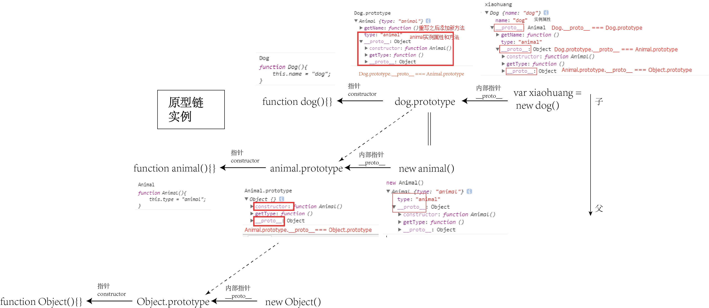

## 对象
1. JavaScript 分为函数对象和普通对象，每个对象都有__proto__属性（每个对象都有的隐式原型属性，指向了创建该对象的构造函数的原型。如示1
其实这个属性指向了 [[prototype]]，但是 [[prototype]] 是内部属性，我们并不能访问到，所以使用__proto__来访问），
但是只有函数对象才有prototype属性。


#### 示1（每个对象都有的隐式原型属性，指向了创建该对象的构造函数的原型。__proto__可以通过Object.getPrototypeOf()获取）
```javascript
const obj = { a: 123 }
obj.__proto__ === Object.prototype // true

function Person(name) { this.name = name }
const Tom = new Person('tom')
Tom.__proto__ === Person.prototype // true
Object.getPrototypeOf(Tom) === Person.prototype // true

const arr = [1,2,3]
arr.__proto__ === Array.prototype

// Array是函数对象，是Function的实例对象，Array是通过newFunction创建出来的。因为Array是Function的实例，所以Array.__proto__ === Function.prototype
Array.__proto__ === Function.prototype
```

> 普通对象
- 最普通的对象：有__proto__属性（指向其原型链），没有prototype属性。
- 原型对象(Person.prototype 原型对象还有constructor属性（指向构造函数对象）)

> 函数对象
- 凡是通过new Function()创建的都是函数对象
- 拥有__proto__、prototype属性（指向原型对象）
- 包括Function、Object、Array、Date、String、自定义函数
- 特例： Function.prototype(是原型对象，却是函数对象)
- 箭头函数没有prototype；箭头函数是匿名函数,是不能作为构造函数的,不能使用new；箭头函数不绑定arguments,取而代之用rest参数…解决；
箭头函数不能当做Generator函数,不能使用yield关键字；
 箭头函数会捕获其所在上下文的 this 值，作为自己的 this 值，任何方法都改变不了其指向，如call(), bind(), apply()，而普通函数的this指向调用它的那个对象。

```javascript
//函数对象  
function F1(){};  
const F2 = function(){};  
const F3 = function(n1, n2) { return n1 + n2};  
  
console.log(typeof F1);  //function  
console.log(typeof F2);  //function  
console.log(typeof F3);   //function  
console.log(typeof Object);   //function  
console.log(typeof Array);   //function  
console.log(typeof String);   //function  
console.log(typeof Date);   //function  
console.log(typeof Function);   //function  
```

### 原型对象（函数的prototype属性）

> 每创建一个函数都会有一个prototype属性，这个属性是一个指针，指向一个对象（通过该构造函数创建实例对象的原型对象）。原型对象是包含特定类型的所有实例共享的属性和方法。
>原型对象的好处是，可以让所有实例对象共享它所包含的属性和方法。

```javascript
function Person(){};  
  
console.log(typeof Person.prototype) //Object  
console.log(typeof Object.prototype) // Object  
console.log(typeof Function.prototype) // 特殊 Function  
console.log(typeof Function.prototype.prototype) //undefined 函数对象却没有prototype属性 
```

原型对象、构造函数、实例对象之间的关系


```javascript
function Dog(){};  
  
Dog.prototype.name = "小黄";  
Dog.prototype.age =  13;  
Dog.prototype.getAge = function(){  
    return this.age;  
}  
  
var dog1 = new Dog();  
var dog2 = new Dog();  
  
dog2.name = "小黑";  
console.log(dog1.name); // 小黄 来自原型  
console.log(dog2.name); // 小黑 来自实例
```
示图


```javascript
dog1.__proto__ === Dog.prototype  // true
  
Dog.prototype.__proto__ === Object.prototype //true
  
dog1.__proto__.__proto__ === Object.prototype  // true
  
Dog.prototype.constructor === Dog   // true
  
Dog.prototype.isPrototypeOf(dog1)  // true
  
//获取对象的原型  
dog1.__proto__  //不推荐  
Object.getPrototypeOf(dog1) === Dog.prototype   //推荐  
```

## 原型链


原型链基本思路：

利用原型让一个引用类型继承另一个引用类型的属性和方法。

每个构造函数都有一个原型对象，原型对象都包含一个指向构造函数想指针(constructor)，而实例对象都包含一个指向原型对象的内部指针(`__proto__`)。如果让原型对象等于另一个类型的实例，此时的原型对象将包含一个指向另一个原型的指针(`__proto__`)，另一个原型也包含着一个指向另一个构造函数的指针(constructor)。假如另一个原型又是另一个类型的实例……这就构成了实例与原型的链条。

原型链基本思路（图解）：

举例说明：
```javascript
function Animal(){  
    this.type = "animal";  
}  
Animal.prototype.getType = function(){  
    return this.type;  
}  
  
function Dog(){  
    this.name = "dog";  
}  
Dog.prototype = new Animal();  
  
Dog.prototype.getName = function(){  
    return this.name;  
}  
  
var xiaohuang = new Dog();  
//原型链关系  
xiaohuang.__proto__ === Dog.prototype  
Dog.prototype.__proto__ === Animal.prototype  
Animal.prototype.__proto__ === Object.prototype  
Object.prototype.__proto__ === null  
```

instanceof 检测的是原型
```javascript
[] instanceof Array; // true
const obj = {}
obj instanceof Object;// true
new Date() instanceof Date;// true
 
function Person(){};
new Person() instanceof Person; // true
 
[] instanceof Object; // true
new Date() instanceof Object;// true
new Person instanceof Object;// true
```
instanceof 能够判断出 [ ].\_proto_  指向 Array.prototype，而 Array.prototype.\_proto_ 又指向了Object.prototype，最终 Object.prototype.\_proto_ 指向了null，标志着原型链的结束。因此，[]、Array、Object 就在内部形成了一条原型链：


### Function 和 Object
- function Object()也是个函数，所以我们可以认为Object()是通过 new Function() 出来的，所以Object()此时是实例对象，实例对象上面一定有__proto__属性，所以`Object.__proto__` === `Function.prototype`
- function Function()同样也是函数，我们也可以认为他是通过 new Function() 出来的，所以Function()此时是实例对象，实例对象上面一定有__proto__属性，所以`Function.__proto__`=== `Function.prototype`
- 我们说过任何东西都是new Object()所出来的，所以Function() 也是new Object() 出来的，此时Function()是实例对象，实例对象上面一定有__proto__属性，但是Function的__proto__属性的连线已经连到了Function的显式原型对象，所以它通过上图的红线进行连接，
`Function.__proto__.__proto__`=== `Object.prototype(true)`


## 总结
- 1、构造函数的原型链
```javascript
function Person(name) {
  this.name = name
}
const Tom = new Person('tom')
// 1、实例Tom 的_proto_ 指向构造函数person的原型对象prototype
console.log(Tom.__proto__ === Person.prototype) // true
// 2、构造函数Person的原型对象prototype的__proto__指向Object的原型对象prototype
console.log(Person.prototype.__proto__ === Object.prototype) // true
// 3、构造函数Object的原型对象prototype的__proto__指向null
console.log(Object.prototype.__proto__ === null) // true


// 其中 Person.prototype的constructor属性在没修改的情况下指向自身
console.log(Person.prototype.constructor === Person)

// 其中 Person在作为函数对象拥有prototype的同时，也是普通对象拥有__proto__，且指向Function.prototype
console.log(Person.__proto__ === Function.prototype) // true
```

参考https://zhuanlan.zhihu.com/p/22787302
https://juejin.im/post/6844904093828251662
